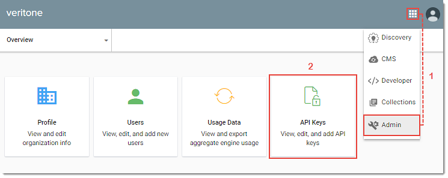

# Authentication

Veritone uses token-based authentication for accessing the system and resources. Currently, the following authentication types are provided to meet the security needs of specific actions being performed:

* **Application:** Third-party applications use OAuth2 protocol for authentication and authorization. OAuth2 provides SSO and generates tokens for users to securely access data without revealing username and password credentials. See [OAuth2 Authentication and Authorization](/developer/applications/oauth) for more information.

* **Engine:** Veritone uses JSON Web Tokens (JWT) for engine authentication. JWTs provide access to resources specifically related to processing tasks (e.g., a TDO’s media assets) and are passed to engines in the Task Payload at engine runtime.

* **API Token:** API Tokens provide access to organization-level resources and are generally used to make ad-hoc API requests by passing the token in an *Authorization* header.

## Creating an API Token {docsify-ignore}

Veritone’s GraphiQL interface is recommended for exploring, writing and testing the API, but calls can also be made using any HTTP client.
When you’re logged into the Veritone platform, GraphiQL logic automatically passes a valid token in the `Authorization` header of every request.
When making requests using a different client, include a valid API Token in the `Authorization` header with the value `Bearer <token>`.
Requests made without this header or with an invalid token will return an error code.

An API Token can be generated in the Veritone Admin App by your Organization Administrator.

To generate an API Token:

1. Log into the Veritone Platform and select **Admin** from the **App Picker** drop-down.
Veritone Admin opens.

2. Click the **API Keys** tile.
The API Keys page opens.

3. Click **New API** Key.
The New API Key window opens.

4. Enter a token name and select the permissions needed for the token to perform the required API tasks.
Click **Generate Token** to save.
The Token Generated window opens.

5. Copy your token and click **Close** when finished.

> For security, once the Token Generated window closes, the token code will no longer display.
You would have to create a new API key to be able to see a valid API key.
