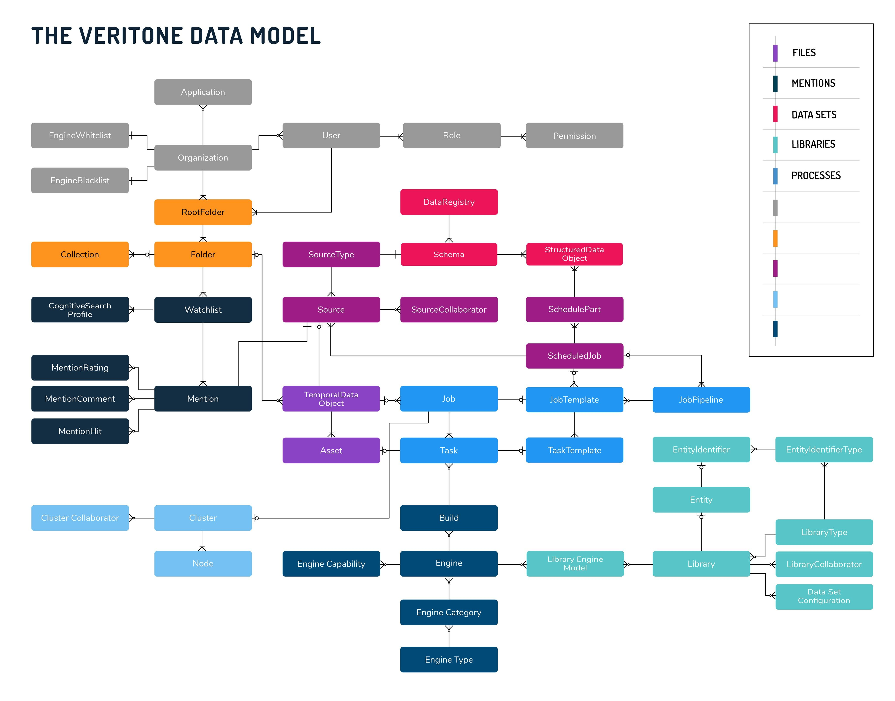

# The Veritone Data Model

The following diagram presents a high-level overview of the data model
implemented in the Veritone GraphQL API.



Typically, each block in the diagram has a corresponding type in the GraphQL
schema. Each type has corresponding queries that retrieve it and mutations
to modify it.

Taking the `Task` and `Job` blocks from the diagram, we have the following
schema in GraphQL:

```graphql
type Job {
  # Retrieve all tasks contained in this job
  tasks: [Task]
}

type Task {
  # Retrieve the job that contains this task
  job: Job
}

type Query {
  # Retrieve a single job by ID
  job(id: ID!): Job
  # Retrieve a list of jobs
  jobs: [Job]
  # Retrieve a single task by ID
  task(id: ID!): Task
}
```

Note that it's been simplified, with only basic fields and no filtering or paging.

The following section describes what each entity means.

* _Asset_:  a piece of data. An asset can be consumed by an engine for analysis,
or it can be produced by an engine to store results.
* _Temporal Data Object_:  contains assets and associated time series and other metadata.
* _Engine_:  a self-contained, encapsulated program that is integrated into the Veritone
platform and performs either AI analysis or infrastructure functions such as ingestion. Third-party developers in the Veritone ecosystem
can create, deploy, and market their own engines using the
Veritone Developer Application (VDA).
* _Task_:  a task is a request to run a single engine. A task is created with a payload containing input to the engine.
* _Job_:  a job describes all the _tasks_ necessary to perform a
single high-level operation, such as run a series of engines against
a piece of data or ingest data from a given source.
* _Organization_:  a Veritone platform subscriber. An organization
may represent a company, a department within a company, or an
individual developer.
* _User_:  a single user account within an organization, representing
a human user (not a service or application).
* _Role_:  an abstract, business-focused way of describing a user's permissions
on the Veritone platform. For example, a "Library Editor" can manage libraries
on behalf of the organization. A role collects a set of fine-grained _permissions_.
* _Permission_: a single functional permission on the Veritone platform,
such as "create library" or "view asset".
* _Application_:  a custom Veritone client application. Third-party developers in the Veritone ecosystem
can create, deploy, and market their own applications using the
Veritone Developer Application (VDA).
* _Engine Category_:  a grouping of engines with similar features.
Expected engine payload and output are common to engines within
an engine category. Engine categories make it easier for users to
find and select the engines they want to use.
* _Engine Whitelist_ / _Engine Blacklist_:  users within a
given organization are allowed to search, view, and use a set of
engines determined by the _engine whitelist_ and _engine blacklist_
for the organization. These lists are managed by Veritone in
accordance with the organization's needs.
* _Build_:  engine developers upload an engine _build_ to deploy
or update their engine; a build represents the engine code.
Each engine can have any number of builds representing different
versions of the code, only one of which is active at any given time.
* _Library_:  A named collection of entities an organization is interested in identifying in media, e.g. American Politicians. A library's type defines what type of entities it can hold.
* _Library type_:  Describes the type of entities the library contains. Used to tailor the UI experience for specific types of entities (for example, People, Ads, etc).
* _Library collaborator_:  An external organization that
a library has been shared with. Users in the collaborator
organization can view the library and use it to train
their own models, but cannot modify it.
* _Library engine model_:  Data generated during an trainable engine's training step. The model is (in some cases) provided to an engine when the engine is run. A model can optionally contain an asset representing the model data.
* _Entity_:  An aggregation of assets (_entity identifiers_) for a defined concept, such as a person, a company or organization, an advertising campaign, a type of object, etc.
* _Entity identifier_:  An asset associated with an entity. Examples are headshots for face recognition, voice clips for speaker recognition, ad creative for audio fingerprinting, DLM for transcription, and aliases for transcription.
* _Entity identifier type_:  The type of asset associated with an entity. e.g. headshot, logo, voice clip, ad, DLM. The library type defines what identifier types it can support.
* _Mention_:  A record that a given entity, tag, or search condition was
matched (or "mentioned") in an engine result. Mentions can be shared and published.
* _Mention comment_:  A user comment on an individual mention. Comments are used
to share, publicize, and collaborate on mentions.
* _Mention rating_:  A user rating on an individual mention. Ratings are used
to share, publicize, and collaborate on mentions.
* _Watchlist_:  An enhanced stored search including a set of search conditions
and filters, effective start and stop date, and other information. Hits against
the search captured in a watchlist generate mentions.
* _Folder_:  A folder is a container for organizing and sharing information,
including temporal data objects (media and other data), watchlists, other folders.
* _Root folder_:  an organization has an implicit top-level folder for each
folder type (collection, watchlist, etc.).
* _Collection_:  a group of related data. A collection can be placed in a folder, or not. Collections can be shared and publicized.
