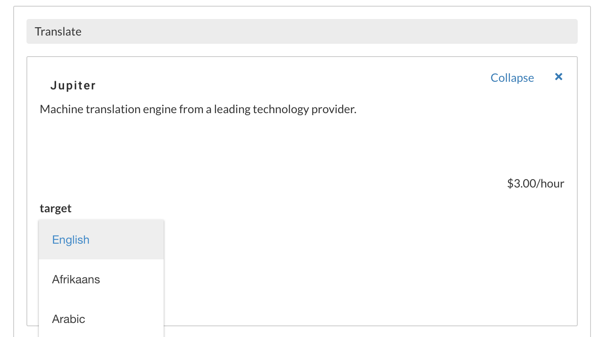

# Looking Up Available Engines

The list of available engines in the Veritone platform is constantly growing and
dependent on the user's permissions.
To get information on what engines are available to run and what options they have,
you can use the GraphQL API.

Here's a sample query that lists all the engine categories and their associated
available engines.

```graphql
query {
  engineCategories {
    records {
      id
      name
      engines(limit: 200) {
        records {
          id
          name
          fields {
            name
            options {
              value
            }
          }
        }
      }
    }
  }
}
```

```json
{
  "data": {
    "engineCategories": {
      "records": [
        {
          "id": "3b2b2ff8-44aa-4db4-9b71-ff96c3bf5923",
          "name": "Translate",
          "engines": {
            "records": [
              {
                "id": "6f47f6d4-57e0-4c2c-9f4f-a3e95e7a725e",
                "name": "Translate - D",
                "fields": []
              },
              {
                "id": "388d951e-c90c-f001-9d6b-8bb70b9e6267",
                "name": "Jupiter",
                "fields": [
                  {
                    "name": "target",
                    "type": "Picklist",
                    "options": [
                      {
                        "value": "en"
                      },
                      {
                        "value": "af"
                      },
                      {
                        "value": "ar"
                      }
...
```

The `fields` property on the engines defines the set of input parameters the engine accepts.
You can see how the various options behave by running engines against media in CMS using
the "Advanced Cognitive Settings" mode and viewing the dropdown options.



In practice, you would probably want to limit your returned dataset by specifying
a particular engine category or searching by engine name

```graphql
query {
  engines(name: "Supernova", categoryId: "67cd4dd0-2f75-445d-a6f0-2f297d6cd182") {
    records {
      id
      name
    }
  }
}
```

```json
{
  "data": {
    "engines": {
      "records": [
        {
          "id": "906b4561-5c53-1d3b-6038-aff9c153545c",
          "name": "Supernova-Russian"
        },
        {
          "id": "3cbc180c-0b60-25f5-a850-c06d71f89e30",
          "name": "Supernova-Japanese"
        }
      ]
    }
  }
}
```

The engine IDs returned are what you would submit as the `engineId` in task definitions.
The fields returned specify the keys and values you would submit as the `payload` in
task definitions.  See [Uploading and Processing Files](/apis/tutorials/upload-and-process) for
details on how to use those values.
