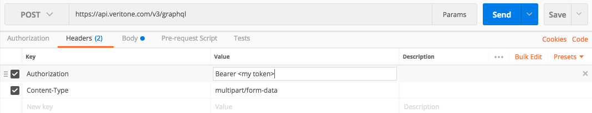
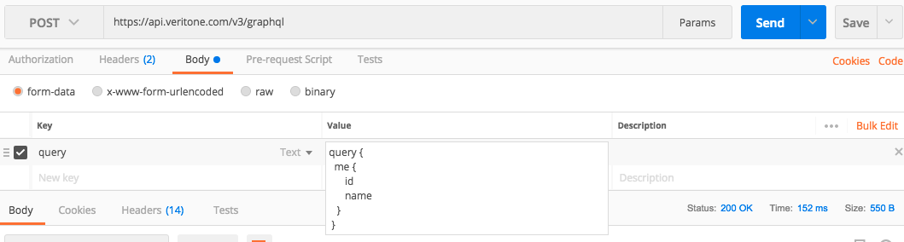
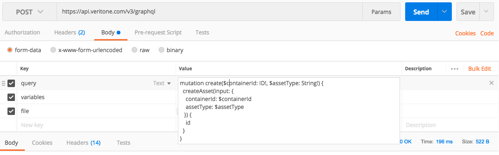
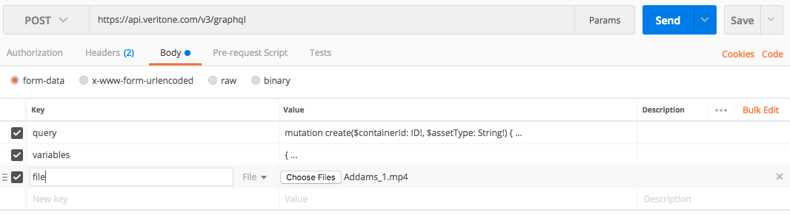

# GraphQL API Basics

This tutorial outlines the basic, raw format of a GraphQL API request.

It assumes that you know what GraphQL is
and understand terms like _schema_, _type_, _field_, _mutation_, and _query_,
and are ready to start using the Veritone APIs.

This page includes examples using `curl`, Postman, Javascript, and Python.

## Basic request format

Every request is an HTTP POST.

Two types of requests are accepted:  plain JSON and multipart form POST. For most requests you'll use plain JSON. Multipart form POST is useful for mutations that accept a file upload.

To make a plain JSON request:

- use HTTP POST
- set the `Content-Type` header to `application/json`
- most operations require authentication. If authenticating, set the `Authorization` header to `Bearer: <your token>`.
- the request body must contain valid JSON. The JSON must contain a `query` element, with a string value containing the GraphQL query.
- optionally, you can include a `variables` element with a map of variable values referenced in the query

Tools like `curl` or `wget` are often used to demonstrate how to use REST APIs. With typical REST APIs, this is essential because every operation has a different URL format and request payload.
In a GraphQL API, every request is the same. Thus, we'll
use `curl` to demonstrate the basic structure of a request.

However, once this basic structure is understand, `curl` is
a poor tool for exploring GraphQL APIs. Use GraphiQL instead.

```bash
console$ curl https://api.veritone.com/v3/graphql \
>   -H 'Authorization: Bearer <id>' \
>   -H 'Content-Type: application/json' \
>   -X POST \
>   -d '{ "query":" query { asset(id: \"<an asset ID>\") { id assetType } }" }'
```

Note that:

- The `Authorization` header is used for authentication
- The `Content-Type` header is set to `application/json`
- HTTP POST is used
- The request body contains JSON.
- That JSON has a single element, `query`
- The value of `query` is a string containing the GraphQL query.
- Since the request body must parse as valid JSON, it must all
be on one line and be properly escaped (note the escaped double quotes).

The API returns plain JSON:

```json
{"data":{"asset":{"id":"<your asset ID>","assetType":"transcript"}}}
```

You can also use the multipart form POST request format. The response and
the way authorization is sent are exactly the same. For manual testing
a form request can be a little easier to format since the GraphQL query
is sent directly in the `query` form field instead of embedded in JSON.
Note that double quotes inside the GraphQL query in this format do
not have to be escaped.

```bash
curl -v \
>  -H 'Authorization: Bearer <token>' \
>  https://api.veritone.com/v3/graphql \
>  -F query='query { asset(id: "<an asset ID>") { id assetType } }'
```

Here's an example of a basic request in Postman.
First we set the `Authorization` header using a valid token:


Then we send the GraphQL query using multipart form post:


## Using GraphQL Variables

It is often convenient to write GraphQL queries using
variables to inject parameterized values, such as the asset ID
in the example above. To do so you must declare the variable
in the query signature, and after that you can reference it
within the query body. The GraphQL server handles any
parsing or formatting of the variable value, as long as a
value of the right type is provided. Note that the type (`ID!`)
in the variable declaration much match the type where it is
used (the `id` parameter on `asset`, which is `ID!`).

Here's the rewritten query:

```graphql
query assetById($assetId: ID!) {
  asset(id: $assetId) {
    id
    assetType
  }
}
```

The client then provides variable values in a separate JSON object.
Here is the `curl` example:

```bash
console$ curl https://api.veritone.com/v3/graphql \
>   -H 'Authorization: Bearer <token>' \
>   -H 'Content-Type: application/json' \
>   -X POST \
>   -d '{ "query":" query byId($assetId: ID!) { asset(id: $assetId) { id assetType } }", "variables": " {\"assetId\":\"<your asset ID>\"}" }'
```

If the request is not formed correctly, you'll receive a 400 error back from the GraphQL server.
The error message will indicate the problem. Typical causes include:

- invalid or unspecified content type
- the request body does not contain valid JSON with a `query` element
- the string value of the `query` element is not escaped properly
- the string value of the `query` element does not contain a valid
GraphQL query
- variables are referenced in the query but not properly declared or sent in the `variables` parameter

Here's a Postman sample query using variables:


And here we bind the variable values:


## Uploading files with multipart form post

The GraphQL server also accepts multipart form post requests as described above.
You can submit plain queries
this way if convenient, but the primary purpose of the method is to support file upload for mutations
that accept them. Here is a `curl` example:

```bash
curl -v \
>  -H 'Authorization: Bearer <token>' \
>  https://api.veritone.com/v3/graphql \
>  -F query='mutation create($containerId: ID!, $assetType: String!) { createAsset(input: { containerId: $containerId, assetType: $assetType}) { id }}' \
>  -F variables='{ "containerId": "<your TDO ID>", "assetType": "<your asset type>" }' \
>  -F file=@<path of file to upload>
```

Note the following differences when using multipart form post:

- the GraphQL query is provided as a plain string parameter (it is not embedded in JSON)
- variables are defined in a JSON object (exclude this parameter if your query does not use variables)
- a single `file` element contains the file to upload. This convention is used across all Veritone GraphQL APIs that accept a file upload.
- all other aspects of the request -- URL, HTTP method, authentication, etc. -- are the same as a plain JSON request.

Here's another example using Postman.
Here's the mutation:

Now we bind variables:

And last, we attach the file:


Use of a client library that handles multipart form post is strongly recommended.

Below is a bare-bones example using Javascript under NodeJS.

```javascript
global.fetch = require('node-fetch');;
const request = require('superagent');
let size = data.length;
let tdoId = "<ID of a target temporal data object>";
let query = `mutation {
  createAsset(input: {
     containerId: "${tdoId}"
     contentType: "video/mp4"
     assetType: "media"
   }) {
     id
     uri
   }
}
 `;

let headers = {
  Authorization: 'Bearer ' + <your token>
};
request
  .post('https://api.veritone.com/v3/graphql')
  .set(headers)
  .field('query', query)
  .field('filename', fileName)
  .attach('file', Buffer.from(data, 'utf8'), fileName)
  .end(function gotResponse(err, response) {
    if (!err) {
      let responseData = JSON.parse(response.text);
      console.log("new asset created with id "+ responseData.data.createAsset.id);
    }
  });
```

Here's another example using Python's `requests` library. It uses `createAsset`
as an example. However, the request format is exactly the same for all mutations
that accept file upload (`updateLibraryEngineModel`, `uploadEngineResult`, etc.).
The only difference is in the GraphQL query string.

```python
import requests
import json
import os

# basic function that creates an asset using the Veritone GraphQL API using
# multipart form POST
#   tdoId:  ID of the TDO that will contain the new asset
#   filePath:  local path to the file to upload
#   assetType:  asset type, such as "media" or "transcript"
#   token:  a valid Veritone authentication token
def createAsset(tdoId, filePath, assetType, token):
    # This is the GraphQL query string, using GraphQL variables.
    query = '''
    mutation createAsset($assetType: String!, $containerId: ID!){
        createAsset(input: {
            assetType: $assetType
            containerId: $containerId
        }) {
            id
            assetType
            contentType
            uri
        }
    }
    '''
    # Our variable map will contain the parameter values.
    variables = {
        'assetType': assetType,
        'containerId': tdoId
    }
    # Set up the files for requests library multipart form upload.
    # First determine the base file name from the path
    fileName = os.path.basename(filePath)
    # Now set up the dict containing the file itself
    files = {
        'file': (fileName, open(filePath))
    }
    # Set up authorization header
    headers = {
        'Authorization': 'Bearer %s' % token
    }
    # Finally set up the other form fields.
    data = {
        'query': query,
        # Note that variables should have a string containing JSON.
        'variables': json.dumps(variables)
    }

    # Make the request and print the result
    r = requests.post('https://api.veritone.com/v3/graphql', files=files, data=data, headers=headers)
    print(r.text)
```
