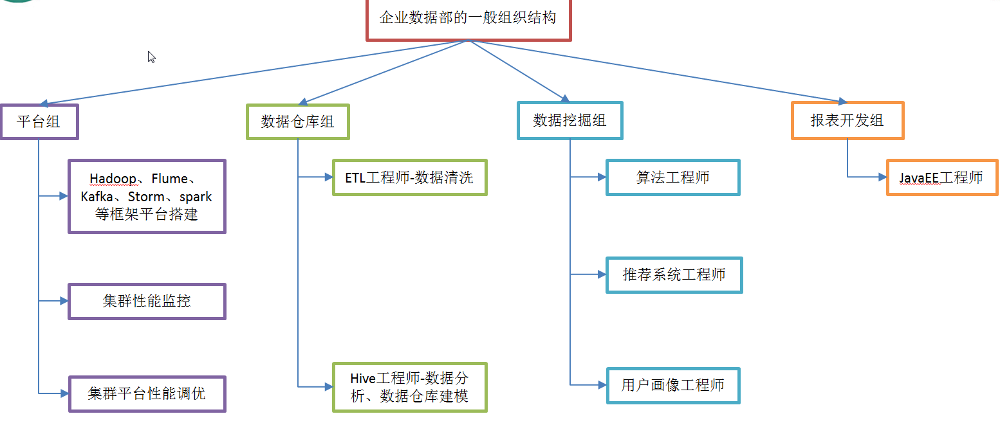
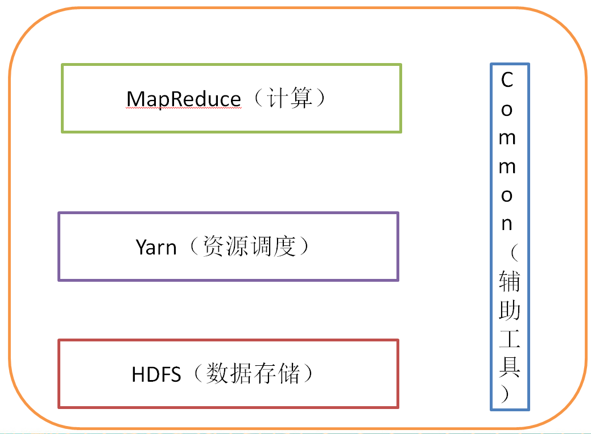
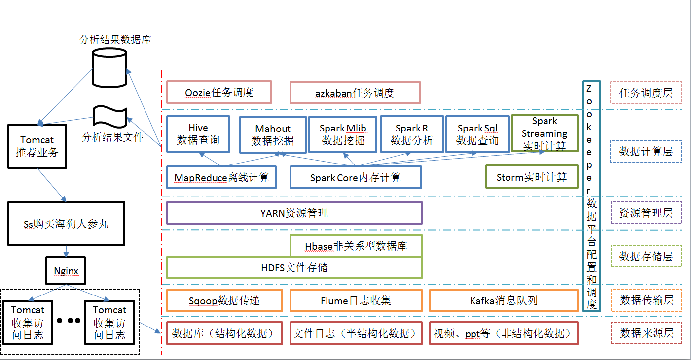

## 一.大数据概论

### 1.1 大数据概念

大数据（big data）：指无法在一定时间范围内用常规软件工具进行捕捉、管理 和处理的数据集合，是需要新处理模式才能具有更强的决策力、洞察发现力和流程 优化能力的海量、高增长率和多样化的信息资产。 

主要解决，海量数据的存储和海量数据的分析计算问题。

按顺序给出数据存储单位：bit、Byte、 KB、MB、GB、TB、PB、EB、ZB、YB、 BB、NB、DB。 1Byte = 8bit 1K = 1024Byte 1MB = 1024K 1G = 1024M 1T = 1024G 1P = 1024T

### 1.2 大数据的特点 

1、Volume（大量）： 截至目前，人类生产的所有印刷材料的数据量是200PB，而历史上全人类总共 说过的话的数据量大约是5EB。当前，典型个人计算机硬盘的容量为TB量级，而 一些大企业的数据量已经接近EB量级。 二、大数据特点

 2、Velocity（高速）： 这是大数据区分于传统数据挖掘的最显著特征。根据IDC的“数字宇宙”的报 告，预计到2020年，全球数据使用量将达到35.2ZB。在如此海量的数据面前，处理 数据的效率就是企业的生命。 天猫双十一：2017年3分01秒，天猫交易额超过100亿 

3、Variety（多样）： 这种类型的多样性也让数据被分为结构化数据和非结构化数据。相对于以往便 于存储的以数据库/文本为主的结构化数据，非结构化数据越来越多，包括网络日志、 音频、视频、图片、地理位置信息等，这些多类型的数据对数据的处理能力提出了 更高要求。

4、Value（低价值密度）： 价值密度的高低与数据总量的大小成反比。比 如，在一天监控视频中，我们只关心宋宋老师晚上 在床上健身那一分钟，如何快速对有价值数据“提 纯”成为目前大数据背景下待解决的难题。

### 1.3 大数据能干啥？ 

1、O2O：百度大数据+平台通过先进的线上线下打通技术和客流分析能力，助 力商家精细化运营，提升销量。 

2、零售：探索用户价值，提供个性化服务解决方案；贯穿网络与实体零售， 携手创造极致体验。经典案例，子尿布+啤酒。 

3、旅游：深度结合大数据能力与旅游行业需求，共建旅游产业智慧管理、智 慧服务和智慧营销的未来。 

4、商品广告推荐：给用户推荐访问过的商品广告类型 

5、保险：海量数据挖掘及风险预测，助力保险 行业精准营销，提升精细化定价能力。 

6、金融：多维度体现用户特征，帮助金融机构 推荐优质客户，防范欺诈风险。 

7、房产：大数据全面助力房地产行业，打造精准 投策与营销，选出更合适的地，建造更合适的楼， 卖给更合适的人。  

8、人工智能：

### 1.4 企业数据部的一般组织结构 

## 二. 从 Hadoop 框架讨论大数据生态 

### 2.1 Hadoop 是什么 

1）Hadoop 是一个由 Apache 基金会所开发的分布式系统基础架构 

2）主要解决，海量数据的存储和海量数据的分析计算问题。

3）广义上来说，HADOOP 通常是指一个更广泛的概念——HADOOP 生态圈 

### 2.2 Hadoop 发展历史 

1）Lucene--Doug Cutting 开创的开源软件，用 java 书写代码，实现与 Google 类似的全文搜 索功能，它提供了全文检索引擎的架构，包括完整的查询引擎和索引引擎 

2）2001 年年底成为 apache 基金会的一个子项目 

3）对于大数量的场景，Lucene 面对与 Google 同样的困难 

4）学习和模仿 Google 解决这些问题的办法 ：微型版 Nutch 

5）可以说 Google 是 hadoop 的思想之源(Google 在大数据方面的三篇论文)

​    **GFS** --->HDFS 

​	Map-Reduce --->MR 

​	BigTable --->Hbase

6）2003-2004 年，Google 公开了部分 GFS 和 Mapreduce 思想的细节，以此为基础 Doug Cutting 等人用了 2 年业余时间实现了 DFS 和 Mapreduce 机制，使 Nutch 性能飙升 

7）2005 年 Hadoop 作为 Lucene 的子项目 Nutch的一部分正式引入 Apache 基金会。2006 年 3 月份，Map-Reduce 和 Nutch Distributed File System (NDFS) 分别被纳入称为 Hadoop 的项 目中

8）名字来源于 Doug Cutting 儿子的玩具大象 

9）Hadoop 就此诞生并迅速发展，标志着云计算时代来临 

### 2.3 Hadoop 三大发行版本

Hadoop 三大发行版本: Apache、Cloudera、Hortonworks。

Apache 版本最原始（最基础）的版本，对于入门学习最好。 

Cloudera 在大型互联网企业中用的较多。 

Hortonworks 文档较好。 

### 2.4 Hadoop 的优势 

1）高可靠性：因为 Hadoop 假设计算元素和存储会出现故障，因为它维护多个工作数据副本，在出现故障时可以对失败的节点重新分布处理。 

2）高扩展性：在集群间分配任务数据，可方便的扩展数以千计的节点。

3）高效性：在 MapReduce 的思想下，Hadoop 是并行工作的，以加快任务处理速度。 

4）高容错性：自动保存多份副本数据，并且能够自动将失败的任务重新分配。 

### 2.5 Hadoop 组成

 

1）Hadoop HDFS：一个高可靠、高吞吐量的分布式文件系统。 

2）Hadoop MapReduce：一个分布式的离线并行计算框架。

3）Hadoop YARN：作业调度与集群资源管理的框架。	

4）Hadoop Common：支持其他模块的工具模块（Configuration、RPC、序列化机制、日志 操作）。 

####  2.5.1 HDFS 架构概述 

1）NameNode（nn）：存储文件的元数据，如文件名，文件目录结构，文件属性（生成时间、副本数、 文件权限），以及每个文件的块列表和块所在的DataNode等。 

2）DataNode(dn)：在本地文件系统存储文件块数据，以及块数据的校验和。 

3）Secondary NameNode(2nn)：用来监控HDFS状态的辅助后台程序，每隔一段时间获取HDFS元数据的快照。 

#### 2.5.2 YARN 架构概述

1）ResourceManager(rm)：处理客户端请求、启动/监控 ApplicationMaster、监控 NodeManager、 资源分配与调度； 

2）NodeManager(nm)：单个节点上的资源管理、处理来自 ResourceManager 的命令、处理来 自 ApplicationMaster 的命令；

3）ApplicationMaster：数据切分、为应用程序申请资源，并分配给内部任务、任务监控与容错。 

4）Container：对任务运行环境的抽象，封装了 CPU、内存等多维资源以及环境变量、启动 命令等任务运行相关的信息。 

#### 2.5.3 MapReduce 架构概述 

MapReduce 将计算过程分为两个阶段：Map 和 Reduce 

1）Map 阶段并行处理输入数据

2）Reduce 阶段对 Map 结果进行汇总 

上图简单的阐明了 map 和 reduce 的两个过程或者作用，虽然不够严谨，但是足以提供 一个大概的认知，map 过程是一个蔬菜到制成食物前的准备工作，reduce 将准备好的材料合 并进而制作出食物的过程。 

### 2.6 大数据技术生态体系 

图中涉及的技术名词解释如下： 

1）Sqoop：sqoop 是一款开源的工具，主要用于在 Hadoop(Hive)与传统的数据库(mysql)间进 行数据的传递，可以将一个关系型数据库（例如 ： MySQL ,Oracle 等）中的数据导进到 Hadoop 的 HDFS 中，也可以将 HDFS 的数据导进到关系型数据库中。

 2）Flume：Flume 是 Cloudera 提供的一个高可用的，高可靠的，分布式的海量日志采集、聚合和传输的系统，Flume 支持在日志系统中定制各类数据发送方，用于收集数据；同时，Flume 提供对数据进行简单处理，并写到各种数据接受方（可定制）的能力。 

3）Kafka：Kafka 是一种高吞吐量的分布式发布订阅消息系统，有如下特性： 

- 通过 O(1)的磁盘数据结构提供消息的持久化，这种结构对于即使数以 TB 的消息 存储也能够保持长时间的稳定性能。 

- 高吞吐量：即使是非常普通的硬件 Kafka 也可以支持每秒数百万的消息 

- 支持通过 Kafka 服务器和消费机集群来分区消息。 

- 支持 Hadoop 并行数据加载。 

4）Storm：Storm 为分布式实时计算提供了一组通用原语，可被用于“流处理”之中，实时 处理消息并更新数据库。这是管理队列及工作者集群的另一种方式。 Storm 也可被用于“连 续计算”（continuous computation），对数据流做连续查询，在计算时就将结果以流的形式 输出给用户。

5）Spark：Spark 是当前最流行的开源大数据内存计算框架。可以基于 Hadoop 上存储的大 数据进行计算。 

6）Oozie：Oozie 是一个管理 Hdoop 作业（job）的工作流程调度管理系统。Oozie 协调作业 就是通过时间（频率）和有效数据触发当前的 Oozie 工作流程。 

7）Hbase：HBase 是一个分布式的、面向列的开源数据库。HBase 不同于一般的关系数据库， 它是一个适合于非结构化数据存储的数据库。 

8）Hive：hive 是基于 Hadoop 的一个数据仓库工具，可以将结构化的数据文件映射为一张 数据库表，并提供简单的 sql 查询功能，可以将 sql 语句转换为 MapReduce 任务进行运行。 其优点是学习成本低，可以通过类 SQL 语句快速实现简单的 MapReduce 统计，不必开发专 门的 MapReduce 应用，十分适合数据仓库的统计分析。 9）R 语言：R 是用于统计分析、绘图的语言和操作环境。R 是属于 GNU 系统的一个自由、 免费、源代码开放的软件，它是一个用于统计计算和统计制图的优秀工具。 

10）Mahout: Apache Mahout 是个可扩展的机器学习和数据挖掘库，当前 Mahout 支持主要的 4 个用 例： 推荐挖掘：搜集用户动作并以此给用户推荐可能喜欢的事物。 聚集：收集文件并进行相关文件分组。 分类：从现有的分类文档中学习，寻找文档中的相似特征，并为无标签的文档进行正确 的归类。 频繁项集挖掘：将一组项分组，并识别哪些个别项会经常一起出现。 

11）ZooKeeper：Zookeeper 是 Google 的 Chubby 一个开源的实现。它是一个针对大型分布 式系统的可靠协调系统，提供的功能包括：配置维护、名字服务、 分布式同步、组服务等。 ZooKeeper 的目标就是封装好复杂易出错的关键服务，将简单易用的接口和性能高效、功能 稳定的系统提供给用户。 

### 2.7 推荐系统框架图 

