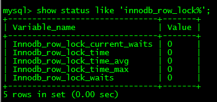

# MySQL锁

锁是计算机协调多个进程或线程并发访问某一资源的机制。

数据库锁定机制简单来说，就是数据库为了保证数据的一致性，而使各种共享资源在被并发访问变得有序所设计的一种规则。主要用来处理并发问题。

 

## 锁的分类

#### 从对数据操作的类型分类：

- **读锁**（共享锁）：针对同一份数据，多个读操作可以同时进行，不会互相影响

- **写锁**（排他锁）：当前写操作没有完成前，它会阻断其他写锁和读锁。

#### 从对数据操作的粒度分类：

> 为了尽可能提高数据库的并发度，每次锁定的数据范围越小越好，理论上每次只锁定当前操作的数据的方案会得到最大的并发度，但是管理锁是很耗资源的事情（涉及获取，检查，释放锁等动作），因此数据库系统需要在高并发响应和系统性能两方面进行平衡，这样就产生了“锁粒度（Lock granularity）”的概念。

- **全局锁**：对整个数据库实例加锁，可以用 `Flush tables with read lock (FTWRL)`设置为只读，就相当于加全局锁了
- **表级锁**：开销小，加锁快；不会出现死锁；锁定粒度大，发生锁冲突的概率最高，并发度最低；
- **行级锁**：开销大，加锁慢；会出现死锁；锁定粒度最小，发生锁冲突的概率最低，并发度也最高；  

适用：从锁的角度来说，表级锁更适合于以查询为主，只有少量按索引条件更新数据的应用，如Web应用；而行级锁则更适合于有大量按索引条件并发更新少量不同数据，同时又有并发查询的应用，如一些在线事务处理（OLTP）系统。


#### 加锁机制

**乐观锁与悲观锁是两种并发控制的思想，可用于解决丢失更新问题** 

乐观锁会“乐观地”假定大概率不会发生并发更新冲突，访问、处理数据过程中不加锁，只在更新数据时再根据版本号或时间戳判断是否有冲突，有则处理，无则提交事务；

悲观锁会“悲观地”假定大概率会发生并发更新冲突，访问、处理数据前就加排他锁，在整个数据处理过程中锁定数据，事务提交或回滚后才释放锁；


#### 锁模式

- 记录锁： 对索引项加锁，锁定符合条件的行。其他事务不能修改 和删除加锁项； 
- gap锁： 对索引项之间的“间隙”加锁，锁定记录的范围（对第一条记录前的间隙或最后一条将记录后的间隙加锁），不包含索引项本身。其他事务不能在锁范围内插入数据，这样就防止了别的事务新增幻影行。 
- next-key锁： 锁定索引项本身和索引范围。即Record Lock和Gap Lock的结合。可解决幻读问题。 
- 意向锁
- 插入意向锁


 MySQL 不同的存储引擎支持不同的锁机制，所有的存储引擎都以自己的方式实现了锁机制 

|        | 行锁 | 表锁 | 页锁 |
| ------ | ---- | ---- | ---- |
| MyISAM |      | √    |      |
| BDB    |      | √    | √    |
| InnoDB | √    | √    |      |
| Memory |      | √    |      |


### 表锁（偏读）

#### 特点：

**偏向MyISAM存储引擎，开销小，加锁快，无死锁；锁定粒度大，发生锁冲突的概率最高，并发度最低**

MyISAM在执行查询语句（SELECT）前，会自动给涉及的所有表加读锁，在执行增删改操作前，会自动给涉及的表加写锁。 
MySQL的表级锁有两种模式：

- 表共享读锁（Table Read Lock）
- 表独占写锁（Table Write Lock）

| 锁类型 | 可否兼容 | 读锁 | 写锁 |
| ------ | -------- | ---- | ---- |
| 读锁   | 是       | 是   | 否   |
| 写锁   | 是       | 否   | 否   |


 结合上表，所以对MyISAM表进行操作，会有以下情况： 

1. 对MyISAM表的读操作（加读锁），不会阻塞其他进程对同一表的读请求，但会阻塞对同一表的写请求。只有当读锁释放后，才会执行其它进程的写操作。 
2. 对MyISAM表的写操作（加写锁），会阻塞其他进程对同一表的读和写操作，只有当写锁释放后，才会执行其它进程的读写操作。

简而言之，就是读锁会阻塞写，但是不会堵塞读。而写锁则会把读和写都堵塞。

MyISAM表的读操作与写操作之间，以及写操作之间是串行的。当一个线程获得对一个表的写锁后，只有持有锁的线程可以对表进行更新操作。其他线程的读、写操作都会等待，直到锁被释放为止。

#### 如何加表锁

MyISAM在执行查询语句（SELECT）前，会自动给涉及的所有表加读锁，在执行更新操作（UPDATE、DELETE、INSERT等）前，会自动给涉及的表加写锁，这个过程并不需要用户干预，因此，用户一般不需要直接用LOCK TABLE命令给MyISAM表显式加锁。

#### MyISAM表锁优化建议

对于MyISAM存储引擎，虽然使用表级锁定在锁定实现的过程中比实现行级锁定或者页级锁所带来的附加成本都要小，锁定本身所消耗的资源也是最少。但是由于锁定的颗粒度比较大，所以造成锁定资源的争用情况也会比其他的锁定级别都要多，从而在较大程度上会降低并发处理能力。所以，在优化MyISAM存储引擎锁定问题的时候，最关键的就是如何让其提高并发度。由于锁定级别是不可能改变的了，所以我们首先需要**尽可能让锁定的时间变短**，然后就是让可能并发进行的操作尽可能的并发。

看看哪些表被加锁了:

```mysql
mysql>show open tables;
```

1. ##### 查询表级锁争用情况

MySQL内部有两组专门的状态变量记录系统内部锁资源争用情况：

```mysql
mysql> show status like 'table%';
```


这里有两个状态变量记录MySQL内部表级锁定的情况，两个变量说明如下：

- Table_locks_immediate：产生表级锁定的次数，表示可以立即获取锁的查询次数，每立即获取锁值加1 

- Table_locks_waited：出现表级锁定争用而发生等待的次数(不能立即获取锁的次数，每等待一次锁值加1)，此值高则说明存在着较严重的表级锁争用情况

两个状态值都是从系统启动后开始记录，出现一次对应的事件则数量加1。如果这里的Table_locks_waited状态值比较高，那么说明系统中表级锁定争用现象比较严重，就需要进一步分析为什么会有较多的锁定资源争用了。

?>  此外，Myisam的读写锁调度是写优先，这也是myisam不适合做写为主表的引擎。因为写锁后，其他线程不能做任何操作，大量的更新会使查询很难得到锁，从而造成永远阻塞

2. **缩短锁定时间**

   如何让锁定时间尽可能的短呢？唯一的办法就是让我们的Query执行时间尽可能的短。

- **尽两减少大的复杂Query，将复杂Query分拆成几个小的Query分布进行；**
- **尽可能的建立足够高效的索引，让数据检索更迅速；**
- **尽量让MyISAM存储引擎的表只存放必要的信息，控制字段类型；**
- **利用合适的机会优化MyISAM表数据文件。**

3. 分离能并行的操作

   说到MyISAM的表锁，而且是读写互相阻塞的表锁，可能有些人会认为在MyISAM存储引擎的表上就只能是完全的串行化，没办法再并行了。大家不要忘记了，MyISAM的存储引擎还有一个非常有用的特性，那就是ConcurrentInsert（并发插入）的特性。

   MyISAM存储引擎有一个控制是否打开Concurrent Insert功能的参数选项：`concurrent_insert`，可以设置为0，1或者2。三个值的具体说明如下：

- concurrent_insert=2，无论MyISAM表中有没有空洞，都允许在表尾并发插入记录；

- concurrent_insert=1，如果MyISAM表中没有空洞（即表的中间没有被删除的行），MyISAM允许在一个进程读表的同时，另一个进程从表尾插入记录。这也是MySQL的默认设置；

- concurrent_insert=0，不允许并发插入。

  可以利用MyISAM存储引擎的并发插入特性，来解决应用中对同一表查询和插入的锁争用。例如，将concurrent_insert系统变量设为2，总是允许并发插入；同时，通过定期在系统空闲时段执行OPTIMIZE TABLE语句来整理空间碎片，收回因删除记录而产生的中间空洞。

4. 合理利用读写优先级

   MyISAM存储引擎的是读写互相阻塞的，那么，一个进程请求某个MyISAM表的读锁，同时另一个进程也请求同一表的写锁，MySQL如何处理呢？

   答案是写进程先获得锁。不仅如此，即使读请求先到锁等待队列，写请求后到，写锁也会插到读锁请求之前。

   这是因为MySQL的表级锁定对于读和写是有不同优先级设定的，默认情况下是写优先级要大于读优先级。

   所以，如果我们可以根据各自系统环境的差异决定读与写的优先级：

   通过执行命令SET LOW_PRIORITY_UPDATES=1，使该连接读比写的优先级高。如果我们的系统是一个以读为主，可以设置此参数，如果以写为主，则不用设置；

   通过指定INSERT、UPDATE、DELETE语句的LOW_PRIORITY属性，降低该语句的优先级。

   虽然上面方法都是要么更新优先，要么查询优先的方法，但还是可以用其来解决查询相对重要的应用（如用户登录系统）中，读锁等待严重的问题。

   另外，MySQL也提供了一种折中的办法来调节读写冲突，即给系统参数max_write_lock_count设置一个合适的值，当一个表的读锁达到这个值后，MySQL就暂时将写请求的优先级降低，给读进程一定获得锁的机会。

   这里还要强调一点：一些需要长时间运行的查询操作，也会使写进程“饿死”，因此，应用中应尽量避免出现长时间运行的查询操作，不要总想用一条SELECT语句来解决问题，因为这种看似巧妙的SQL语句，往往比较复杂，执行时间较长，在可能的情况下可以通过使用中间表等措施对SQL语句做一定的“分解”，使每一步查询都能在较短时间完成，从而减少锁冲突。如果复杂查询不可避免，应尽量安排在数据库空闲时段执行，比如一些定期统计可以安排在夜间执行。


### 行锁（偏写）

- 偏向InnoDB存储引擎，开销大，加锁慢；会出现死锁；锁定粒度最小，发生锁冲突的概率最低,并发度也最高。

- InnoDB与MyISAM的最大不同有两点：一是支持事务（TRANSACTION）；二是采用了行级锁


Innodb存储引擎由于实现了行级锁定，虽然在锁定机制的实现方面所带来的性能损耗可能比表级锁定会要更高一些，但是在整体并发处理能力方面要远远优于MyISAM的表级锁定的。当系统并发量较高的时候，Innodb的整体性能和MyISAM相比就会有比较明显的优势了。


1. InnoDB锁定模式及实现机制

   InnoDB的行级锁定同样分为两种类型，**共享锁和排他锁**，而在锁定机制的实现过程中为了让行级锁定和表级锁定共存，InnoDB也同样使用了**意向锁**（表级锁定）的概念，也就有了**意向共享锁**和**意向排他锁**这两种。

   当一个事务需要给自己需要的某个资源加锁的时候，如果遇到一个共享锁正锁定着自己需要的资源的时候，自己可以再加一个共享锁，不过不能加排他锁。但是，如果遇到自己需要锁定的资源已经被一个排他锁占有之后，则只能等待该锁定释放资源之后自己才能获取锁定资源并添加自己的锁定。而意向锁的作用就是当一个事务在需要获取资源锁定的时候，如果遇到自己需要的资源已经被排他锁占用的时候，该事务可以需要锁定行的表上面添加一个合适的意向锁。如果自己需要一个共享锁，那么就在表上面添加一个意向共享锁。而如果自己需要的是某行（或者某些行）上面添加一个排他锁的话，则先在表上面添加一个意向排他锁。意向共享锁可以同时并存多个，但是意向排他锁同时只能有一个存在。所以，可以说**InnoDB的锁定模式实际上可以分为四种：共享锁（S），排他锁（X），意向共享锁（IS）和意向排他锁（IX）**，我们可以通过以下表格来总结上面这四种所的共存逻辑关系：


如果一个事务请求的锁模式与当前的锁兼容，InnoDB就将请求的锁授予该事务；反之，如果两者不兼容，该事务就要等待锁释放。

意向锁是InnoDB自动加的，不需用户干预。**对于UPDATE、DELETE和INSERT语句，InnoDB会自动给涉及数据集加排他锁**（X)；对于普通SELECT语句，InnoDB不会加任何锁；事务可以通过以下语句显示给记录集加共享锁或排他锁。

共享锁（S）：SELECT * FROM table_name WHERE ... LOCK IN SHARE MODE 

排他锁（X)：SELECT * FROM table_name WHERE ... FOR UPDATE

用SELECT ... IN SHARE MODE获得共享锁，主要用在需要数据依存关系时来确认某行记录是否存在，并确保没有人对这个记录进行UPDATE或者DELETE操作。

但是如果当前事务也需要对该记录进行更新操作，则很有可能造成死锁，对于锁定行记录后需要进行更新操作的应用，应该使用SELECT... FOR UPDATE方式获得排他锁。

2. InnoDB行锁实现方式

   **InnoDB行锁是通过给索引上的索引项加锁来实现的，只有通过索引条件检索数据，InnoDB才使用行级锁，否则，InnoDB将使用表锁**

   在实际应用中，要特别注意InnoDB行锁的这一特性，不然的话，可能导致大量的锁冲突，从而影响并发性能。下面通过一些实际例子来加以说明。

   （1）在不通过索引条件查询的时候，InnoDB确实使用的是表锁，而不是行锁。

   （2）由于MySQL的行锁是针对索引加的锁，不是针对记录加的锁，所以虽然是访问不同行的记录，但是如果是使用相同的索引键，是会出现锁冲突的。

   （3）当表有多个索引的时候，不同的事务可以使用不同的索引锁定不同的行，另外，不论是使用主键索引、唯一索引或普通索引，InnoDB都会使用行锁来对数据加锁。

   （4）即便在条件中使用了索引字段，但是否使用索引来检索数据是由MySQL通过判断不同执行计划的代价来决定的，如果MySQL认为全表扫描效率更高，比如对一些很小的表，它就不会使用索引，这种情况下InnoDB将使用表锁，而不是行锁。因此，**在分析锁冲突时，别忘了检查SQL的执行计划，以确认是否真正使用了索引**。

 

#### 如何分析行锁定

通过检查InnoDB_row_lock状态变量来分析系统上的行锁的争夺情况

```mysql
mysql>show status like 'innodb_row_lock%';
```




对各个状态量的说明如下：

Innodb_row_lock_current_waits：当前正在等待锁定的数量；
Innodb_row_lock_time：从系统启动到现在锁定总时间长度；
Innodb_row_lock_time_avg：每次等待所花平均时间；
Innodb_row_lock_time_max：从系统启动到现在等待最常的一次所花的时间；
Innodb_row_lock_waits：系统启动后到现在总共等待的次数；
对于这5个状态变量，比较重要的主要是
  Innodb_row_lock_time_avg（等待平均时长），
  Innodb_row_lock_waits（等待总次数）
  Innodb_row_lock_time（等待总时长）这三项。
尤其是当等待次数很高，而且每次等待时长也不小的时候，我们就需要分析系统中为什么会有如此多的等待，然后根据分析结果着手指定优化计划。


#### 行锁优化

- 尽可能让所有数据检索都通过索引来完成，避免无索引行锁升级为表锁。

- 合理设计索引，尽量缩小锁的范围

- 尽可能较少检索条件，避免间隙锁

- 尽量控制事务大小，减少锁定资源量和时间长度

- 尽可能低级别事务隔离


### 页锁

开销和加锁时间界于表锁和行锁之间；会出现死锁；锁定粒度界于表锁和行锁之间，并发度一般。


## 死锁

死锁是指两个或者多个事务在同一资源上互相占用，并请求锁定对方占用的资源，从而导致恶性循环的现象。当多个事务试图以不同的顺序锁定资源时，就可能会产生死锁。多个事务同时锁定同一个资源时，也会产生死锁。

`例如：` 设想下面两个事务同时处理 `StockPrice` 表：

事务1


事务2：


如果凑巧，两个事务都执行了第一条 `UPDATE` 语句，更新了一行数据，同时也锁定了改行数据，接着每个事务都尝试去执行

第二条 `UPDATE` 语句，缺发现该行已经被对方锁定，然后两个事务都在等待对方释放锁，同时又持有对方需要的锁，则陷入死

循环。除非有外部因素介入才可能解除`死锁`。

为了解决这种问题，数据库系统实现了各种死锁检测和死锁超时机制。越复杂的系统，比如 `InnoDB` 存储引擎，越能检测到死锁

的循环依赖，并立即返回一个错误。这种解决方式很有效，否则死锁会导致出现非常慢的查询。

还有一种解决方式，就是当查询的时候达到锁等待超时的设定后放弃锁请求，这种方式通常来说不太好。

`InnoDB` 目前处理死锁的方法是，将持有最少行级排他锁的事务进行回滚（这是相对比较简单的死锁回滚算法）。


乐观锁

悲观锁


## 参考

- 《高性能 MySQL》


