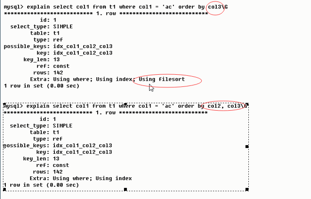
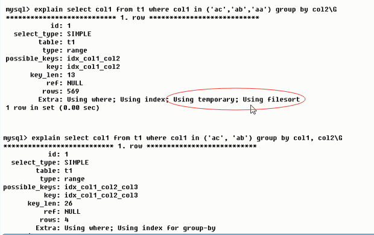
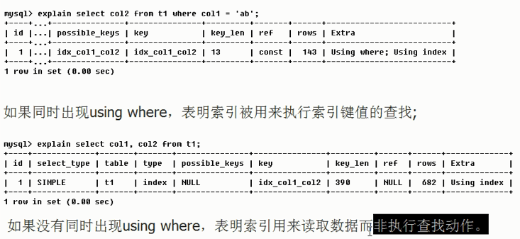
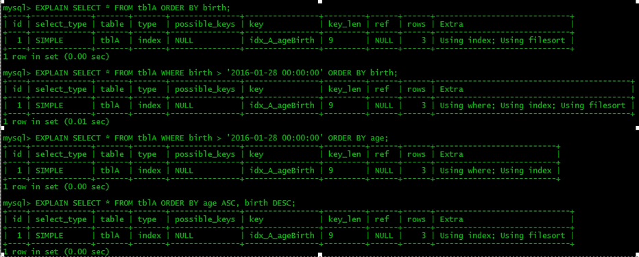
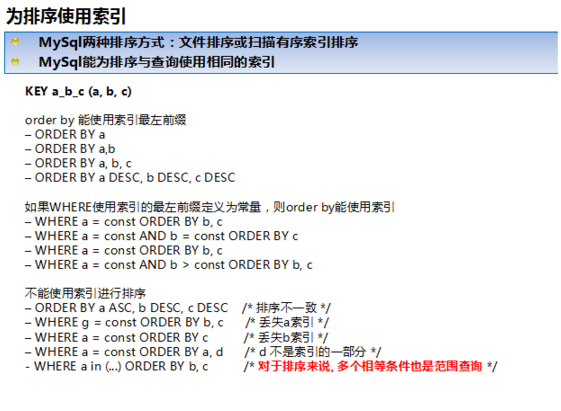

> 《高性能MySQL》给出的性能定义：完成某件任务所需要的的时间度量，性能既响应时间。
>
> 我们主要探讨 Select 的优化，包括 MySQL Server 做了哪些工作以及我们作为开发，如何定位问题，以及如何优化，怎么写出高性能 SQL


## 一、MySQL  Server 优化了什么 

MySQL查询优化器是一个复杂的组件，它的主要任务是确定执行给定查询的最优方式。以下是 MySQL 查询优化器在处理查询时所进行的一些关键活动：

#### 1.1 解析查询：

- 优化器首先解析查询语句，理解其语法和语义。

#### 1.2 词法和语法分析：

- 检查查询语句是否符合SQL语法规则。

#### 1.3 语义分析：

- 确保查询引用的所有数据库对象（如表、列、别名等）都是存在的，并且用户具有相应的访问权限。

#### 1.4 查询重写：

可能对查询进行一些变换，以提高其效率。例如，使用等价变换简化查询或应用数据库的视图定义。

#### 1.5 确定执行计划：

- 优化器会生成一个或多个可能的执行计划，并估算每个计划的成本（如I/O操作、CPU使用等）。

#### 1.6 选择最佳执行计划：

执行成本包括 I/O 成本和 CPU 成本。MySQL 有一套自己的计算公式，在一条单表查询语句真正执行之前，MySQL  的查询优化器会找出执行该语句所有可能使用的方案，对比之后找出成本最低的方案，这个成本最低的方案就是所谓的`执行计划`，之后才会调用存储引擎提供的接口真正的执行查询。

#### 1.7 索引选择：

- 确定是否使用索引以及使用哪个索引。考虑因素包括索引的选择性、查询条件、索引的前缀等。

#### 1.8 表访问顺序：

- 对于涉及多个表的查询，优化器决定最佳的表访问顺序，以减少数据的访问量。

#### 1.9 连接算法选择：

join 我们每天都在用，左、右连接、内连接就不详细介绍了


对于连接操作，优化器会选择最合适的算法，如嵌套循环、块嵌套循环、哈希连接等。

- **嵌套循环连接（Nested-Loop Join）**：驱动表只访问一次，但被驱动表却可能被多次访问，访问次数取决于对驱动表执行单表查询后的结果集中的记录条数的连接执行方式称之为`嵌套循环连接`。

  左（外）连接的驱动表就是左边的那个表，右（外）连接的驱动表就是右边的那个表。内连接驱动表就无所谓了。

- **基于块的嵌套循环连接（Block Nested-Loop Join）**: 块嵌套循环连接是嵌套循环连接的优化版本。每次访问被驱动表，被驱动表的记录会被加载到内存中，与驱动表匹配，然后清理内存，然后再取下一条，这样 I/O 成本是超级高的。

  所以为了减少了对被驱动表的访问次数，引入了 `join buffer` 的概念，执行连接查询前申请的一块固定大小的内存，先把若干条驱动表结果集中的记录装在这个`join buffer`中，然后开始扫描被驱动表，每一条被驱动表的记录一次性和`join buffer`中的多条驱动表记录做匹配，因为匹配的过程都是在内存中完成的，所以这样可以显著减少被驱动表的`I/O`代价。

#### 1.10 子查询优化：

对于子查询，优化器决定是将其物化、转换为半连接、还是其他形式。

#### 1.11 谓词下推：

- 将查询条件（谓词）尽可能地下推到存储引擎层面，以便尽早过滤数据。

#### 1.12 分区修剪：

- 如果表被分区，优化器会识别出只需要扫描的分区。

#### 1.13 排序和分组优化：

- 优化器会考虑使用索引来执行排序和分组操作。

#### 1.14 临时表和物化：

- 优化器可能会决定使用临时表来存储中间结果，以简化查询。

#### 1.15 并行查询执行：

- 对于某些查询，优化器可以决定使用并行执行来提高性能。

#### 1.16 执行计划缓存：

- 如果可能，优化器会重用之前缓存的执行计划，以减少解析和优化的开销。

#### 1.17 生成执行语句：

- 最终，优化器生成用于执行查询的底层指令。

#### 1.18 监控和调整：

- 优化器的行为可以通过各种参数进行调整，以适应特定的工作负载和系统配置。

#### 1.19 统计信息更新：

优化器依赖于表和索引的统计信息来做出决策，因此需要确保统计信息是最新的。

InnoDB存储引擎的统计数据收集是数据库性能优化的重要组成部分，因为这些统计数据会被MySQL查询优化器用来生成查询执行计划。以下是InnoDB统计数据收集的一些关键点：

1. **统计数据存储方式**：
   - InnoDB提供了两种存储统计数据的方式：永久性统计数据和非永久性统计数据。
   - 永久性统计数据存储在磁盘上，服务器重启后依然存在。
   - 非永久性统计数据存储在内存中，服务器关闭时会被清除。
2. **系统变量控制**：
   - `innodb_stats_persistent`：控制是否使用永久性统计数据，默认在MySQL 5.6.6之后的版本中为ON。
   - `innodb_stats_persistent_sample_pages`：控制永久性统计数据采样的页数，默认值为2012。
   - `innodb_stats_transient_sample_pages`：控制非永久性统计数据采样的页数，默认值为82。
3. **统计信息的更新**：
   - `ANALYZE TABLE`：可以用于手动更新统计信息，它将重新计算表的统计数据3。
   - `innodb_stats_auto_recalc`：控制是否自动重新计算统计数据，默认为ON24。
4. **统计数据的收集**：
   - InnoDB通过采样页面来估计表中的行数和其他统计信息24。
   - `innodb_table_stats`和`innodb_index_stats`：这两个内部表存储了关于表和索引的统计数据24。
5. **特定表的统计数据属性**：
   - 在创建或修改表时，可以通过`STATS_PERSISTENT`、`STATS_AUTO_RECALC`和`STATS_SAMPLE_PAGES`属性来控制表的统计数据行为234。
6. **NULL值的处理**：
   - `innodb_stats_method`变量决定了在统计索引列不重复值的数量时如何对待NULL值310。
7. **手动更新统计数据**：
   - 可以手动更新`innodb_table_stats`和`innodb_index_stats`表中的统计数据，之后需要使用`FLUSH TABLE`命令让优化器重新加载统计信息4。
8. **非永久性统计数据**：
   - 当`innodb_stats_persistent`设置为OFF时，新创建的表将使用非永久性统计数据，这些数据存储在内存中45。
9. **统计数据的自动更新**：
   - 如果表中数据变动超过一定比例（默认10%），并且`innodb_stats_auto_recalc`为ON，InnoDB将自动更新统计数据34。

通过以上信息，我们了解到InnoDB的统计数据收集是一个动态的过程，旨在帮助优化器做出更好的查询执行计划决策。数据库管理员可以根据系统的具体需求和性能指标来调整相关的系统变量，以优化统计数据的收集和使用。

> 问个问题：为什么 InnoDB `rows`这个统计项的值是估计值呢？
>
> `InnoDB`统计一个表中有多少行记录的套路大概是这样的：按照一定算法（并不是纯粹随机的）选取几个叶子节点页面，计算每个页面中主键值记录数量，然后计算平均一个页面中主键值的记录数量乘以全部叶子节点的数量就算是该表的`n_rows`值。

通过`EXPLAIN`或`EXPLAIN ANALYZE`命令可以查看查询优化器的执行计划，这有助于理解查询的执行方式，并据此进行优化。优化器的目标是找到最快、最高效的执行计划，但有时它也可能做出不理想的决策，特别是在数据量变化或统计信息不准确时。在这种情况下，可以通过调整索引、修改查询或使用SQL提示词来引导优化器做出更好的选择。


## 二、业务开发者可以优化什么


假设性能优化就是在一定负载下尽可能的降低响应时间。

性能监测工具：  **New Relic**   **OneAPM**  

## 1. 影响mysql的性能因素

##### 1.1 业务需求对mysql的影响(合适合度)

##### 1.2 存储定位对mysql的影响

- 不适合放进mysql的数据
  - 二进制多媒体数据
  - 流水队列数据
  - 超大文本数据
- 需要放进缓存的数据
  - 系统各种配置及规则数据
  - 活跃用户的基本信息数据
  - 活跃用户的个性化定制信息数据
  - 准实时的统计信息数据
  - 其他一些访问频繁但变更较少的数据

##### 1.3 Schema设计对系统的性能影响

- 尽量减少对数据库访问的请求
- 尽量减少无用数据的查询请求

##### 1.4 硬件环境对系统性能的影响

**典型OLTP应用系统**

 <small> 什么是OLTP：OLTP即联机事务处理，就是我们经常说的关系数据库，意即记录即时的增、删、改、查，就是我们经常应用的东西，这是数据库的基础

对于各种数据库系统环境中大家最常见的OLTP系统，其特点是并发量大，整体数据量比较多，但每次访问的数据比较少，且访问的数据比较离散，活跃数据占总体数据的比例不是太大。对于这类系统的数据库实际上是最难维护，最难以优化的，对主机整体性能要求也是最高的。因为不仅访问量很高，数据量也不小。

针对上面的这些特点和分析，我们可以对OLTP的得出一个大致的方向。 虽然系统总体数据量较大，但是系统活跃数据在数据总量中所占的比例不大，那么我们可以通过扩大内存容量来尽可能多的将活跃数据cache到内存中； 虽然IO访问非常频繁，但是每次访问的数据量较少且很离散，那么我们对磁盘存储的要求是IOPS表现要很好，吞吐量是次要因素； 并发量很高，CPU每秒所要处理的请求自然也就很多，所以CPU处理能力需要比较强劲； 虽然与客户端的每次交互的数据量并不是特别大，但是网络交互非常频繁，所以主机与客户端交互的网络设备对流量能力也要求不能太弱。 </small> 

**典型OLAP应用系统**

<small>用于数据分析的OLAP系统的主要特点就是数据量非常大，并发访问不多，但每次访问所需要检索的数据量都比较多，而且数据访问相对较为集中，没有太明显的活跃数据概念。

什么是OLAP：OLAP即联机分析处理，是数据仓库的核心部心，所谓数据仓库是对于大量已经由OLTP形成的数据的一种分析型的数据库，用于处理商业智能、决策支持等重要的决策信息；数据仓库是在数据库应用到一定程序之后而对历史数据的加工与分析 基于OLAP系统的各种特点和相应的分析，针对OLAP系统硬件优化的大致策略如下： 数据量非常大，所以磁盘存储系统的单位容量需要尽量大一些； 单次访问数据量较大，而且访问数据比较集中，那么对IO系统的性能要求是需要有尽可能大的每秒IO吞吐量，所以应该选用每秒吞吐量尽可能大的磁盘； 虽然IO性能要求也比较高，但是并发请求较少，所以CPU处理能力较难成为性能瓶颈，所以CPU处理能力没有太苛刻的要求；

虽然每次请求的访问量很大，但是执行过程中的数据大都不会返回给客户端，最终返回给客户端的数据量都较小，所以和客户端交互的网络设备要求并不是太高；

此外，由于OLAP系统由于其每次运算过程较长，可以很好的并行化，所以一般的OLAP系统都是由多台主机构成的一个集群，而集群中主机与主机之间的数据交互量一般来说都是非常大的，所以在集群中主机之间的网络设备要求很高。</small> 


## 2. 性能分析

### 2.1 MySQL常见瓶颈

- CPU：CPU在饱和的时候一般发生在数据装入内存或从磁盘上读取数据时候

- IO：磁盘I/O瓶颈发生在装入数据远大于内存容量的时候

- 服务器硬件的性能瓶颈：top,free, iostat和vmstat来查看系统的性能状态


**查看Linux系统性能的常用命令**

MySQL数据库是常见的两个瓶颈是CPU和I/O的瓶颈。CPU在饱和的时候一般发生在数据装入内存或从磁盘上读取数据时候，磁盘I/O瓶颈发生在装入数据远大于内存容量的时候，如果应用分布在网络上，那么查询量相当大的时候那么瓶颈就会出现在网络上。Linux中我们常用mpstat、vmstat、iostat、sar和top来查看系统的性能状态。

`mpstat`： mpstat是Multiprocessor Statistics的缩写，是实时系统监控工具。其报告为CPU的一些统计信息，这些信息存放在/proc/stat文件中。在多CPUs系统里，其不但能查看所有CPU的平均状况信息，而且能够查看特定CPU的信息。mpstat最大的特点是可以查看多核心cpu中每个计算核心的统计数据，而类似工具vmstat只能查看系统整体cpu情况。

`vmstat`：vmstat命令是最常见的Linux/Unix监控工具，可以展现给定时间间隔的服务器的状态值，包括服务器的CPU使用率，内存使用，虚拟内存交换情况，IO读写情况。这个命令是我查看Linux/Unix最喜爱的命令，一个是Linux/Unix都支持，二是相比top，我可以看到整个机器的CPU、内存、IO的使用情况，而不是单单看到各个进程的CPU使用率和内存使用率(使用场景不一样)。

`iostat`: 主要用于监控系统设备的IO负载情况，iostat首次运行时显示自系统启动开始的各项统计信息，之后运行iostat将显示自上次运行该命令以后的统计信息。用户可以通过指定统计的次数和时间来获得所需的统计信息。

`sar`： sar（System Activity Reporter系统活动情况报告）是目前 Linux 上最为全面的系统性能分析工具之一，可以从多方面对系统的活动进行报告，包括：文件的读写情况、系统调用的使用情况、磁盘I/O、CPU效率、内存使用状况、进程活动及IPC有关的活动等。

`top`：top命令是Linux下常用的性能分析工具，能够实时显示系统中各个进程的资源占用状况，类似于Windows的任务管理器。top显示系统当前的进程和其他状况，是一个动态显示过程,即可以通过用户按键来不断刷新当前状态.如果在前台执行该命令，它将独占前台，直到用户终止该程序为止。比较准确的说，top命令提供了实时的对系统处理器的状态监视。它将显示系统中CPU最“敏感”的任务列表。该命令可以按CPU使用。内存使用和执行时间对任务进行排序；而且该命令的很多特性都可以通过交互式命令或者在个人定制文件中进行设定。

除了服务器硬件的性能瓶颈，对于MySQL系统本身，我们可以使用工具来优化数据库的性能，通常有三种：使用索引，使用EXPLAIN分析查询以及调整MySQL的内部配置。


### 2.2 性能下降SQL慢 执行时间长 等待时间长 原因分析

- 查询语句写的烂
- 索引失效（单值 复合）
- 关联查询太多join（设计缺陷或不得已的需求）
- 服务器调优及各个参数设置（缓冲、线程数等）


### 2.3 MySql Query Optimizer

1. Mysql中有专门负责优化SELECT语句的优化器模块，主要功能：通过计算分析系统中收集到的统计信息，为客户端请求的Query提供他认为最优的执行计划（他认为最优的数据检索方式，但不见得是DBA认为是最优的，这部分最耗费时间）

2. 当客户端向MySQL 请求一条Query，命令解析器模块完成请求分类，区别出是 SELECT 并转发给MySQL Query Optimizer时，MySQL Query Optimizer 首先会对整条Query进行优化，处理掉一些常量表达式的预算，直接换算成常量值。并对 Query 中的查询条件进行简化和转换，如去掉一些无用或显而易见的条件、结构调整等。然后分析 Query 中的 Hint 信息（如果有），看显示Hint信息是否可以完全确定该Query 的执行计划。如果没有 Hint 或Hint 信息还不足以完全确定执行计划，则会读取所涉及对象的统计信息，根据 Query 进行写相应的计算分析，然后再得出最后的执行计划。


### 2.4 MySQL常见性能分析手段

在优化MySQL时，通常需要对数据库进行分析，常见的分析手段有**慢查询日志**，**EXPLAIN 分析查询**，**profiling分析**以及**show命令查询系统状态及系统变量**，通过定位分析性能的瓶颈，才能更好的优化数据库系统的性能。

####  2.4.1 性能瓶颈定位 

我们可以通过show命令查看MySQL状态及变量，找到系统的瓶颈：

```shell
Mysql> show status ——显示状态信息（扩展show status like ‘XXX’）

Mysql> show variables ——显示系统变量（扩展show variables like ‘XXX’）

Mysql> show innodb status ——显示InnoDB存储引擎的状态

Mysql> show processlist ——查看当前SQL执行，包括执行状态、是否锁表等

Shell> mysqladmin variables -u username -p password——显示系统变量

Shell> mysqladmin extended-status -u username -p password——显示状态信息
```


#### 2.4.2 Explain(执行计划)

- 是什么：使用Explain关键字可以模拟优化器执行SQL查询语句，从而知道MySQL是如何处理你的SQL语句的。分析你的查询语句或是表结构的性能瓶颈
- 能干吗
  - 表的读取顺序
  - 数据读取操作的操作类型
  - 哪些索引可以使用
  - 哪些索引被实际使用
  - 表之间的引用
  - 每张表有多少行被优化器查询

- 怎么玩

  - Explain + SQL语句
  - 执行计划包含的信息


- 各字段解释

  - <mark>**id**</mark>（select 查询的序列号，包含一组数字，表示查询中执行 select 子句或操作表的顺序）

    - id 相同，执行顺序从上往下
    - id 不同，如果是子查询，id 的序号会递增，id 值越大优先级越高，越先被执行
    - id 相同不同，同时存在，相同的属于一组，从上往下执行

  - <mark> **select_type**</mark>（查询的类型，用于区别普通查询、联合查询、子查询等复杂查询）

    - **SIMPLE** ：简单的 select 查询，查询中不包含子查询或 UNION
    -  **PRIMARY**：查询中若包含任何复杂的子部分，最外层查询被标记为 PRIMARY
    -  **SUBQUERY**：在 select 或 where 列表中包含了子查询
    - **DERIVED**：在 from 列表中包含的子查询被标记为 DERIVED，mysql 会递归执行这些子查询，把结果放在临时表里
    -  **UNION**：若第二个 select 出现在 UNION 之后，则被标记为 UNION，若 UNION 包含在 from 子句的子查询中，外层 select 将被标记为 DERIVED
    -  **UNION RESULT**：从 UNION 表获取结果的 select

  - <mark> **table**</mark>（显示这一行的数据是关于哪张表的）

  - <mark> **partitions**</mark>（匹配的分区信息，高版本才有的）

  - <mark> **type**</mark>（显示查询使用了那种类型，从最好到最差依次排列 **system > const > eq_ref > ref > fulltext > ref_or_null > index_merge > unique_subquery > index_subquery > range > index > ALL** ）

    - system：表只有一行记录（等于系统表），是 const 类型的特例，平时不会出现
    - const：表示通过索引一次就找到了，const 用于比较 primary key 或 unique 索引，因为只要匹配一行数据，所以很快，如将主键置于 where 列表中，mysql 就能将该查询转换为一个常量
    - eq_ref：唯一性索引扫描，对于每个索引键，表中只有一条记录与之匹配，常见于主键或唯一索引扫描
    - ref：非唯一性索引扫描，范围匹配某个单独值得所有行。本质上也是一种索引访问，他返回所有匹配某个单独值的行，然而，它可能也会找到多个符合条件的行，多以他应该属于查找和扫描的混合体
    - ref_or_null：当对普通二级索引进行等值匹配查询，该索引列的值也可以是`NULL`值时，那么对该表的访问方法就可能是ref_or_null
    - index_merge: 在某些场景下可以使用`Intersection`、`Union`、`Sort-Union`这三种索引合并的方式来执行查询
    - range：只检索给定范围的行，使用一个索引来选择行。key 列显示使用了哪个索引，一般就是在你的 where 语句中出现了between、<、>、in等的查询，这种范围扫描索引比全表扫描要好，因为它只需开始于索引的某一点，而结束于另一点，不用扫描全部索引
    - index：Full Index Scan，index 于 ALL 区别为 index 类型只遍历索引树。通常比 ALL 快，因为索引文件通常比数据文件小。（**也就是说虽然 all 和 index 都是读全表，但 index 是从索引中读取的，而 all 是从硬盘中读的**）
    - all：Full Table Scan，将遍历全表找到匹配的行

    > 一般来说，得保证查询至少达到 range 级别，最好到达 ref

  - <mark> **possible_keys**</mark>（显示可能应用在这张表中的索引，一个或多个，查询涉及到的字段若存在索引，则该索引将被列出，但不一定被查询实际使用）
    
  - <mark> **key**</mark> 

    - 实际使用的索引，如果为NULL，则没有使用索引

    - **查询中若使用了覆盖索引，则该索引和查询的 select 字段重叠，仅出现在 key 列表中**

  

  - <mark> **key_len**</mark>
    - 表示索引中使用的字节数，可通过该列计算查询中使用的索引的长度。在不损失精确性的情况下，长度越短越好
    - key_len显示的值为索引字段的最大可能长度，并非实际使用长度，即key_len是根据表定义计算而得，不是通过表内检索出的

  - <mark> **ref**</mark> （显示索引的哪一列被使用了，如果可能的话，是一个常数。哪些列或常量被用于查找索引列上的值）

  - <mark> **rows**</mark> （根据表统计信息及索引选用情况，大致估算找到所需的记录所需要读取的行数）

  - <mark> **filtered**</mark>（某个表经过搜索条件过滤后剩余记录条数的百分比）

  - <mark> **Extra**</mark>（包含不适合在其他列中显示但十分重要的额外信息）

    1. <font color=red>using filesort</font>: 说明 mysql 会对数据使用一个外部的索引排序，不是按照表内的索引顺序进行读取。mysql 中无法利用索引完成的排序操作称为“文件排序”

       

    2. <font color=red>Using temporary</font>：使用了临时表保存中间结果，mysql在对查询结果排序时使用临时表。常见于排序order by和分组查询group by。

    3. <font color=red>using index</font>：表示相应的select操作中使用了覆盖索引，避免访问了表的数据行，效率不错，如果同时出现using where，表明索引被用来执行索引键值的查找；否则索引被用来读取数据而非执行查找操作

    4. using where：使用了where过滤

    5. using join buffer：使用了连接缓存

    6. impossible where：where子句的值总是false，不能用来获取任何元祖

    7. select tables optimized away：在没有group by子句的情况下，基于索引优化操作或对于MyISAM存储引擎优化COUNT(*)操作，不必等到执行阶段再进行计算，查询执行计划生成的阶段即完成优化

    8. distinct：优化distinct操作，在找到第一匹配的元祖后即停止找同样值的动作
    
       

- case:


 

1. 第一行（执行顺序4）：id列为1，表示是union里的第一个select，select_type列的primary表 示该查询为外层查询，table列被标记为<derived3>，表示查询结果来自一个衍生表，其中derived3中3代表该查询衍生自第三个select查询，即id为3的select。【select d1.name......】

2. 第二行（执行顺序2）：id为3，是整个查询中第三个select的一部分。因查询包含在from中，所以为derived。【select id,name from t1 where other_column=''】
3.  第三行（执行顺序3）：select列表中的子查询select_type为subquery，为整个查询中的第二个select。【select id from t3】
4. 第四行（执行顺序1）：select_type为union，说明第四个select是union里的第二个select，最先执行【select name,id from t2】
5. 第五行（执行顺序5）：代表从union的临时表中读取行的阶段，table列的<union1,4>表示用第一个和第四个select的结果进行union操作。【两个结果union操作】


#### 2.4.3 慢查询日志

MySQL的慢查询日志是MySQL提供的一种日志记录，它用来记录在MySQL中响应时间超过阈值的语句，具体指运行时间超过long_query_time值的SQL，则会被记录到慢查询日志中。

- long_query_time的默认值为10，意思是运行10秒以上的语句。
- 默认情况下，MySQL数据库没有开启慢查询日志，需要手动设置参数开启。
- 如果不是调优需要的话，一般不建议启动该参数。

**查看开启状态**

`SHOW VARIABLES LIKE '%slow_query_log%'`

**开启慢查询日志**

- 临时配置：

```mysql
mysql> set global slow_query_log='ON';
mysql> set global slow_query_log_file='/var/lib/mysql/hostname-slow.log';
mysql> set global long_query_time=2;
```

​	也可set文件位置，系统会默认给一个缺省文件host_name-slow.log

​	使用set操作开启慢查询日志只对当前数据库生效，如果MySQL重启则会失效。

- 永久配置

  修改配置文件my.cnf或my.ini，在[mysqld]一行下面加入两个配置参数

```cnf
[mysqld]
slow_query_log = ON
slow_query_log_file = /var/lib/mysql/hostname-slow.log
long_query_time = 3
```

​	注：log-slow-queries参数为慢查询日志存放的位置，一般这个目录要有mysql的运行帐号的可写权限，一般都	将这个目录设置为mysql的数据存放目录；long_query_time=2中的2表示查询超过两秒才记录；在my.cnf或者	my.ini中添加log-queries-not-using-indexes参数，表示记录下没有使用索引的查询。

可以用 `select sleep(4)` 验证是否成功开启。

在生产环境中，如果手工分析日志，查找、分析SQL，还是比较费劲的，所以MySQL提供了日志分析工具mysqldumpslow。

通过 mysqldumpslow --help查看操作帮助信息

- 得到返回记录集最多的10个SQL

  `mysqldumpslow -s r -t 10 /var/lib/mysql/hostname-slow.log`

- 得到访问次数最多的10个SQL

  `mysqldumpslow -s c -t 10 /var/lib/mysql/hostname-slow.log`

- 得到按照时间排序的前10条里面含有左连接的查询语句

  `mysqldumpslow -s t -t 10 -g "left join" /var/lib/mysql/hostname-slow.log`

- 也可以和管道配合使用

  `mysqldumpslow -s r -t 10 /var/lib/mysql/hostname-slow.log | more`

**也可使用 pt-query-digest 分析 RDS MySQL 慢查询日志**


#### 2.4.4 Show Profile分析查询

通过慢日志查询可以知道哪些SQL语句执行效率低下，通过explain我们可以得知SQL语句的具体执行情况，索引使用等，还可以结合Show Profile命令查看执行状态。

- Show Profile是mysql提供可以用来分析当前会话中语句执行的资源消耗情况。可以用于SQL的调优的测量

- 默认情况下，参数处于关闭状态，并保存最近15次的运行结果

- 分析步骤

  1. 是否支持，看看当前的mysql版本是否支持

     ```mysql
     mysql>Show  variables like 'profiling';  --默认是关闭，使用前需要开启
     ```

  2. 开启功能，默认是关闭，使用前需要开启

     ```mysql
     mysql>set profiling=1;  
     ```

  3. 运行SQL

  4. 查看结果，show profiles;

  5. 诊断SQL，show profile cpu,block io for query 上一步前面的问题SQL数字号码;

  6. 日常开发需要注意的结论

     - converting HEAP to MyISAM 查询结果太大，内存都不够用了往磁盘上搬了。

     - create tmp table 创建临时表，这个要注意

     - Copying to tmp table on disk   把内存临时表复制到磁盘

     - locked


## 3. 性能优化

### 3.1 索引优化

1. 全值匹配我最爱
2. 最佳左前缀法则
3. 不在索引列上做任何操作（计算、函数、(自动or手动)类型转换），会导致索引失效而转向全表扫描
4. 存储引擎不能使用索引中范围条件右边的列
5. 尽量使用覆盖索引(只访问索引的查询(索引列和查询列一致))，减少select 
6. mysql 在使用不等于(!= 或者<>)的时候无法使用索引会导致全表扫描
7. is null ,is not null 也无法使用索引
8. like以通配符开头('%abc...')mysql索引失效会变成全表扫描的操作
9. 字符串不加单引号索引失效
10. 少用or,用它来连接时会索引失效


**一般性建议**

- 对于单键索引，尽量选择针对当前query过滤性更好的索引

- 在选择组合索引的时候，当前Query中过滤性最好的字段在索引字段顺序中，位置越靠前越好。

- 在选择组合索引的时候，尽量选择可以能够包含当前query中的where字句中更多字段的索引

- 尽可能通过分析统计信息和调整query的写法来达到选择合适索引的目的

- 少用Hint强制索引

  

### 3.2 查询优化

- **永远小标驱动大表（小的数据集驱动大的数据集）**

  `slect * from A where id in (select id from B)`

  等价于

  `select id from B`

  `select * from A where A.id=B.id`

  当B表的数据集必须小于A表的数据集时，用in优于exists

  `select * from A where exists (select 1 from B where B.id=A.id)`

  等价于

  `select *from A`

  `select * from B where B.id = A.id`

  当A表的数据集小于B表的数据集时，用exists优于用in

  注意：A表与B表的ID字段应建立索引。

  

- order by关键字优化

- - order by子句，尽量使用Index方式排序，避免使用FileSort方式排序

- - - mysql支持两种方式的排序，FileSort和Index,Index效率高，它指MySQL扫描索引本身完成排序，FileSort效率较低；
    - ORDER BY 满足两种情况，会使用Index方式排序；①ORDER BY语句使用索引最左前列 ②使用where子句与ORDER BY子句条件列组合满足索引最左前列



- - 尽可能在索引列上完成排序操作，遵照索引建的最佳最前缀
  - 如果不在索引列上，filesort有两种算法，mysql就要启动双路排序和单路排序

- - - 双路排序
    - 单路排序
    - 由于单路是后出的，总体而言好过双路

- - 优化策略

- - - 增大sort_buffer_size参数的设置

    - 增大max_lencth_for_sort_data参数的设置

      

- GROUP BY关键字优化
  - group by实质是先排序后进行分组，遵照索引建的最佳左前缀
  - 当无法使用索引列，增大max_length_for_sort_data参数的设置+增大sort_buffer_size参数的设置
  - where高于having，能写在where限定的条件就不要去having限定了。


### 3.3 数据类型优化

MySQL支持的数据类型非常多，选择正确的数据类型对于获取高性能至关重要。不管存储哪种类型的数据，下面几个简单的原则都有助于做出更好的选择。

- 更小的通常更好：一般情况下，应该尽量使用可以正确存储数据的最小数据类型。

  简单就好：简单的数据类型通常需要更少的CPU周期。例如，整数比字符操作代价更低，因为字符集和校对规则（排序规则）使字符比较比整型比较复杂。

- 尽量避免NULL：通常情况下最好指定列为NOT NULL


>  https://www.jianshu.com/p/3c79039e82aa 

