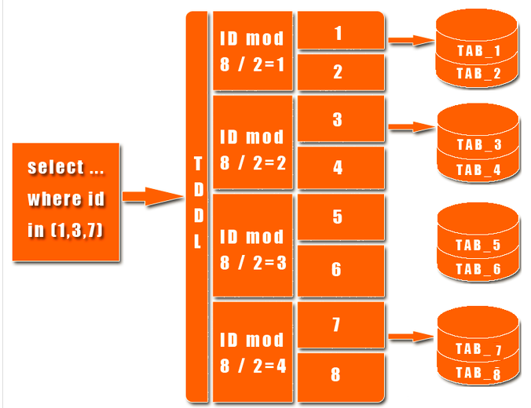

分区： 就是把一张表的数据分成N多个区块，这些区块可以在同一个磁盘上，也可以在不同的磁盘上 

分表： 就是把一张表分成N多个小表。 一张表分成很多表后，每一个小表都是完正的一张表，都对应三个文件，一个.MYD数据文件，.MYI索引文件，.frm表结构文件 

分库：

## MySQL分区

如果一张表的数据量太大的话，那么myd,myi就会变的很大，查找数据就会变的很慢，这个时候我们可以利用mysql的分区功能，在物理上将这一张表对应的三个文件，分割成许多个小块，这样呢，我们查找一条数据时，就不用全部查找了，只要知道这条数据在哪一块，然后在那一块找就行了。如果表的数据太大，可能一个磁盘放不下，这个时候，我们可以把数据分配到不同的磁盘里面去。

### 能干嘛

- 逻辑数据分割
- 提高单一的写和读应用速度
- 提高分区范围读查询的速度
- 分割数据能够有多个不同的物理文件路径
- 高效的保存历史数据

### 怎么玩

首先查看当前数据库是否支持分区

SHOW VARIABLES LIKE '%partition%';

show plugins;

subtopic

### 分区类型及操作

#### RANGE分区

mysql将会根据指定的拆分策略，,把数据放在不同的表文件上。相当于在文件上,被拆成了小块.但是,对外给客户的感觉还是一张表，透明的。

 按照 range 来分，就是每个库一段连续的数据，这个一般是按比如**时间范围**来的，但是这种一般较少用，因为很容易产生热点问题，大量的流量都打在最新的数据上了。

 range 来分，好处在于说，扩容的时候很简单 

#### List分区

MySQL中的LIST分区在很多方面类似于RANGE分区。和按照RANGE分区一样，每个分区必须明确定义。它们的主要区别在于，LIST分区中每个分区的定义和选择是基于某列的值从属于一个值列表集中的一个值，而RANGE分区是从属于一个连续区间值的集合。

#### 其它

- Hash分区: hash 分发，好处在于说，可以平均分配每个库的数据量和请求压力；坏处在于说扩容起来比较麻烦，会有一个数据迁移的过程，之前的数据需要重新计算 hash 值重新分配到不同的库或表 

- Key分区

- 子分区

#### 对NULL值的处理

MySQL中的分区在禁止空值NULL上没有进行处理，无论它是一个列值还是一个用户定义表达式的值，一般而言，在这种情况下MySQL把NULL当做零。如果你不希望出现类似情况，建议在设计表时声明该列“NOT NULL”

**看上去分区表很帅气，为什么大部分互联网还是更多的选择自己分库分表来水平扩展咧？**

回答：

1）分区表，分区键设计不太灵活，如果不走分区键，很容易出现全表锁

2）一旦数据量并发量上来，如果在分区表实施关联，就是一个灾难

3）自己分库分表，自己掌控业务场景与访问模式，可控。分区表，研发写了一个sql，都不确定mysql是怎么玩的，不太可控

4）运维的坑，嘿嘿

## Mysql分库

为什么要分库分库
 数据库集群环境后都是多台slave,基本满足了读取操作;
 但是写入或者说大数据、频繁的写入操作对master性能影响就比较大，
 这个时候，单库并不能解决大规模并发写入的问题。

优点

减少增量数据写入时的锁对查询的影响。

由于单表数量下降，常见的查询操作由于减少了需要扫描的记录，使得单表单次查询所需的检索行数变少，减少了磁盘IO，时延变短。

但是它无法解决单表数据量太大的问题。

 是什么？
  一个库里表太多了，导致了海量数据，系统性能下降，把原本存储于一个库的表拆分存储到多个库上，
通常是将表按照功能模块、关系密切程度划分出来，部署到不同库上。

## Mysql分表

### 是什么

####  垂直拆分

垂直分表，
  通常是按照业务功能的使用频次，把主要的、热门的字段放在一起做为主要表；

  然后把不常用的，按照各自的业务属性进行聚集，拆分到不同的次要表中；主要表和次要表的关系一般都是一对一的。

#### 水平拆分(数据分片)

mysql单表的容量不超过500W，否则建议水平拆分

#### 切分策略

#### 导航路由

#### 是否有一些开源方案

##### MySQL Fabric

网址：http://www.mysql.com/products/enterprise/fabric.html

 MySQL Fabric 是一个用于管理 MySQL 服务器群的可扩展框架。该框架实现了两个特性 — 高可用性 (HA) 以及使用数据分片的横向扩展
 官方推荐，但是2014年左右才推出，是真正的分表，不是代理的(不同于mysql-proxy)。
未来很有前景，目前属于测试阶段还没大规模运用于生产,期待它的升级。

##### Atlas

Atlas是由 Qihoo 360, Web平台部基础架构团队开发维护的一个基于MySQL协议的数据中间层项目。
它在MySQL官方推出的MySQL-Proxy 0.8.2版本的基础上，修改了大量bug，添加了很多功能特性。目前该项目在360公司内部得到了广泛应用，很多MySQL业务已经接入了Atlas平台，每天承载的读写请求数达几十亿条。

主要功能：
 * 读写分离
 * 从库负载均衡
 * IP过滤
 * SQL语句黑白名单
 * 自动分表，只支持单库多表，不支持分布式分表，同理，该功能我们可以用分库来代替，多库多表搞不定。

网址： https://github.com/Qihoo360/Atlas

##### TDDL

 江湖外号：头都大了
淘宝根据自己的业务特点开发了TDDL（Taobao Distributed Data Layer ）框架，主要解决了分库分表对应用的透明化以及异构数据库之间的数据复制，它是一个基于集中式配置的 jdbc datasource实现，具有主备，读写分离，动态数据库配置等功能。

TDDL所处的位置（tddl通用数据访问层，部署在客户端的jar包，用于将用户的SQL路由到指定的数据库中）：

淘宝很早就对数据进行过分库的处理， 上层系统连接多个数据库，中间有一个叫做DBRoute的路由来对数据进行统一访问。DBRoute对数据进行多库的操作、数据的整合，让上层系统像操作 一个数据库一样操作多个库。但是随着数据量的增长，对于库表的分法有了更高的要求，例如，你的商品数据到了百亿级别的时候，任何一个库都无法存放了，于是 分成2个、4个、8个、16个、32个……直到1024个、2048个。好，分成这么多，数据能够存放了，那怎么查询它？这时候，数据查询的中间件就要能 够承担这个重任了，它对上层来说，必须像查询一个数据库一样来查询数据，还要像查询一个数据库一样快（每条查询在几毫秒内完成），TDDL就承担了这样一 个工作。在外面有些系统也用DAL（数据访问层） 这个概念来命名这个中间件。

 系出名门，淘宝诞生。功能强大，阿里开源（部分）
主要优点：
1.数据库主备和动态切换
2.带权重的读写分离
3.单线程读重试
4.集中式数据源信息管理和动态变更
5.剥离的稳定jboss数据源
6.支持mysql和oracle数据库
7.基于jdbc规范，很容易扩展支持实现jdbc规范的数据源
8.无server,client-jar形式存在，应用直连数据库
9.读写次数,并发度流程控制，动态变更
10.可分析的日志打印,日志流控，动态变更
TDDL必须要依赖diamond配置中心（diamond是淘宝内部使用的一个管理持久配置的系统，目前淘宝内部绝大多数系统的配置，由diamond来进行统一管理，同时diamond也已开源）。
TDDL动态数据源使用示例说明：http://rdc.taobao.com/team/jm/archives/1645
diamond简介和快速使用：http://jm.taobao.org/tag/diamond%E4%B8%93%E9%A2%98/
TDDL源码：https://github.com/alibaba/tb_tddl
TDDL复杂度相对较高。当前公布的文档较少，只开源动态数据源，分表分库部分还未开源，还需要依赖diamond，不推荐使用。

##### MySQL proxy

 官网提供的，小巧精干型的，但是能力有限，对于大数据量的分库分表无能为力，适合中小型的互联网应用，基本上
  mysql-proxy - master/slave就可以构成一个简单版的读写分离和负载均衡

## 分库分表演变过程

单库多表--->读写分离主从复制--->垂直分库，每个库又可以带着salve--->继续垂直分库，极端情况单库单表
  --->分区(变相的水平拆分表，只不过是单库的)--->水平分表后再放入多个数据库里，进行分布式部署

单库多表
读写分离主从复制
垂直分库（每个库又可以带salve）
继续垂直分库，理论上可以到极端情况，单库单表
分区（partition是变相的水平拆分，只不过是单库内进行）
终于到水平分表，后续放入多个数据库里，进行分布式部署，终极method。

但是理论上OK，实际上中间的各种通信、调度、维护和编码要求，更加高

### 分库分表后的难题

 

分布式事务的问题，数据的完整性和一致性问题。
数据操作维度问题：用户、交易、订单各个不同的维度，用户查询维度、产品数据分析维度的不同对比分析角度。
跨库联合查询的问题，可能需要两次查询
跨节点的count、order by、group by以及聚合函数问题，可能需要分别在各个节点上得到结果后在应用程序端进行合并
额外的数据管理负担，如：访问数据表的导航定位
额外的数据运算压力，如：需要在多个节点执行，然后再合并计算
程序编码开发难度提升，没有太好的框架解决，更多依赖业务看如何分，如何合，是个难题。

  

**不到最后一步，轻易不用进行水平分表**

 

 异构索引表 

TODO

 https://tech.meituan.com/2016/11/18/dianping-order-db-sharding.html 