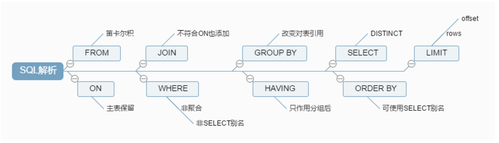
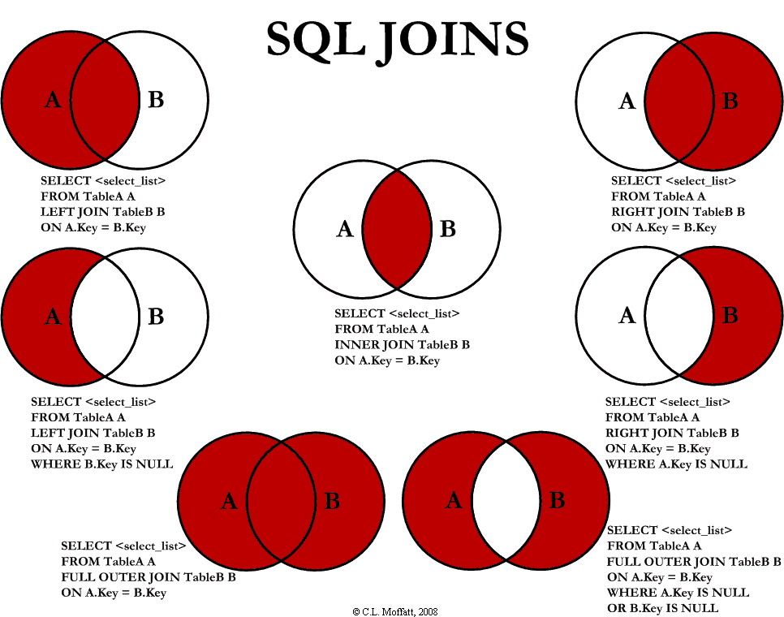
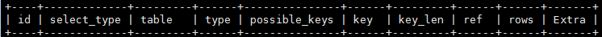
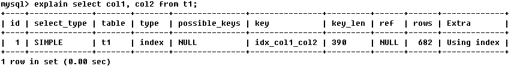
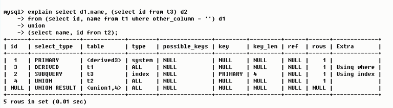

MySQL 3万字总结 + 面试100问，吊打面试官绰绰有余（不收藏算我输）


1. limit 100000 加载很慢的话，你是怎么解决的呢？


8. 数据库和缓存的一致性问题。先更新数据库，再更新缓存，若更新完数据库了，还没有更新缓存，此时有请求过来了，访问到了缓存中的数据，怎么办？

11. 


数据库索引？B+树？为什么要建索引？什么样的字段需要建索引，建索引的时候一般考虑什么？索引会不会使插入、删除***作效率变低，怎么解决（分表***作）？

-------------

1. 如何选择合适的分布式主键方案呢？
2. 在高并发情况下，如何做到安全的修改同一行数据？
3. select for update有什么含义，会锁表还是锁行还是其他
4. 如果某个表有近千万数据，CRUD比较慢，如何优化
6. 数据库自增主键可能遇到什么问题
7. 数据库中间件了解过吗，sharding jdbc，mycat？
8. MYSQL的主从延迟，你怎么解决？
9. 说一下大表的优化方案
10. 什么是数据库连接池?为什么需要数据库连接池呢?
11. 数据库存储日期格式时，如何考虑时区转换问题？
12. MYSQL数据库服务器性能分析的方法命令有哪些?
13. 
14. mysql 的内连接、左连接、右连接有什么区别？
15. 什么是内连接、外连接、交叉连接、笛卡尔积呢？
16. mysql有关权限的表有哪几个呢？
17. Mysql的binlog有几种录入格式？分别有什么区别？
18. 百万级别或以上的数据，你是如何删除的？
19. 覆盖索引、回表等这些，了解过吗？
21. 联合索引是什么？为什么需要注意联合索引中的顺序？
22. 隔离级别与锁的关系
24. 什么是存储过程？有哪些优缺点？
25. SQL 约束有哪几种呢？
26. 谈谈六种关联查询，使用场景。
27. varchar(50)中50的涵义
28. UNION与UNION ALL的区别？
29. SQL的生命周期？
30. 
31. mysql自增主键用完了怎么办？
32. 字段为什么要求定义为not null？


## 一、MySQL架构

和其它数据库相比，MySQL有点与众不同，它的架构可以在多种不同场景中应用并发挥良好作用。主要体现在存储引擎的架构上，**插件式的存储引擎架构将查询处理和其它的系统任务以及数据的存储提取相分离**。这种架构可以根据业务的需求和实际需要选择合适的存储引擎。


- **连接层**：最上层是一些客户端和连接服务。**主要完成一些类似于连接处理、授权认证、及相关的安全方案**。在该层上引入了线程池的概念，为通过认证安全接入的客户端提供线程。同样在该层上可以实现基于SSL的安全链接。服务器也会为安全接入的每个客户端验证它所具有的操作权限。

- **服务层**：第二层服务层，主要完成大部分的核心服务功能， 包括查询解析、分析、优化、缓存、以及所有的内置函数，所有跨存储引擎的功能也都在这一层实现，包括触发器、存储过程、视图等 

- **引擎层**：第三层存储引擎层，存储引擎真正的负责了MySQL中数据的存储和提取，服务器通过API与存储引擎进行通信。不同的存储引擎具有的功能不同，这样我们可以根据自己的实际需要进行选取

- **存储层**：第四层为数据存储层，主要是将数据存储在运行于该设备的文件系统之上，并完成与存储引擎的交互


> 画出 MySQL 架构图，这种变态问题都能问的出来
>
> MySQL 的查询流程具体是？or 一条SQL语句在MySQL中如何执行的？
>

客户端请求 ---> 连接器（验证用户身份，给予权限）  ---> 查询缓存（存在缓存则直接返回，不存在则执行后续操作） ---> 分析器（对SQL进行词法分析和语法分析操作）  ---> 优化器（主要对执行的sql优化选择最优的执行方案方法）  ---> 执行器（执行时会先看用户是否有执行权限，有才去使用这个引擎提供的接口） ---> 去引擎层获取数据返回（如果开启查询缓存则会缓存查询结果）


> 说说MySQL有哪写存储引擎？都有哪些区别？

## 二、存储引擎

存储引擎是MySQL的组件，用于处理不同表类型的SQL操作。不同的存储引擎提供不同的存储机制、索引技巧、锁定水平等功能，使用不同的存储引擎，还可以获得特定的功能。

使用哪一种引擎可以灵活选择，**<mark>一个数据库中多个表可以使用不同引擎以满足各种性能和实际需求</mark>**，使用合适的存储引擎，将会提高整个数据库的性能 。

 MySQL服务器使用可插拔的存储引擎体系结构，可以从运行中的 MySQL 服务器加载或卸载存储引擎 。

### 查看存储引擎

```mysql
-- 查看支持的存储引擎
SHOW ENGINES

-- 查看默认存储引擎
SHOW VARIABLES LIKE 'storage_engine'

--查看具体某一个表所使用的存储引擎，这个默认存储引擎被修改了！
show create table tablename

--准确查看某个数据库中的某一表所使用的存储引擎
show table status like 'tablename'
show table status from database where name="tablename"
```

### 设置存储引擎

```mysql
-- 建表时指定存储引擎。默认的就是INNODB，不需要设置
CREATE TABLE t1 (i INT) ENGINE = INNODB;
CREATE TABLE t2 (i INT) ENGINE = CSV;
CREATE TABLE t3 (i INT) ENGINE = MEMORY;

-- 修改存储引擎
ALTER TABLE t ENGINE = InnoDB;

-- 修改默认存储引擎，也可以在配置文件my.cnf中修改默认引擎
SET default_storage_engine=NDBCLUSTER;
```

默认情况下，每当 `CREATE TABLE` 或 `ALTER TABLE` 不能使用默认存储引擎时，都会生成一个警告。为了防止在所需的引擎不可用时出现令人困惑的意外行为，可以启用 `NO_ENGINE_SUBSTITUTION SQL` 模式。如果所需的引擎不可用，则此设置将产生错误而不是警告，并且不会创建或更改表 


### 存储引擎对比

常问的存储引擎就 InnoDB、MyISAM、Memory、NDB

InnoDB 现在是 MySQL 默认的存储引擎，支持**事务、行级锁定和外键**

#### 文件存储结构对比

在 MySQL中建立任何一张数据表，在其数据目录对应的数据库目录下都有对应表的 `.frm` 文件，`.frm` 文件是用来保存每个数据表的元数据(meta)信息，包括表结构的定义等，与数据库存储引擎无关，也就是任何存储引擎的数据表都必须有.frm文件，命名方式为数据表名.frm，如user.frm。

MyISAM 物理文件结构为：

- `.frm`文件：与表相关的元数据信息都存放在frm文件，包括表结构的定义信息等
-  `.MYD` (`MYData`) 文件：MyISAM 存储引擎专用，用于存储MyISAM 表的数据
-  `.MYI` (`MYIndex`)文件：MyISAM 存储引擎专用，用于存储MyISAM 表的索引相关信息

InnoDB 物理文件结构为：

- `.frm` 文件：与表相关的元数据信息都存放在frm文件，包括表结构的定义信息等

- `.ibd` 文件和 `.ibdata` 文件： 这两种文件都是存放 InnoDB 数据的文件，之所以用两种文件来存放 InnoDB 的数据，是因为 InnoDB 的数据存储方式能够通过配置来决定是使用**共享表空间**存放存储数据，还是用**独享表空间**存放存储数据。

  独享表空间存储方式使用`.ibd`文件，并且每个表一个`.ibd`文件
  共享表空间存储方式使用`.ibdata`文件，所有表共同使用一个`.ibdata`文件（或多个，可自己配置）

> ps：正经公司，这些都有专业运维去做，数据备份、恢复啥的，让我一个 Javaer 搞这的话，加钱不？

#### 面试这么回答

1. InnoDB 支持事务，MyISAM 不支持事务。这是 MySQL 将默认存储引擎从 MyISAM 变成 InnoDB 的重要原因之一；
2. InnoDB 支持外键，而 MyISAM 不支持。对一个包含外键的 InnoDB 表转为 MYISAM 会失败；  
3. InnoDB 是聚集索引，MyISAM 是非聚集索引。聚簇索引的文件存放在主键索引的叶子节点上，因此 InnoDB 必须要有主键，通过主键索引效率很高。但是辅助索引需要两次查询，先查询到主键，然后再通过主键查询到数据。因此，主键不应该过大，因为主键太大，其他索引也都会很大。而 MyISAM 是非聚集索引，数据文件是分离的，索引保存的是数据文件的指针。主键索引和辅助索引是独立的。 
4. InnoDB 不保存表的具体行数，执行` select count(*) from table` 时需要全表扫描。而MyISAM 用一个变量保存了整个表的行数，执行上述语句时只需要读出该变量即可，速度很快；    
5. InnoDB 最小的锁粒度是行锁，MyISAM 最小的锁粒度是表锁。一个更新语句会锁住整张表，导致其他查询和更新都会被阻塞，因此并发访问受限。这也是 MySQL 将默认存储引擎从 MyISAM 变成 InnoDB 的重要原因之一；

| 对比项   | MyISAM                                                   | InnoDB                                                       |
| -------- | -------------------------------------------------------- | ------------------------------------------------------------ |
| 主外键   | 不支持                                                   | 支持                                                         |
| 事务     | 不支持                                                   | 支持                                                         |
| 行表锁   | 表锁，即使操作一条记录也会锁住整个表，不适合高并发的操作 | 行锁,操作时只锁某一行，不对其它行有影响，<br/>适合高并发的操作 |
| 缓存     | 只缓存索引，不缓存真实数据                               | 不仅缓存索引还要缓存真实数据，对内存要求较高，而且内存大小对性能有决定性的影响 |
| 表空间   | 小                                                       | 大                                                           |
| 关注点   | 性能                                                     | 事务                                                         |
| 默认安装 | 是                                                       | 是                                                           |

 

> 一张表，里面有ID自增主键，当insert了17条记录之后，删除了第15,16,17条记录，再把Mysql重启，再insert一条记录，这条记录的ID是18还是15 ？

如果表的类型是MyISAM，那么是18。因为MyISAM表会把自增主键的最大ID 记录到数据文件中，重启MySQL自增主键的最大ID也不会丢失；

如果表的类型是InnoDB，那么是15。因为InnoDB 表只是把自增主键的最大ID记录到内存中，所以重启数据库或对表进行OPTION操作，都会导致最大ID丢失。

> 哪个存储引擎执行 select count(*) 更快，为什么?

MyISAM更快，因为MyISAM内部维护了一个计数器，可以直接调取。

- 在 MyISAM 存储引擎中，把表的总行数存储在磁盘上，当执行 select count(\*) from t 时，直接返回总数据。

- 在 InnoDB 存储引擎中，跟 MyISAM 不一样，没有将总行数存储在磁盘上，当执行 select count(\*) from t 时，会先把数据读出来，一行一行的累加，最后返回总数量。

InnoDB 中 count(\*) 语句是在执行的时候，全表扫描统计总数量，所以当数据越来越大时，语句就越来越耗时了，为什么 InnoDB 引擎不像 MyISAM 引擎一样，将总行数存储到磁盘上？这跟 InnoDB 的事务特性有关，由于多版本并发控制（MVCC）的原因，InnoDB 表“应该返回多少行”也是不确定的。


## 三、数据类型

> CHAR 和 VARCHAR 的区别？

char是固定长度，varchar长度可变：

存储时，前者不管实际存储数据的长度，直接规定CHAR规定的长度分配存储空间；而后者会根据实际存储的数据分配最终的存储空间

相同点：

1. char(n)，varchar(n)中的n都代表字符的个数
2. 超过char，varchar最大长度n的限制后，字符串会被截断。

不同点：

1. char不论实际存储的字符数都会占用n个字符的空间，而varchar只会占用实际字符应该占用的字节空间加1（实际长度length，0<=length<255）或加2（length>255）。因为varchar保存数据时除了要保存字符串之外还会加一个字节来记录长度（如果列声明长度大于255则使用两个字节来保存长度）。
2. 能存储的最大空间限制不一样：char的存储上限为255字节。
3. char在存储时会截断尾部的空格，而varchar不会。

char是适合存储很短的、一般固定长度的字符串。例如，char非常适合存储密码的MD5值，因为这是一个定长的值。对于非常短的列，char比varchar在存储空间上也更有效率。


> 列的字符串类型可以是什么？

字符串类型是：SET、BLOB、ENUM、CHAR、CHAR、TEXT、VARCHAR


> BLOB和TEXT有什么区别？

BLOB是一个二进制对象，可以容纳可变数量的数据。有四种类型的BLOB：TINYBLOB、BLOB、MEDIUMBLO和 LONGBLOB

TEXT是一个不区分大小写的BLOB。四种TEXT类型：TINYTEXT、TEXT、MEDIUMTEXT 和 LONGTEXT。

BLOB 保存二进制数据，TEXT 保存字符数据。


>说说你对 MySQL 索引的理解？
>
>数据库索引的原理，为什么要用 B+树，为什么不用二叉树？
>
>聚集索引与非聚集索引的区别？
>
>InnoDB引擎中的索引策略，了解过吗？
>
>创建索引的方式有哪些？
>
>聚簇索引/非聚簇索引，mysql索引底层实现，为什么不用B-tree，为什么不用hash，叶子结点存放的是数据还是指向数据的内存地址，使用索引需要注意的几个地方？

## 四、索引

- MYSQL官方对索引的定义为：索引（Index）是帮助MySQL高效获取数据的数据结构，所以说**索引的本质是：数据结构**

- 索引的目的在于提高查询效率，可以类比字典、 火车站的车次表、图书的目录等 。

- 可以简单的理解为“排好序的快速查找数据结构”，数据本身之外，<font color=#FF0000>**数据库还维护者一个满足特定查找算法的数据结构**</font>，这些数据结构以某种方式引用（指向）数据，这样就可以在这些数据结构上实现高级查找算法。这种数据结构，就是索引。下图是一种可能的索引方式示例。

  

  左边的数据表，一共有两列七条记录，最左边的是数据记录的物理地址

  为了加快Col2的查找，可以维护一个右边所示的二叉查找树，每个节点分别包含索引键值，和一个指向对应数据记录物理地址的指针，这样就可以运用二叉查找在一定的复杂度内获取到对应的数据，从而快速检索出符合条件的记录。

- 索引本身也很大，不可能全部存储在内存中，**一般以索引文件的形式存储在磁盘上**

- 平常说的索引，没有特别指明的话，就是B+树（多路搜索树，不一定是二叉树）结构组织的索引。其中聚集索引，次要索引，覆盖索引，符合索引，前缀索引，唯一索引默认都是使用B+树索引，统称索引。此外还有哈希索引等。


### 基本语法：

- 创建：

  - 创建索引：`CREATE [UNIQUE] INDEX indexName ON mytable(username(length));`

    如果是CHAR，VARCHAR类型，length可以小于字段实际长度；如果是BLOB和TEXT类型，必须指定 length。

  - 修改表结构(添加索引)：`ALTER table tableName ADD [UNIQUE] INDEX  indexName(columnName)`

- 删除：`DROP INDEX [indexName] ON mytable;`

- 查看：`SHOW INDEX FROM table_name\G`             --可以通过添加 \G 来格式化输出信息。

- 使用ALERT命令

  - `ALTER TABLE tbl_name ADD PRIMARY KEY (column_list):` 该语句添加一个主键，这意味着索引值必须是唯一的，且不能为NULL。
  - `ALTER TABLE tbl_name ADD UNIQUE index_name (column_list` 这条语句创建索引的值必须是唯一的（除了NULL外，NULL可能会出现多次）。
  - `ALTER TABLE tbl_name ADD INDEX index_name (column_list)` 添加普通索引，索引值可出现多次。
  - `ALTER TABLE tbl_name ADD FULLTEXT index_name (column_list)`该语句指定了索引为 FULLTEXT ，用于全文索引。


### 优势

- **提高数据检索效率，降低数据库IO成本**

- **降低数据排序的成本，降低CPU的消耗**

  

### 劣势

- 索引也是一张表，保存了主键和索引字段，并指向实体表的记录，所以也需要占用内存
- 虽然索引大大提高了查询速度，同时却会降低更新表的速度，如对表进行INSERT、UPDATE和DELETE。
  因为更新表时，MySQL不仅要保存数据，还要保存一下索引文件每次更新添加了索引列的字段，
  都会调整因为更新所带来的键值变化后的索引信息


### MySQL索引分类

#### 数据结构角度

- B+树索引 
- Hash索引
- Full-Text全文索引
- R-Tree索引

#### 从物理存储角度

- 聚集索引（clustered index） 

- 非聚集索引（non-clustered index），也叫辅助索引（secondary index）

  聚集索引和非聚集索引都是B+树结构

####  从逻辑角度 

-  主键索引：主键索引是一种特殊的唯一索引，不允许有空值 
-  普通索引或者单列索引：每个索引只包含单个列，一个表可以有多个单列索引
-  多列索引（复合索引）：复合索引指多个字段上创建的索引，只有在查询条件中使用了创建索引时的第一个字段，索引才会被使用。使用复合索引时遵循最左前缀集合 
-  唯一索引或者非唯一索引
-  空间索引：空间索引是对空间数据类型的字段建立的索引，MYSQL中的空间数据类型有4种，分别是GEOMETRY、POINT、LINESTRING、POLYGON。
   MYSQL使用SPATIAL关键字进行扩展，使得能够用于创建正规索引类型的语法创建空间索引。创建空间索引的列，必须将其声明为NOT NULL，空间索引只能在存储引擎为MYISAM的表中创建 


> 为什么MySQL 索引中用B+tree，不用B-tree 或者其他树，为什么不用 Hash 索引
>
> 聚簇索引/非聚簇索引，MySQL 索引底层实现，叶子结点存放的是数据还是指向数据的内存地址，使用索引需要注意的几个地方？
>
> 使用索引查询一定能提高查询的性能吗？为什么?

### MySQL索引结构

**首先要明白索引（index）是在存储引擎（storage engine）层面实现的，而不是server层面**。不是所有的存储引擎都支持所有的索引类型。即使多个存储引擎支持某一索引类型，它们的实现和行为也可能有所差别。 

#### B+Tree索引

MyISAM和 InnoDB 存储引擎，都使用 B+Tree的数据结构，它相对与 BTree结构，所有的数据都存放在叶子节点上，且把叶子节点通过指针连接到一起，形成了一条数据链表，以加快相邻数据的检索效率。

**先了解下 B-Tree 和 B+Tree 的区别**

##### B-Tree

B-Tree是为磁盘等外存储设备设计的一种平衡查找树。

系统从磁盘读取数据到内存时是以磁盘块（block）为基本单位的，位于同一个磁盘块中的数据会被一次性读取出来，而不是需要什么取什么。

InnoDB存储引擎中有页（Page）的概念，页是其磁盘管理的最小单位。InnoDB 存储引擎中默认每个页的大小为16KB，可通过参数 `innodb_page_size` 将页的大小设置为 4K、8K、16K，在 MySQL 中可通过如下命令查看页的大小：`show variables like *'innodb_page_size';`

而系统一个磁盘块的存储空间往往没有这么大，因此 InnoDB 每次申请磁盘空间时都会是若干地址连续磁盘块来达到页的大小 16KB。InnoDB 在把磁盘数据读入到磁盘时会以页为基本单位，在查询数据时如果一个页中的每条数据都能有助于定位数据记录的位置，这将会减少磁盘I/O次数，提高查询效率。

B-Tree 结构的数据可以让系统高效的找到数据所在的磁盘块。为了描述 B-Tree，首先定义一条记录为一个二元组[key, data] ，key为记录的键值，对应表中的主键值，data 为一行记录中除主键外的数据。对于不同的记录，key值互不相同。

一棵m阶的B-Tree有如下特性： 
1. 每个节点最多有m个孩子。 
2. 除了根节点和叶子节点外，其它每个节点至少有Ceil(m/2)个孩子。 
3. 若根节点不是叶子节点，则至少有2个孩子 
4. 所有叶子节点都在同一层，且不包含其它关键字信息 
5. 每个非终端节点包含n个关键字信息（P0,P1,…Pn, k1,…kn） 
6. 关键字的个数n满足：ceil(m/2)-1 <= n <= m-1 
7. ki(i=1,…n)为关键字，且关键字升序排序。 
8. Pi(i=1,…n)为指向子树根节点的指针。P(i-1)指向的子树的所有节点关键字均小于ki，但都大于k(i-1)

B-Tree 中的每个节点根据实际情况可以包含大量的关键字信息和分支，如下图所示为一个 3 阶的 B-Tree：


每个节点占用一个盘块的磁盘空间，一个节点上有两个升序排序的关键字和三个指向子树根节点的指针，指针存储的是子节点所在磁盘块的地址。两个关键词划分成的三个范围域对应三个指针指向的子树的数据的范围域。以根节点为例，关键字为17和35，P1指针指向的子树的数据范围为小于17，P2指针指向的子树的数据范围为17~35，P3指针指向的子树的数据范围为大于35。

模拟查找关键字29的过程：

1. 根据根节点找到磁盘块1，读入内存。【磁盘I/O操作第1次】
2. 比较关键字29在区间（17,35），找到磁盘块1的指针P2。
3. 根据P2指针找到磁盘块3，读入内存。【磁盘I/O操作第2次】
4. 比较关键字29在区间（26,30），找到磁盘块3的指针P2。
5. 根据P2指针找到磁盘块8，读入内存。【磁盘I/O操作第3次】
6. 在磁盘块8中的关键字列表中找到关键字29。

分析上面过程，发现需要3次磁盘I/O操作，和3次内存查找操作。由于内存中的关键字是一个有序表结构，可以利用二分法查找提高效率。而3次磁盘I/O操作是影响整个B-Tree查找效率的决定因素。B-Tree相对于AVLTree缩减了节点个数，使每次磁盘I/O取到内存的数据都发挥了作用，从而提高了查询效率。

##### B+Tree

B+Tree是在B-Tree基础上的一种优化，使其更适合实现外存储索引结构，InnoDB存储引擎就是用B+Tree实现其索引结构。

从上一节中的B-Tree结构图中可以看到每个节点中不仅包含数据的key值，还有data值。而每一个页的存储空间是有限的，如果data数据较大时将会导致每个节点（即一个页）能存储的key的数量很小，当存储的数据量很大时同样会导致B-Tree的深度较大，增大查询时的磁盘I/O次数，进而影响查询效率。在B+Tree中，所有数据记录节点都是按照键值大小顺序存放在同一层的叶子节点上，而非叶子节点上只存储key值信息，这样可以大大加大每个节点存储的key值数量，降低B+Tree的高度。

B+Tree相对于B-Tree有几点不同：

1. 非叶子节点只存储键值信息；
2. 所有叶子节点之间都有一个链指针；
3. 数据记录都存放在叶子节点中

将上一节中的B-Tree优化，由于B+Tree的非叶子节点只存储键值信息，假设每个磁盘块能存储4个键值及指针信息，则变成B+Tree后其结构如下图所示： 


通常在B+Tree上有两个头指针，一个指向根节点，另一个指向关键字最小的叶子节点，而且所有叶子节点（即数据节点）之间是一种链式环结构。因此可以对B+Tree进行两种查找运算：一种是对于主键的范围查找和分页查找，另一种是从根节点开始，进行随机查找。

可能上面例子中只有22条数据记录，看不出B+Tree的优点，下面做一个推算：

InnoDB存储引擎中页的大小为16KB，一般表的主键类型为INT（占用4个字节）或BIGINT（占用8个字节），指针类型也一般为4或8个字节，也就是说一个页（B+Tree中的一个节点）中大概存储16KB/(8B+8B)=1K个键值（因为是估值，为方便计算，这里的K取值为〖10〗^3）。也就是说一个深度为3的B+Tree索引可以维护10^3 * 10^3 * 10^3 = 10亿 条记录。

实际情况中每个节点可能不能填充满，因此在数据库中，B+Tree的高度一般都在2-4层。MySQL的InnoDB存储引擎在设计时是将根节点常驻内存的，也就是说查找某一键值的行记录时最多只需要1~3次磁盘I/O操作。

B+Tree性质

1. 通过上面的分析，我们知道IO次数取决于b+数的高度h，假设当前数据表的数据为N，每个磁盘块的数据项的数量是m，则有h=㏒(m+1)N，当数据量N一定的情况下，m越大，h越小；而m = 磁盘块的大小 / 数据项的大小，磁盘块的大小也就是一个数据页的大小，是固定的，如果数据项占的空间越小，数据项的数量越多，树的高度越低。这就是为什么每个数据项，即索引字段要尽量的小，比如int占4字节，要比bigint8字节少一半。这也是为什么b+树要求把真实的数据放到叶子节点而不是内层节点，一旦放到内层节点，磁盘块的数据项会大幅度下降，导致树增高。当数据项等于1时将会退化成线性表。
2. 当b+树的数据项是复合的数据结构，比如(name,age,sex)的时候，b+数是按照从左到右的顺序来建立搜索树的，比如当(张三,20,F)这样的数据来检索的时候，b+树会优先比较name来确定下一步的所搜方向，如果name相同再依次比较age和sex，最后得到检索的数据；但当(20,F)这样的没有name的数据来的时候，b+树就不知道下一步该查哪个节点，因为建立搜索树的时候name就是第一个比较因子，必须要先根据name来搜索才能知道下一步去哪里查询。比如当(张三,F)这样的数据来检索时，b+树可以用name来指定搜索方向，但下一个字段age的缺失，所以只能把名字等于张三的数据都找到，然后再匹配性别是F的数据了， 这个是非常重要的性质，即索引的最左匹配特性。


##### MyISAM主键索引与辅助索引的结构

MyISAM引擎的索引文件和数据文件是分离的。**<mark>MyISAM引擎索引结构的叶子节点的数据域，存放的并不是实际的数据记录，而是数据记录的地址</mark>**。索引文件与数据文件分离，这样的索引称为***"<mark>非聚簇索引</mark>"***。MyISAM的主索引与辅助索引区别并不大，只是主键索引不能有重复的关键字。 


在MyISAM中，索引（含叶子节点）存放在单独的.myi文件中，叶子节点存放的是数据的物理地址偏移量（通过偏移量访问就是随机访问，速度很快）。

主索引是指主键索引，键值不可能重复；辅助索引则是普通索引，键值可能重复。

通过索引查找数据的流程：先从索引文件中查找到索引节点，从中拿到数据的文件指针，再到数据文件中通过文件指针定位了具体的数据。辅助索引类似。


##### InnoDB主键索引与辅助索引的结构

**InnoDB引擎索引结构的叶子节点的数据域，存放的就是实际的数据记录**（对于主索引，此处会存放表中所有的数据记录；对于辅助索引此处会引用主键，检索的时候通过主键到主键索引中找到对应数据行），或者说，InnoDB的数据文件本身就是主键索引文件，这样的索引被称为"<mark>“聚簇索引”</mark>，一个表只能有一个聚簇索引。

###### 主键索引：

我们知道InnoDB索引是聚集索引，它的索引和数据是存入同一个.idb文件中的，因此它的索引结构是在同一个树节点中同时存放索引和数据，如下图中最底层的叶子节点有三行数据，对应于数据表中的id、stu_id、name数据项。


在Innodb中，索引分叶子节点和非叶子节点，非叶子节点就像新华字典的目录，单独存放在索引段中，叶子节点则是顺序排列的，在数据段中。Innodb的数据文件可以按照表来切分（只需要开启innodb_file_per_table)，切分后存放在xxx.ibd中，默认不切分，存放在xxx.ibdata中。

###### 辅助（非主键）索引：

这次我们以示例中学生表中的name列建立辅助索引，它的索引结构跟主键索引的结构有很大差别，在最底层的叶子结点有两行数据，第一行的字符串是辅助索引，按照ASCII码进行排序，第二行的整数是主键的值。

这就意味着，对name列进行条件搜索，需要两个步骤：①在辅助索引上检索name，到达其叶子节点获取对应的主键；②使用主键在主索引上再进行对应的检索操作


**InnoDB索引结构需要注意的点**

1. 数据文件本身就是索引文件

2. 表数据文件本身就是按B+Tree组织的一个索引结构文件
3. 聚集索引中叶节点包含了完整的数据记录
4. InnoDB表必须要有主键，并且推荐使用整型自增主键

正如我们上面介绍InnoDB存储结构，索引与数据是共同存储的，不管是主键索引还是辅助索引，在查找时都是通过先查找到索引节点才能拿到相对应的数据，如果我们在设计表结构时没有显式指定索引列的话，MySQL会从表中选择数据不重复的列建立索引，如果没有符合的列，则MySQL自动为InnoDB表生成一个隐含字段作为主键，并且这个字段长度为6个字节，类型为整型。

> 那为什么推荐使用整型自增主键而不是选择UUID？

- UUID是字符串，比整型消耗更多的存储空间；
- 在B+树中进行查找时需要跟经过的节点值比较大小，整型数据的比较运算比字符串更快速；
- 自增的整型索引在磁盘中会连续存储，在读取一页数据时也是连续；UUID是随机产生的，读取的上下两行数据存储是分散的，不适合执行where id > 5 && id < 20的条件查询语句。
- 在插入或删除数据时，整型自增主键会在叶子结点的末尾建立新的叶子节点，不会破坏左侧子树的结构；UUID主键很容易出现这样的情况，B+树为了维持自身的特性，有可能会进行结构的重构，消耗更多的时间。

> 为什么非主键索引结构叶子节点存储的是主键值？

保证数据一致性和节省存储空间，可以这么理解：商城系统订单表会存储一个用户ID作为关联外键，而不推荐存储完整的用户信息，因为当我们用户表中的信息（真实名称、手机号、收货地址···）修改后，不需要再次维护订单表的用户数据，同时也节省了存储空间。


#### Hash索引

- 主要就是通过Hash算法（常见的Hash算法有直接定址法、平方取中法、折叠法、除数取余法、随机数法），将数据库字段数据转换成定长的Hash值，与这条数据的行指针一并存入Hash表的对应位置；如果发生Hash碰撞（两个不同关键字的Hash值相同），则在对应Hash键下以链表形式存储。

  检索算法：在检索查询时，就再次对待查关键字再次执行相同的Hash算法，得到Hash值，到对应Hash表对应位置取出数据即可，如果发生Hash碰撞，则需要在取值时进行筛选。目前使用Hash索引的数据库并不多，主要有Memory等。

  MySQL目前有Memory引擎和NDB引擎支持Hash索引。


#### full-text全文索引

-  全文索引也是MyISAM的一种特殊索引类型，主要用于全文索引，InnoDB从MYSQL5.6版本提供对全文索引的支持。 

-  它用于替代效率较低的LIKE模糊匹配操作，而且可以通过多字段组合的全文索引一次性全模糊匹配多个字段。 
-  同样使用B-Tree存放索引数据，但使用的是特定的算法，将字段数据分割后再进行索引（一般每4个字节一次分割），索引文件存储的是分割前的索引字符串集合，与分割后的索引信息，对应Btree结构的节点存储的是分割后的词信息以及它在分割前的索引字符串集合中的位置。 

#### R-Tree空间索引

空间索引是MyISAM的一种特殊索引类型，主要用于地理空间数据类型 


> 为什么Mysql索引要用B+树不是B树？

用B+树不用B树考虑的是IO对性能的影响，B树的每个节点都存储数据，而B+树只有叶子节点才存储数据，所以查找相同数据量的情况下，B树的高度更高，IO更频繁。数据库索引是存储在磁盘上的，当数据量大时，就不能把整个索引全部加载到内存了，只能逐一加载每一个磁盘页（对应索引树的节点）。其中在MySQL底层对B+树进行进一步优化：在叶子节点中是双向链表，且在链表的头结点和尾节点也是循环指向的。


> 面试官：为何不采用Hash方式？

因为Hash索引底层是哈希表，哈希表是一种以key-value存储数据的结构，所以多个数据在存储关系上是完全没有任何顺序关系的，所以，对于区间查询是无法直接通过索引查询的，就需要全表扫描。所以，哈希索引只适用于等值查询的场景。而B+ Tree是一种多路平衡查询树，所以他的节点是天然有序的（左子节点小于父节点、父节点小于右子节点），所以对于范围查询的时候不需要做全表扫描。

哈希索引不支持多列联合索引的最左匹配规则 如果有大量重复键值得情况下，哈希索引的效率会很低，因为存在哈希碰撞问题。


### 哪些情况需要创建索引

1. 主键自动建立唯一索引

2. 频繁作为查询条件的字段

3. 查询中与其他表关联的字段，外键关系建立索引

4. 单键/组合索引的选择问题，who?高并发下倾向创建组合索引

5. 查询中排序的字段，排序字段通过索引访问大幅提高排序速度

6. 查询中统计或分组字段


### 哪些情况不要创建索引

1. 表记录太少
2. 经常增删改的表
3. 数据重复且分布均匀的表字段，只应该为最经常查询和最经常排序的数据列建立索引（如果某个数据类包含太多的重复数据，建立索引没有太大意义）
4. 频繁更新的字段不适合创建索引（会加重IO负担）
5. where条件里用不到的字段不创建索引


### MySQL高效索引

**覆盖索引**（Covering Index）,或者叫索引覆盖， 也就是平时所说的不需要回表操作 

- 就是select的数据列只用从索引中就能够取得，不必读取数据行，MySQL可以利用索引返回select列表中的字段，而不必根据索引再次读取数据文件，换句话说**查询列要被所建的索引覆盖**。

- 索引是高效找到行的一个方法，但是一般数据库也能使用索引找到一个列的数据，因此它不必读取整个行。毕竟索引叶子节点存储了它们索引的数据，当能通过读取索引就可以得到想要的数据，那就不需要读取行了。一个索引包含（覆盖）满足查询结果的数据就叫做覆盖索引。

- **判断标准** 

  使用explain，可以通过输出的extra列来判断，对于一个索引覆盖查询，显示为**using index**，MySQL查询优化器在执行查询前会决定是否有索引覆盖查询 


## 五、MySQL查询

> count(*) 和 count(1)和count(列名)区别  ps：这道题结果还有待确定

执行效果上：

- count(*)包括了所有的列，相当于行数，在统计结果的时候，不会忽略列值为NULL 
- count(1)包括了忽略所有列，用1代表代码行，在统计结果的时候，不会忽略列值为NULL 
- count(列名)只包括列名那一列，在统计结果的时候，会忽略列值为空（这里的空不是只空字符串或者0，而是表示null）的计数，即某个字段值为NULL时，不统计。

执行效率上：

- 列名为主键，count(列名)会比count(1)快 
- 列名不为主键，count(1)会比count(列名)快
- 如果表多个列并且没有主键，则 count（1） 的执行效率优于 count（*）
- 如果有主键，则 select count（主键）的执行效率是最优的 
- 如果表只有一个字段，则 select count（*）最优。


> MySQL中 in和 exists 的区别？

- exists：exists对外表用loop逐条查询，每次查询都会查看exists的条件语句，当exists里的条件语句能够返回记录行时（无论记录行是的多少，只要能返回），条件就为真，返回当前loop到的这条记录；反之，如果exists里的条件语句不能返回记录行，则当前loop到的这条记录被丢弃，exists的条件就像一个bool条件，当能返回结果集则为true，不能返回结果集则为false
- in：in查询相当于多个or条件的叠加

```mysql
SELECT * FROM A WHERE A.id IN (SELECT id FROM B);
SELECT * FROM A WHERE EXISTS (SELECT * from B WHERE B.id = A.id);
```

**如果查询的两个表大小相当，那么用in和exists差别不大**。 

如果两个表中一个较小，一个是大表，则子查询表大的用exists，子查询表小的用in：


### SQL执行顺序

- 手写

  ```mysql
  SELECT DISTINCT <select_list>
  FROM  <left_table> <join_type>
  JOIN  <right_table> ON <join_condition>
  WHERE  <where_condition>
  GROUP BY  <group_by_list>
  HAVING <having_condition>
  ORDER BY <order_by_condition>
  LIMIT <limit_number>
  ```

- 机读

  ```mysql
  FROM  <left_table>
  ON <join_condition>
  <join_type> JOIN  <right_table> 
  WHERE  <where_condition>
  GROUP BY  <group_by_list>
  HAVING <having_condition>
  SELECT
  DISTINCT <select_list>
  ORDER BY <order_by_condition>
  LIMIT <limit_number>
  ```

- 总结

  

  

### Join图



### 

------


## 六、MySQL 事务

> 事务的隔离级别有哪些？MySQL的默认隔离级别是什么？
>
> 什么是幻读，脏读，不可重复读呢？
>
> MySQL事务得四大特性以及实现原理
>
> MVCC熟悉吗，它的底层原理？

MySQL 事务主要用于处理操作量大，复杂度高的数据。比如说，在人员管理系统中，你删除一个人员，你即需要删除人员的基本资料，也要删除和该人员相关的信息，如信箱，文章等等，这样，这些数据库操作语句就构成一个事务！ 


### ACID — 事务基本要素


事务是由一组SQL语句组成的逻辑处理单元，具有4个属性，通常简称为事务的ACID属性。

- **A (Atomicity) 原子性**：整个事务中的所有操作，要么全部完成，要么全部不完成，不可能停滞在中间某个环节。事务在执行过程中发生错误，会被回滚（Rollback）到事务开始前的状态，就像这个事务从来没有执行过一样
- **C (Consistency) 一致性**：在事务开始之前和事务结束以后，数据库的完整性约束没有被破坏
- **I (Isolation)隔离性**：一个事务的执行不能其它事务干扰。即一个事务内部的操作及使用的数据对其它并发事务是隔离的，并发执行的各个事务之间不能互相干扰
- **D (Durability) 持久性**：在事务完成以后，该事务所对数据库所作的更改便持久的保存在数据库之中，并不会被回滚


**并发事务处理带来的问题**

- 更新丢失（Lost Update)： 事务A和事务B选择同一行，然后基于最初选定的值更新该行时，由于两个事务都不知道彼此的存在，就会发生丢失更新问题 
- 脏读(Dirty Reads)：事务A读取了事务B更新的数据，然后B回滚操作，那么A读取到的数据是脏数据
- 不可重复读（Non-Repeatable Reads)：事务 A 多次读取同一数据，事务 B 在事务A多次读取的过程中，对数据作了更新并提交，导致事务A多次读取同一数据时，结果不一致。
- 幻读（Phantom Reads)：幻读与不可重复读类似。它发生在一个事务A读取了几行数据，接着另一个并发事务B插入了一些数据时。在随后的查询中，事务A就会发现多了一些原本不存在的记录，就好像发生了幻觉一样，所以称为幻读。


**幻读和不可重复读的区别：**

- 不可重复读的重点是修改：在同一事务中，同样的条件，第一次读的数据和第二次读的数据不一样。（因为中间有其他事务提交了修改）
- 幻读的重点在于新增或者删除：在同一事务中，同样的条件,，第一次和第二次读出来的记录数不一样。（因为中间有其他事务提交了插入/删除）


**并发事务处理带来的问题的解决办法：**

- “更新丢失”通常是应该完全避免的。但防止更新丢失，并不能单靠数据库事务控制器来解决，需要应用程序对要更新的数据加必要的锁来解决，因此，防止更新丢失应该是应用的责任。

- “脏读” 、 “不可重复读”和“幻读” ，其实都是数据库读一致性问题，必须由数据库提供一定的事务隔离机制来解决：

  - 一种是加锁：在读取数据前，对其加锁，阻止其他事务对数据进行修改。
  - 另一种是数据多版本并发控制（MultiVersion Concurrency Control，简称 **MVCC** 或 MCC），也称为多版本数据库：不用加任何锁， 通过一定机制生成一个数据请求时间点的一致性数据快照 （Snapshot)， 并用这个快照来提供一定级别 （语句级或事务级） 的一致性读取。从用户的角度来看，好象是数据库可以提供同一数据的多个版本。


查看当前数据库的事务隔离级别：  

```mysql
show variables like 'tx_isolation'
```


### 事务隔离级别

数据库事务的隔离级别有4种，由低到高分别为

- **READ-UNCOMMITTED(读未提交)：** 最低的隔离级别，允许读取尚未提交的数据变更，**可能会导致脏读、幻读或不可重复读**。
- **READ-COMMITTED(读已提交)：** 允许读取并发事务已经提交的数据，**可以阻止脏读，但是幻读或不可重复读仍有可能发生**。
- **REPEATABLE-READ(可重复读)：** 对同一字段的多次读取结果都是一致的，除非数据是被本身事务自己所修改，**可以阻止脏读和不可重复读，但幻读仍有可能发生**。
- **SERIALIZABLE(可串行化)：** 最高的隔离级别，完全服从ACID的隔离级别。所有的事务依次逐个执行，这样事务之间就完全不可能产生干扰，也就是说，**该级别可以防止脏读、不可重复读以及幻读**。


下面通过事例一一阐述在事务的并发操作中可能会出现脏读，不可重复读，幻读和事务隔离级别的联系。

数据库的事务隔离越严格，并发副作用越小，但付出的代价就越大，因为事务隔离实质上就是使事务在一定程度上“串行化”进行，这显然与“并发”是矛盾的。同时，不同的应用对读一致性和事务隔离程度的要求也是不同的，比如许多应用对“不可重复读”和“幻读”并不敏感，可能更关系数据并发访问的能力。

#### Read uncommitted

读未提交，就是一个事务可以读取另一个未提交事务的数据。

事例：老板要给程序员发工资，程序员的工资是3.6万/月。但是发工资时老板不小心按错了数字，按成3.9万/月，该钱已经打到程序员的户口，但是事务还没有提交，就在这时，程序员去查看自己这个月的工资，发现比往常多了3千元，以为涨工资了非常高兴。但是老板及时发现了不对，马上回滚差点就提交了的事务，将数字改成3.6万再提交。

分析：实际程序员这个月的工资还是3.6万，但是程序员看到的是3.9万。他看到的是老板还没提交事务时的数据。这就是脏读。

那怎么解决脏读呢？Read committed！读提交，能解决脏读问题。

#### Read committed

读提交，顾名思义，就是一个事务要等另一个事务提交后才能读取数据。

事例：程序员拿着信用卡去享受生活（卡里当然是只有3.6万），当他埋单时（程序员事务开启），收费系统事先检测到他的卡里有3.6万，就在这个时候！！程序员的妻子要把钱全部转出充当家用，并提交。当收费系统准备扣款时，再检测卡里的金额，发现已经没钱了（第二次检测金额当然要等待妻子转出金额事务提交完）。程序员就会很郁闷，明明卡里是有钱的…

分析：这就是读提交，若有事务对数据进行更新（UPDATE）操作时，读操作事务要等待这个更新操作事务提交后才能读取数据，可以解决脏读问题。但在这个事例中，出现了一个事务范围内两个相同的查询却返回了不同数据，这就是不可重复读。

那怎么解决可能的不可重复读问题？Repeatable read ！

#### Repeatable read

重复读，就是在开始读取数据（事务开启）时，不再允许修改操作。 <mark>**MySQL的默认事务隔离级别** </mark>

事例：程序员拿着信用卡去享受生活（卡里当然是只有3.6万），当他埋单时（事务开启，不允许其他事务的UPDATE修改操作），收费系统事先检测到他的卡里有3.6万。这个时候他的妻子不能转出金额了。接下来收费系统就可以扣款了。

分析：重复读可以解决不可重复读问题。写到这里，应该明白的一点就是，不可重复读对应的是修改，即UPDATE操作。但是可能还会有幻读问题。因为幻读问题对应的是插入INSERT操作，而不是UPDATE操作。

**什么时候会出现幻读？**

事例：程序员某一天去消费，花了2千元，然后他的妻子去查看他今天的消费记录（全表扫描FTS，妻子事务开启），看到确实是花了2千元，就在这个时候，程序员花了1万买了一部电脑，即新增INSERT了一条消费记录，并提交。当妻子打印程序员的消费记录清单时（妻子事务提交），发现花了1.2万元，似乎出现了幻觉，这就是幻读。

那怎么解决幻读问题？Serializable！

#### Serializable 序列化

Serializable 是最高的事务隔离级别，在该级别下，事务串行化顺序执行，可以避免脏读、不可重复读与幻读。简单来说，Serializable会在读取的每一行数据上都加锁，所以可能导致大量的超时和锁争用问题。这种事务隔离级别效率低下，比较耗数据库性能，一般不使用。


#### 比较

| 事务隔离级别                 | 读数据一致性                             | 脏读 | 不可重复读 | 幻读 |
| ---------------------------- | ---------------------------------------- | ---- | ---------- | ---- |
| 读未提交（read-uncommitted） | 最低级被，只能保证不读取物理上损坏的数据 | 是   | 是         | 是   |
| 读已提交（read-committed）   | 语句级                                   | 否   | 是         | 是   |
| 可重复读（repeatable-read）  | 事务级                                   | 否   | 否         | 是   |
| 串行化（serializable）       | 最高级别，事务级                         | 否   | 否         | 否   |

需要说明的是，事务隔离级别和数据访问的并发性是对立的，事务隔离级别越高并发性就越差。所以要根据具体的应用来确定合适的事务隔离级别，这个地方没有万能的原则。


MySQL InnoDB 存储引擎的默认支持的隔离级别是 **REPEATABLE-READ（可重读）**。我们可以通过`SELECT @@tx_isolation;`命令来查看,MySQL 8.0 该命令改为`SELECT @@transaction_isolation;`

这里需要注意的是：与 SQL 标准不同的地方在于InnoDB 存储引擎在 **REPEATABLE-READ（可重读）**事务隔离级别下使用的是Next-Key Lock 算法，因此可以避免幻读的产生，这与其他数据库系统(如 SQL Server)是不同的。所以说InnoDB 存储引擎的默认支持的隔离级别是 REPEATABLE-READ（可重读）已经可以完全保证事务的隔离性要求，即达到了 SQL标准的 **SERIALIZABLE(可串行化)**隔离级别，而且保留了比较好的并发性能。

因为隔离级别越低，事务请求的锁越少，所以大部分数据库系统的隔离级别都是**READ-COMMITTED(读已提交):**，但是你要知道的是InnoDB 存储引擎默认使用 **REPEATABLE-READ（可重读）**并不会有任何性能损失。


### MVCC 多版本并发控制

MySQL的大多数事务型存储引擎实现都不是简单的行级锁。基于提升并发性考虑，一般都同时实现了多版本并发控制（MVCC），包括Oracle、PostgreSQL。只是实现机制各不相同。

可以认为 MVCC 是行级锁的一个变种，但它在很多情况下避免了加锁操作，因此开销更低。虽然实现机制有所不同，但大都实现了非阻塞的读操作，写操作也只是锁定必要的行。

MVCC 的实现是通过保存数据在某个时间点的快照来实现的。也就是说不管需要执行多长时间，每个事物看到的数据都是一致的。

典型的MVCC实现方式，分为**乐观（optimistic）并发控制和悲观（pressimistic）并发控制**。下边通过InnoDB的简化版行为来说明MVCC是如何工作的。

InnoDB的MVCC，是通过在每行记录后面保存两个隐藏的列来实现。这两个列，一个保存了行的创建时间，一个保存行的过期时间（删除时间）。当然存储的并不是真实的时间，而是系统版本号（system version number）。每开始一个新的事务，系统版本号都会自动递增。事务开始时刻的系统版本号会作为事务的版本号，用来和查询到的每行记录的版本号进行比较。 

**REPEATABLE READ（可重读）隔离级别下MVCC如何工作：**

- SELECT

  InnoDB会根据以下两个条件检查每行记录：

  - InnoDB只查找版本早于当前事务版本的数据行，这样可以确保事务读取的行，要么是在开始事务之前已经存在要么是事务自身插入或者修改过的

  - 行的删除版本号要么未定义，要么大于当前事务版本号，这样可以确保事务读取到的行在事务开始之前未被删除

  只有符合上述两个条件的才会被查询出来

- INSERT

  InnoDB为新插入的每一行保存当前系统版本号作为行版本号

- DELETE

  InnoDB为删除的每一行保存当前系统版本号作为行删除标识

- UPDATE

  InnoDB为插入的一行新纪录保存当前系统版本号作为行版本号，同时保存当前系统版本号到原来的行作为删除标识

保存这两个额外系统版本号，使大多数操作都不用加锁。使数据操作简单，性能很好，并且也能保证只会读取到符合要求的行。不足之处是每行记录都需要额外的存储空间，需要做更多的行检查工作和一些额外的维护工作。

MVCC 只在 COMMITTED READ（读提交）和REPEATABLE READ（可重复读）两种隔离级别下工作。


### 事务日志

InnoDB使用日志来减少提交事务时的开销。因为日志中已经记录了事务，就无须在每个事务提交时把缓冲池的脏块刷新(flush)到磁盘中。

事务修改的数据和索引通常会映射到表空间的随机位置，所以刷新这些变更到磁盘需要很多随机IO。

InnoDB假设使用常规磁盘，随机IO比顺序IO昂贵得多，因为一个IO请求需要时间把磁头移到正确的位置，然后等待磁盘上读出需要的部分，再转到开始位置。

InnoDB用日志把随机IO变成顺序IO。一旦日志安全写到磁盘，事务就持久化了，即使断电了，InnoDB可以重放日志并且恢复已经提交的事务。

InnoDB使用一个后台线程智能地刷新这些变更到数据文件。这个线程可以批量组合写入，使得数据写入更顺序，以提高效率。

事务日志可以帮助提高事务效率：

- 使用事务日志，存储引擎在修改表的数据时只需要修改其内存拷贝，再把该修改行为记录到持久在硬盘上的事务日志中，而不用每次都将修改的数据本身持久到磁盘。
- 事务日志采用的是追加的方式，因此写日志的操作是磁盘上一小块区域内的顺序I/O，而不像随机I/O需要在磁盘的多个地方移动磁头，所以采用事务日志的方式相对来说要快得多。
- 事务日志持久以后，内存中被修改的数据在后台可以慢慢刷回到磁盘。
- 如果数据的修改已经记录到事务日志并持久化，但数据本身没有写回到磁盘，此时系统崩溃，存储引擎在重启时能够自动恢复这一部分修改的数据。

目前来说，大多数存储引擎都是这样实现的，我们通常称之为**预写式日志**（Write-Ahead Logging），修改数据需要写两次磁盘。


### 事务的实现

事务的实现是基于数据库的存储引擎。不同的存储引擎对事务的支持程度不一样。Mysql 中支持事务的存储引擎有 InnoDB 和 NDB。 

事务的实现就是如何实现ACID特性。

事务的隔离性是通过锁实现，而事务的原子性、一致性和持久性则是通过事务日志实现 。


> 事务是如何通过日志来实现的，说得越深入越好。

事务日志包括：**重做日志redo**和**回滚日志undo**

- **redo log（重做日志**） 实现持久化和原子性

  在innoDB的存储引擎中，事务日志通过重做(redo)日志和innoDB存储引擎的日志缓冲(InnoDB Log Buffer)实现。事务开启时，事务中的操作，都会先写入存储引擎的日志缓冲中，在事务提交之前，这些缓冲的日志都需要提前刷新到磁盘上持久化，这就是DBA们口中常说的“日志先行”(Write-Ahead Logging)。当事务提交之后，在Buffer Pool中映射的数据文件才会慢慢刷新到磁盘。此时如果数据库崩溃或者宕机，那么当系统重启进行恢复时，就可以根据redo log中记录的日志，把数据库恢复到崩溃前的一个状态。未完成的事务，可以继续提交，也可以选择回滚，这基于恢复的策略而定。

  在系统启动的时候，就已经为redo log分配了一块连续的存储空间，以顺序追加的方式记录Redo Log，通过顺序IO来改善性能。所有的事务共享redo log的存储空间，它们的Redo Log按语句的执行顺序，依次交替的记录在一起。

- **undo log（回滚日志）**  实现一致性

  undo log 主要为事务的回滚服务。在事务执行的过程中，除了记录redo log，还会记录一定量的undo log。undo log记录了数据在每个操作前的状态，如果事务执行过程中需要回滚，就可以根据undo log进行回滚操作。单个事务的回滚，只会回滚当前事务做的操作，并不会影响到其他的事务做的操作。 

  Undo记录的是已部分完成并且写入硬盘的未完成的事务，默认情况下回滚日志是记录下表空间中的（共享表空间或者独享表空间）

二种日志均可以视为一种恢复操作，redo_log是恢复提交事务修改的页操作，而undo_log是回滚行记录到特定版本。二者记录的内容也不同，redo_log是物理日志，记录页的物理修改操作，而undo_log是逻辑日志，根据每行记录进行记录。


> 又引出个问题：你知道MySQL 有多少种日志吗？

- **错误日志**：记录出错信息，也记录一些警告信息或者正确的信息。

- **查询日志**：记录所有对数据库请求的信息，不论这些请求是否得到了正确的执行。

- **慢查询日志**：设置一个阈值，将运行时间超过该值的所有SQL语句都记录到慢查询的日志文件中。

- **二进制日志**：记录对数据库执行更改的所有操作。

- **中继日志**：中继日志也是二进制日志，用来给slave 库恢复

- **事务日志**：重做日志redo和回滚日志undo


> 分布式事务相关问题，可能还会问到 2PC、3PC，，，

### MySQL对分布式事务的支持

分布式事务的实现方式有很多，既可以采用 InnoDB 提供的原生的事务支持，也可以采用消息队列来实现分布式事务的最终一致性。这里我们主要聊一下innoDB对分布式事务的支持。

MySQL 从 5.0.3  InnoDB 存储引擎开始支持支持XA协议的分布式事务。一个分布式事务会涉及多个行动，这些行动本身是事务性的。所有行动都必须一起成功完成，或者一起被回滚。

在MySQL中，使用分布式事务涉及一个或多个资源管理器和一个事务管理器。


如图，mysql的分布式事务模型。模型中分三块：应用程序（AP）、资源管理器（RM）、事务管理器（TM）:

- 应用程序：定义了事务的边界，指定需要做哪些事务；
- 资源管理器：提供了访问事务的方法，通常一个数据库就是一个资源管理器；
- 事务管理器：协调参与了全局事务中的各个事务。

分布式事务采用两段式提交（two-phase commit）的方式：

- 第一阶段所有的事务节点开始准备，告诉事务管理器ready。
- 第二阶段事务管理器告诉每个节点是commit还是rollback。如果有一个节点失败，就需要全局的节点全部rollback，以此保障事务的原子性。

 

------


> 数据库的乐观锁和悲观锁？
>
> MySQL 中有哪几种锁，列举一下？
>
> MySQL中InnoDB引擎的行锁是怎么实现的？
>
> MySQL 间隙锁有没有了解，死锁有没有了解，写一段会造成死锁的 sql 语句，死锁发生了如何解决，MySQL 有没有提供什么机制去解决死锁

## 七、MySQL锁机制

锁是计算机协调多个进程或线程并发访问某一资源的机制。

在数据库中，除传统的计算资源（如CPU、RAM、I/O等）的争用以外，数据也是一种供许多用户共享的资源。数据库锁定机制简单来说，就是数据库为了保证数据的一致性，而使各种共享资源在被并发访问变得有序所设计的一种规则。

打个比方，我们到淘宝上买一件商品，商品只有一件库存，这个时候如果还有另一个人买，那么如何解决是你买到还是另一个人买到的问题？这里肯定要用到事物，我们先从库存表中取出物品数量，然后插入订单，付款后插入付款表信息，然后更新商品数量。在这个过程中，使用锁可以对有限的资源进行保护，解决隔离和并发的矛盾。

 

### 锁的分类

**从对数据操作的类型分类**：

- **读锁**（共享锁）：针对同一份数据，多个读操作可以同时进行，不会互相影响

- **写锁**（排他锁）：当前写操作没有完成前，它会阻断其他写锁和读锁

**从对数据操作的粒度分类**：


为了尽可能提高数据库的并发度，每次锁定的数据范围越小越好，理论上每次只锁定当前操作的数据的方案会得到最大的并发度，但是管理锁是很耗资源的事情（涉及获取，检查，释放锁等动作），因此数据库系统需要在高并发响应和系统性能两方面进行平衡，这样就产生了“锁粒度（Lock granularity）”的概念。

- **表级锁**：开销小，加锁快；不会出现死锁；锁定粒度大，发生锁冲突的概率最高，并发度最低（MyISAM 和 MEMORY 存储引擎采用的是表级锁）；

- **行级锁**：开销大，加锁慢；会出现死锁；锁定粒度最小，发生锁冲突的概率最低，并发度也最高（InnoDB 存储引擎既支持行级锁也支持表级锁，但默认情况下是采用行级锁）；  

- **页面锁**：开销和加锁时间界于表锁和行锁之间；会出现死锁；锁定粒度界于表锁和行锁之间，并发度一般。

适用：从锁的角度来说，表级锁更适合于以查询为主，只有少量按索引条件更新数据的应用，如Web应用；而行级锁则更适合于有大量按索引条件并发更新少量不同数据，同时又有并发查询的应用，如一些在线事务处理（OLTP）系统。

|        | 行锁 | 表锁 | 页锁 |
| ------ | ---- | ---- | ---- |
| MyISAM |      | √    |      |
| BDB    |      | √    | √    |
| InnoDB | √    | √    |      |
| Memory |      | √    |      |


### MyISAM 表锁

MyISAM 的表锁有两种模式：

- 表共享读锁 （Table Read Lock）：不会阻塞其他用户对同一表的读请求，但会阻塞对同一表的写请求；
- 表独占写锁 （Table Write Lock）：会阻塞其他用户对同一表的读和写操作；

MyISAM 表的读操作与写操作之间，以及写操作之间是串行的。当一个线程获得对一个表的写锁后， 只有持有锁的线程可以对表进行更新操作。 其他线程的读、 写操作都会等待，直到锁被释放为止。

默认情况下，写锁比读锁具有更高的优先级：当一个锁释放时，这个锁会优先给写锁队列中等候的获取锁请求，然后再给读锁队列中等候的获取锁请求。


### InnoDB 行锁

InnoDB 实现了以下两种类型的**行锁**：

- 共享锁（S）：允许一个事务去读一行，阻止其他事务获得相同数据集的排他锁。
- 排他锁（X）：允许获得排他锁的事务更新数据，阻止其他事务取得相同数据集的共享读锁和排他写锁。

为了允许行锁和表锁共存，实现多粒度锁机制，InnoDB 还有两种内部使用的意向锁（Intention Locks），这两种意向锁都是**表锁**：

- 意向共享锁（IS）：事务打算给数据行加行共享锁，事务在给一个数据行加共享锁前必须先取得该表的 IS 锁。
- 意向排他锁（IX）：事务打算给数据行加行排他锁，事务在给一个数据行加排他锁前必须先取得该表的 IX 锁。

索引失效会导致行锁变表锁。比如 vchar查询不写单引号的情况。

#### 加锁机制

**乐观锁与悲观锁是两种并发控制的思想，可用于解决丢失更新问题** 

乐观锁会“乐观地”假定大概率不会发生并发更新冲突，访问、处理数据过程中不加锁，只在更新数据时再根据版本号或时间戳判断是否有冲突，有则处理，无则提交事务；

悲观锁会“悲观地”假定大概率会发生并发更新冲突，访问、处理数据前就加排他锁，在整个数据处理过程中锁定数据，事务提交或回滚后才释放锁；


#### 锁模式

- **记录锁(Record Locks)**： 对索引项加锁，锁定符合条件的行。其他事务不能修改和删除加锁项； 
- gap锁： 对索引项之间的“间隙”加锁，锁定记录的范围（对第一条记录前的间隙或最后一条将记录后的间隙加锁），不包含索引项本身。其他事务不能在锁范围内插入数据，这样就防止了别的事务新增幻影行。 
- **临键锁(Next-key Locks)**： **临键锁**，是**记录锁与间隙锁的组合**，它的封锁范围，既包含索引记录，又包含索引区间。(临键锁的主要目的，也是为了避免**幻读**(Phantom Read)。如果把事务的隔离级别降级为RC，临键锁则也会失效。)
- 意向锁
- 插入意向锁


> MySQL 遇到过死锁问题吗，你是如何解决的？

### 死锁

**死锁产生：**

- 死锁是指两个或多个事务在同一资源上相互占用，并请求锁定对方占用的资源，从而导致恶性循环
- 当事务试图以不同的顺序锁定资源时，就可能产生死锁。多个事务同时锁定同一个资源时也可能会产生死锁
- 锁的行为和顺序和存储引擎相关。以同样的顺序执行语句，有些存储引擎会产生死锁有些不会——死锁有双重原因：真正的数据冲突；存储引擎的实现方式。

**检测死锁：**数据库系统实现了各种死锁检测和死锁超时的机制。InnoDB存储引擎能检测到死锁的循环依赖并立即返回一个错误。

**死锁恢复：**死锁发生以后，只有部分或完全回滚其中一个事务，才能打破死锁，InnoDB目前处理死锁的方法是，将持有最少行级排他锁的事务进行回滚。所以事务型应用程序在设计时必须考虑如何处理死锁，多数情况下只需要重新执行因死锁回滚的事务即可。

**外部锁的死锁检测：**发生死锁后，InnoDB 一般都能自动检测到，并使一个事务释放锁并回退，另一个事务获得锁，继续完成事务。但在涉及外部锁，或涉及表锁的情况下，InnoDB 并不能完全自动检测到死锁， 这需要通过设置锁等待超时参数 innodb_lock_wait_timeout 来解决

**死锁影响性能：**死锁会影响性能而不是会产生严重错误，因为InnoDB会自动检测死锁状况并回滚其中一个受影响的事务。在高并发系统上，当许多线程等待同一个锁时，死锁检测可能导致速度变慢。 有时当发生死锁时，禁用死锁检测（使用innodb_deadlock_detect配置选项）可能会更有效，这时可以依赖innodb_lock_wait_timeout设置进行事务回滚。


**MyISAM避免死锁**：

- 在自动加锁的情况下，MyISAM 总是一次获得 SQL 语句所需要的全部锁，所以 MyISAM 表不会出现死锁。

**InnoDB避免死锁**：

- 为了在单个InnoDB表上执行多个并发写入操作时避免死锁，可以在事务开始时通过为预期要修改的每个元祖（行）使用SELECT ... FOR UPDATE语句来获取必要的锁，即使这些行的更改语句是在之后才执行的。
- 在事务中，如果要更新记录，应该直接申请足够级别的锁，即排他锁，而不应先申请共享锁、更新时再申请排他锁，因为这时候当用户再申请排他锁时，其他事务可能又已经获得了相同记录的共享锁，从而造成锁冲突，甚至死锁
- 如果事务需要修改或锁定多个表，则应在每个事务中以相同的顺序使用加锁语句。 在应用中，如果不同的程序会并发存取多个表，应尽量约定以相同的顺序来访问表，这样可以大大降低产生死锁的机会
- 通过SELECT ... LOCK IN SHARE MODE获取行的读锁后，如果当前事务再需要对该记录进行更新操作，则很有可能造成死锁。
- 改变事务隔离级别

如果出现死锁，可以用 SHOW INNODB STATUS 命令来确定最后一个死锁产生的原因。返回结果中包括死锁相关事务的详细信息，如引发死锁的 SQL 语句，事务已经获得的锁，正在等待什么锁，以及被回滚的事务等。据此可以分析死锁产生的原因和改进措施。

------


## 八、MySQL调优

> 日常工作中你是怎么优化SQL的？
>
> SQL优化的一般步骤是什么，怎么看执行计划（explain），如何理解其中各个字段的含义？
>
> 如何写sql能够有效的使用到复合索引？
>
> 一条sql执行过长的时间，你如何优化，从哪些方面入手？
>
> 什么是最左前缀原则？什么是最左匹配原则？

### 影响mysql的性能因素

- 业务需求对MySQL的影响(合适合度)

- 存储定位对MySQL的影响
  - 不适合放进MySQL的数据
    - 二进制多媒体数据
    - 流水队列数据
    - 超大文本数据
  - 需要放进缓存的数据
    - 系统各种配置及规则数据
    - 活跃用户的基本信息数据
    - 活跃用户的个性化定制信息数据
    - 准实时的统计信息数据
    - 其他一些访问频繁但变更较少的数据

- Schema设计对系统的性能影响
  - 尽量减少对数据库访问的请求
  - 尽量减少无用数据的查询请求

- 硬件环境对系统性能的影响


### 性能分析

#### MySQL Query Optimizer

1. MySQL 中有专门负责优化 SELECT 语句的优化器模块，主要功能：通过计算分析系统中收集到的统计信息，为客户端请求的 Query 提供他认为最优的执行计划（他认为最优的数据检索方式，但不见得是 DBA 认为是最优的，这部分最耗费时间）

2. 当客户端向 MySQL 请求一条 Query，命令解析器模块完成请求分类，区别出是 SELECT 并转发给 MySQL Query Optimize r时，MySQL Query Optimizer 首先会对整条 Query 进行优化，处理掉一些常量表达式的预算，直接换算成常量值。并对 Query 中的查询条件进行简化和转换，如去掉一些无用或显而易见的条件、结构调整等。然后分析 Query 中的 Hint 信息（如果有），看显示 Hint 信息是否可以完全确定该 Query 的执行计划。如果没有 Hint 或 Hint 信息还不足以完全确定执行计划，则会读取所涉及对象的统计信息，根据 Query 进行写相应的计算分析，然后再得出最后的执行计划。

#### MySQL常见瓶颈

- CPU：CPU在饱和的时候一般发生在数据装入内存或从磁盘上读取数据时候

- IO：磁盘I/O瓶颈发生在装入数据远大于内存容量的时候

- 服务器硬件的性能瓶颈：top，free，iostat 和 vmstat来查看系统的性能状态

#### 性能下降SQL慢 执行时间长 等待时间长 原因分析

- 查询语句写的烂
- 索引失效（单值、复合）
- 关联查询太多join（设计缺陷或不得已的需求）
- 服务器调优及各个参数设置（缓冲、线程数等）


#### MySQL常见性能分析手段

在优化MySQL时，通常需要对数据库进行分析，常见的分析手段有**慢查询日志**，**EXPLAIN 分析查询**，**profiling分析**以及**show命令查询系统状态及系统变量**，通过定位分析性能的瓶颈，才能更好的优化数据库系统的性能。

#####  性能瓶颈定位 

我们可以通过 show 命令查看 MySQL 状态及变量，找到系统的瓶颈：

```mysql
Mysql> show status ——显示状态信息（扩展show status like ‘XXX’）

Mysql> show variables ——显示系统变量（扩展show variables like ‘XXX’）

Mysql> show innodb status ——显示InnoDB存储引擎的状态

Mysql> show processlist ——查看当前SQL执行，包括执行状态、是否锁表等

Shell> mysqladmin variables -u username -p password——显示系统变量

Shell> mysqladmin extended-status -u username -p password——显示状态信息
```


##### Explain(执行计划)

是什么：使用 **Explain** 关键字可以模拟优化器执行SQL查询语句，从而知道 MySQL 是如何处理你的 SQL 语句的。分析你的查询语句或是表结构的性能瓶颈

能干吗：
- 表的读取顺序
- 数据读取操作的操作类型
- 哪些索引可以使用
- 哪些索引被实际使用
- 表之间的引用
- 每张表有多少行被优化器查询

怎么玩：

- Explain + SQL语句
- 执行计划包含的信息（如果有分区表的话还会有**partitions**）



各字段解释

- <mark>**id**</mark>（select 查询的序列号，包含一组数字，表示查询中执行select子句或操作表的顺序）

  - id相同，执行顺序从上往下
  - id全不同，如果是子查询，id的序号会递增，id值越大优先级越高，越先被执行
  - id部分相同，执行顺序是先按照数字大的先执行，然后数字相同的按照从上往下的顺序执行

- <mark> **select_type**</mark>（查询类型，用于区别普通查询、联合查询、子查询等复杂查询）

  - **SIMPLE** ：简单的select查询，查询中不包含子查询或UNION
  - **PRIMARY**：查询中若包含任何复杂的子部分，最外层查询被标记为PRIMARY
  - **SUBQUERY**：在select或where列表中包含了子查询
  - **DERIVED**：在from列表中包含的子查询被标记为DERIVED，MySQL会递归执行这些子查询，把结果放在临时表里
  - **UNION**：若第二个select出现在UNION之后，则被标记为UNION，若UNION包含在from子句的子查询中，外层select将被标记为DERIVED
  - **UNION RESULT**：从UNION表获取结果的select

- <mark> **table**</mark>（显示这一行的数据是关于哪张表的）

- <mark> **type**</mark>（显示查询使用了那种类型，从最好到最差依次排列	**system > const > eq_ref > ref > fulltext > ref_or_null > index_merge > unique_subquery > index_subquery > range > index > ALL** ）

  - system：表只有一行记录（等于系统表），是 const 类型的特例，平时不会出现
  - const：表示通过索引一次就找到了，const 用于比较 primary key 或 unique 索引，因为只要匹配一行数据，所以很快，如将主键置于 where 列表中，mysql 就能将该查询转换为一个常量
  - eq_ref：唯一性索引扫描，对于每个索引键，表中只有一条记录与之匹配，常见于主键或唯一索引扫描
  - ref：非唯一性索引扫描，范围匹配某个单独值得所有行。本质上也是一种索引访问，他返回所有匹配某个单独值的行，然而，它可能也会找到多个符合条件的行，多以他应该属于查找和扫描的混合体
  - range：只检索给定范围的行，使用一个索引来选择行。key列显示使用了哪个索引，一般就是在你的where语句中出现了between、<、>、in等的查询，这种范围扫描索引比全表扫描要好，因为它只需开始于索引的某一点，而结束于另一点，不用扫描全部索引
  - index：Full Index Scan，index于ALL区别为index类型只遍历索引树。通常比ALL快，因为索引文件通常比数据文件小。（**也就是说虽然all和index都是读全表，但index是从索引中读取的，而all是从硬盘中读的**）
  - ALL：Full Table Scan，将遍历全表找到匹配的行

  tip: 一般来说，得保证查询至少达到range级别，最好到达ref

- <mark> **possible_keys**</mark>（显示可能应用在这张表中的索引，一个或多个，查询涉及到的字段若存在索引，则该索引将被列出，但不一定被查询实际使用）

- <mark> **key**</mark> 

  - 实际使用的索引，如果为NULL，则没有使用索引

  - **查询中若使用了覆盖索引，则该索引和查询的 select 字段重叠，仅出现在key列表中**



- <mark> **key_len**</mark>

  - 表示索引中使用的字节数，可通过该列计算查询中使用的索引的长度。在不损失精确性的情况下，长度越短越好
  - key_len显示的值为索引字段的最大可能长度，并非实际使用长度，即key_len是根据表定义计算而得，不是通过表内检索出的

- <mark> **ref**</mark> （显示索引的哪一列被使用了，如果可能的话，是一个常数。哪些列或常量被用于查找索引列上的值）

- <mark> **rows**</mark> （根据表统计信息及索引选用情况，大致估算找到所需的记录所需要读取的行数）

- <mark> **Extra**</mark>（包含不适合在其他列中显示但十分重要的额外信息）

  1. <font color=red>using filesort</font>: 说明mysql会对数据使用一个外部的索引排序，不是按照表内的索引顺序进行读取。mysql中无法利用索引完成的排序操作称为“文件排序”。常见于order by和group by语句中

  2. <font color=red>Using temporary</font>：使用了临时表保存中间结果，mysql在对查询结果排序时使用临时表。常见于排序order by和分组查询group by。

  3. <font color=red>using index</font>：表示相应的select操作中使用了覆盖索引，避免访问了表的数据行，效率不错，如果同时出现using where，表明索引被用来执行索引键值的查找；否则索引被用来读取数据而非执行查找操作

  4. using where：使用了where过滤

  5. using join buffer：使用了连接缓存

  6. impossible where：where子句的值总是false，不能用来获取任何元祖

  7. select tables optimized away：在没有group by子句的情况下，基于索引优化操作或对于MyISAM存储引擎优化COUNT(*)操作，不必等到执行阶段再进行计算，查询执行计划生成的阶段即完成优化

  8. distinct：优化distinct操作，在找到第一匹配的元祖后即停止找同样值的动作

     

**case**:



1. 第一行（执行顺序4）：id列为1，表示是union里的第一个select，select_type列的primary表示该查询为外层查询，table列被标记为<derived3>，表示查询结果来自一个衍生表，其中derived3中3代表该查询衍生自第三个select查询，即id为3的select。【select d1.name......】

2. 第二行（执行顺序2）：id为3，是整个查询中第三个select的一部分。因查询包含在from中，所以为derived。【select id,name from t1 where other_column=''】
3. 第三行（执行顺序3）：select列表中的子查询select_type为subquery，为整个查询中的第二个select。【select id from t3】
4. 第四行（执行顺序1）：select_type为union，说明第四个select是union里的第二个select，最先执行【select name,id from t2】
5. 第五行（执行顺序5）：代表从union的临时表中读取行的阶段，table列的<union1,4>表示用第一个和第四个select的结果进行union操作。【两个结果union操作】


##### 慢查询日志

MySQL 的慢查询日志是 MySQL 提供的一种日志记录，它用来记录在 MySQL 中响应时间超过阈值的语句，具体指运行时间超过 `long_query_time` 值的 SQL，则会被记录到慢查询日志中。

- `long_query_time` 的默认值为10，意思是运行10秒以上的语句
- 默认情况下，MySQL数据库没有开启慢查询日志，需要手动设置参数开启

**查看开启状态**

```mysql
SHOW VARIABLES LIKE '%slow_query_log%'
```

**开启慢查询日志**

- 临时配置：

```mysql
mysql> set global slow_query_log='ON';
mysql> set global slow_query_log_file='/var/lib/mysql/hostname-slow.log';
mysql> set global long_query_time=2;
```

​	也可set文件位置，系统会默认给一个缺省文件host_name-slow.log

​	使用set操作开启慢查询日志只对当前数据库生效，如果MySQL重启则会失效。

- 永久配置

  修改配置文件my.cnf或my.ini，在[mysqld]一行下面加入两个配置参数

```mysql
[mysqld]
slow_query_log = ON
slow_query_log_file = /var/lib/mysql/hostname-slow.log
long_query_time = 3
```

注：log-slow-queries 参数为慢查询日志存放的位置，一般这个目录要有 MySQL 的运行帐号的可写权限，一般都将这个目录设置为 MySQL 的数据存放目录；long_query_time=2 中的 2 表示查询超过两秒才记录；在my.cnf或者 my.ini 中添加 log-queries-not-using-indexes 参数，表示记录下没有使用索引的查询。

可以用 `select sleep(4)` 验证是否成功开启。

在生产环境中，如果手工分析日志，查找、分析SQL，还是比较费劲的，所以MySQL提供了日志分析工具**mysqldumpslow**。

通过 mysqldumpslow --help 查看操作帮助信息

- 得到返回记录集最多的10个SQL

  `mysqldumpslow -s r -t 10 /var/lib/mysql/hostname-slow.log`

- 得到访问次数最多的10个SQL

  `mysqldumpslow -s c -t 10 /var/lib/mysql/hostname-slow.log`

- 得到按照时间排序的前10条里面含有左连接的查询语句

  `mysqldumpslow -s t -t 10 -g "left join" /var/lib/mysql/hostname-slow.log`

- 也可以和管道配合使用

  `mysqldumpslow -s r -t 10 /var/lib/mysql/hostname-slow.log | more`

**也可使用 pt-query-digest 分析 RDS MySQL 慢查询日志**


##### Show Profile 分析查询

通过慢日志查询可以知道哪些 SQL 语句执行效率低下，通过 explain 我们可以得知 SQL 语句的具体执行情况，索引使用等，还可以结合Show Profile命令查看执行状态。

- Show Profile 是 MySQL 提供可以用来分析当前会话中语句执行的资源消耗情况。可以用于SQL的调优的测量

- 默认情况下，参数处于关闭状态，并保存最近15次的运行结果

- 分析步骤

  1. 是否支持，看看当前的mysql版本是否支持

     ```mysql
     mysql>Show  variables like 'profiling';  --默认是关闭，使用前需要开启
     ```

  2. 开启功能，默认是关闭，使用前需要开启

     ```mysql
     mysql>set profiling=1;  
     ```

  3. 运行SQL

  4. 查看结果

     ```mysql
   mysql> show profiles;
     +----------+------------+---------------------------------+
   | Query_ID | Duration   | Query                           |
     +----------+------------+---------------------------------+
   |        1 | 0.00385450 | show variables like "profiling" |
     |        2 | 0.00170050 | show variables like "profiling" |
   |        3 | 0.00038025 | select * from t_base_user       |
     +----------+------------+---------------------------------+
   ```
  
  5. 诊断SQL，show profile cpu,block io for query  id(上一步前面的问题SQL数字号码)
  
  6. 日常开发需要注意的结论
  
     - converting HEAP to MyISAM 查询结果太大，内存都不够用了往磁盘上搬了。
  
     - create tmp table 创建临时表，这个要注意
  
     - Copying to tmp table on disk   把内存临时表复制到磁盘
  
     - locked


> 查询中哪些情况不会使用索引？

### 性能优化

#### 索引优化

1. 全值匹配我最爱
2. 最佳左前缀法则，比如建立了一个联合索引(a,b,c)，那么其实我们可利用的索引就有(a), (a,b), (a,b,c)
3. 不在索引列上做任何操作（计算、函数、(自动or手动)类型转换），会导致索引失效而转向全表扫描
4. 存储引擎不能使用索引中范围条件右边的列
5. 尽量使用覆盖索引(只访问索引的查询(索引列和查询列一致))，减少select 
7. is null ,is not null 也无法使用索引
8. like "xxxx%" 是可以用到索引的，like "%xxxx" 则不行(like "%xxx%" 同理)。like以通配符开头('%abc...')索引失效会变成全表扫描的操作，
9. 字符串不加单引号索引失效
10. 少用or，用它来连接时会索引失效
10. <，<=，=，>，>=，BETWEEN，IN 可用到索引，<>，not in ，!= 则不行，会导致全表扫描


**一般性建议**

- 对于单键索引，尽量选择针对当前query过滤性更好的索引

- 在选择组合索引的时候，当前Query中过滤性最好的字段在索引字段顺序中，位置越靠前越好。

- 在选择组合索引的时候，尽量选择可以能够包含当前query中的where字句中更多字段的索引

- 尽可能通过分析统计信息和调整query的写法来达到选择合适索引的目的

- 少用Hint强制索引

  

#### 查询优化

**永远小标驱动大表（小的数据集驱动大的数据集）**

```mysql
slect * from A where id in (select id from B)`等价于
#等价于
select id from B
select * from A where A.id=B.id
```

当 B 表的数据集必须小于 A 表的数据集时，用 in 优于 exists

```mysql
select * from A where exists (select 1 from B where B.id=A.id)
#等价于
select * from A
select * from B where B.id = A.id`
```

当 A 表的数据集小于B表的数据集时，用 exists优于用 in

注意：A表与B表的ID字段应建立索引。


**order by关键字优化**

- order by子句，尽量使用 Index 方式排序，避免使用 FileSort 方式排序

- MySQL 支持两种方式的排序，FileSort 和 Index，Index效率高，它指 MySQL 扫描索引本身完成排序，FileSort 效率较低；
- ORDER BY 满足两种情况，会使用Index方式排序；①ORDER BY语句使用索引最左前列 ②使用where子句与ORDER BY子句条件列组合满足索引最左前列

- 尽可能在索引列上完成排序操作，遵照索引建的最佳最前缀
- 如果不在索引列上，filesort 有两种算法，mysql就要启动双路排序和单路排序
  - 双路排序：MySQL 4.1之前是使用双路排序,字面意思就是两次扫描磁盘，最终得到数据
  - 单路排序：从磁盘读取查询需要的所有列，按照order by 列在 buffer对它们进行排序，然后扫描排序后的列表进行输出，效率高于双路排序

- 优化策略

  - 增大sort_buffer_size参数的设置
  - 增大max_lencth_for_sort_data参数的设置


**GROUP BY关键字优化**

- group by实质是先排序后进行分组，遵照索引建的最佳左前缀
- 当无法使用索引列，增大 `max_length_for_sort_data` 参数的设置，增大`sort_buffer_size`参数的设置
- where高于having，能写在where限定的条件就不要去having限定了


#### 数据类型优化

MySQL 支持的数据类型非常多，选择正确的数据类型对于获取高性能至关重要。不管存储哪种类型的数据，下面几个简单的原则都有助于做出更好的选择。

- 更小的通常更好：一般情况下，应该尽量使用可以正确存储数据的最小数据类型。

  简单就好：简单的数据类型通常需要更少的CPU周期。例如，整数比字符操作代价更低，因为字符集和校对规则（排序规则）使字符比较比整型比较复杂。

- 尽量避免NULL：通常情况下最好指定列为NOT NULL


>  https://www.jianshu.com/p/3c79039e82aa 

------


## 九、分区、分表、分库

### MySQL分区

一般情况下我们创建的表对应一组存储文件，使用`MyISAM`存储引擎时是一个`.MYI`和`.MYD`文件，使用`Innodb`存储引擎时是一个`.ibd`和`.frm`（表结构）文件。

当数据量较大时（一般千万条记录级别以上），MySQL的性能就会开始下降，这时我们就需要将数据分散到多组存储文件，保证其单个文件的执行效率

**能干嘛**

- 逻辑数据分割
- 提高单一的写和读应用速度
- 提高分区范围读查询的速度
- 分割数据能够有多个不同的物理文件路径
- 高效的保存历史数据

**怎么玩**

首先查看当前数据库是否支持分区

- MySQL5.6以及之前版本：  

  ```mysql
  SHOW VARIABLES LIKE '%partition%';
  ```

- MySQL5.6：

  ```mysql
  show plugins;
  ```

**分区类型及操作**

- **RANGE分区**：基于属于一个给定连续区间的列值，把多行分配给分区。mysql将会根据指定的拆分策略，,把数据放在不同的表文件上。相当于在文件上,被拆成了小块.但是,对外给客户的感觉还是一张表，透明的。

  按照 range 来分，就是每个库一段连续的数据，这个一般是按比如**时间范围**来的，比如交易表啊，销售表啊等，可以根据年月来存放数据。可能会产生热点问题，大量的流量都打在最新的数据上了。

  range 来分，好处在于说，扩容的时候很简单。

- **LIST分区**：类似于按RANGE分区，每个分区必须明确定义。它们的主要区别在于，LIST分区中每个分区的定义和选择是基于某列的值从属于一个值列表集中的一个值，而RANGE分区是从属于一个连续区间值的集合。

- **HASH分区**：基于用户定义的表达式的返回值来进行选择的分区，该表达式使用将要插入到表中的这些行的列值进行计算。这个函数可以包含MySQL 中有效的、产生非负整数值的任何表达式。

  hash 分发，好处在于说，可以平均分配每个库的数据量和请求压力；坏处在于说扩容起来比较麻烦，会有一个数据迁移的过程，之前的数据需要重新计算 hash 值重新分配到不同的库或表 

- **KEY分区**：类似于按HASH分区，区别在于KEY分区只支持计算一列或多列，且MySQL服务器提供其自身的哈希函数。必须有一列或多列包含整数值。

**看上去分区表很帅气，为什么大部分互联网还是更多的选择自己分库分表来水平扩展咧？**

- 分区表，分区键设计不太灵活，如果不走分区键，很容易出现全表锁
- 一旦数据并发量上来，如果在分区表实施关联，就是一个灾难
- 自己分库分表，自己掌控业务场景与访问模式，可控。分区表，研发写了一个sql，都不确定mysql是怎么玩的，不太可控


> 随着业务的发展，业务越来越复杂，应用的模块越来越多，总的数据量很大，高并发读写操作均超过单个数据库服务器的处理能力怎么办？

这个时候就出现了**数据分片**，数据分片指按照某个维度将存放在单一数据库中的数据分散地存放至多个数据库或表中。数据分片的有效手段就是对关系型数据库进行分库和分表。

区别于分区的是，分区一般都是放在单机里的，用的比较多的是时间范围分区，方便归档。只不过分库分表需要代码实现，分区则是mysql内部实现。分库分表和分区并不冲突，可以结合使用。


>说说分库与分表的设计

### MySQL分表

分表有两种分割方式，一种垂直拆分，另一种水平拆分。

- **垂直拆分**

  垂直分表，通常是按照业务功能的使用频次，把主要的、热门的字段放在一起做为主要表。然后把不常用的，按照各自的业务属性进行聚集，拆分到不同的次要表中；主要表和次要表的关系一般都是一对一的。

- **水平拆分(数据分片)**

  单表的容量不超过500W，否则建议水平拆分。是把一个表复制成同样表结构的不同表，然后把数据按照一定的规则划分，分别存储到这些表中，从而保证单表的容量不会太大，提升性能；当然这些结构一样的表，可以放在一个或多个数据库中。

  水平分割的几种方法：

  - 使用MD5哈希，做法是对UID进行md5加密，然后取前几位（我们这里取前两位），然后就可以将不同的UID哈希到不同的用户表（user_xx）中了。
  - 还可根据时间放入不同的表，比如：article_201601，article_201602。
  - 按热度拆分，高点击率的词条生成各自的一张表，低热度的词条都放在一张大表里，待低热度的词条达到一定的贴数后，再把低热度的表单独拆分成一张表。
  - 根据ID的值放入对应的表，第一个表user_0000，第二个100万的用户数据放在第二 个表user_0001中，随用户增加，直接添加用户表就行了。


### MySQL分库

> 为什么要分库?

数据库集群环境后都是多台 slave，基本满足了读取操作;  但是写入或者说大数据、频繁的写入操作对master性能影响就比较大，这个时候，单库并不能解决大规模并发写入的问题，所以就会考虑分库。

> 分库是什么？   

一个库里表太多了，导致了海量数据，系统性能下降，把原本存储于一个库的表拆分存储到多个库上， 通常是将表按照功能模块、关系密切程度划分出来，部署到不同库上。

优点：

- 减少增量数据写入时的锁对查询的影响

- 由于单表数量下降，常见的查询操作由于减少了需要扫描的记录，使得单表单次查询所需的检索行数变少，减少了磁盘IO，时延变短

但是它无法解决单表数据量太大的问题


**分库分表后的难题**

分布式事务的问题，数据的完整性和一致性问题。

数据操作维度问题：用户、交易、订单各个不同的维度，用户查询维度、产品数据分析维度的不同对比分析角度。 跨库联合查询的问题，可能需要两次查询 跨节点的count、order by、group by以及聚合函数问题，可能需要分别在各个节点上得到结果后在应用程序端进行合并 额外的数据管理负担，如：访问数据表的导航定位 额外的数据运算压力，如：需要在多个节点执行，然后再合并计算程序编码开发难度提升，没有太好的框架解决，更多依赖业务看如何分，如何合，是个难题。


> 配主从，正经公司的话，也不会让 Javaer 去搞的，但还是要知道

## 十、主从复制

### 复制的基本原理

- slave 会从 master 读取 binlog 来进行数据同步

- 三个步骤

  1. master将改变记录到二进制日志（binary log）。这些记录过程叫做二进制日志事件，binary log events；
  2. salve 将 master 的 binary log events 拷贝到它的中继日志（relay log）;
  3. slave 重做中继日志中的事件，将改变应用到自己的数据库中。MySQL 复制是异步且是串行化的。

  

### 复制的基本原则

- 每个 slave只有一个 master
- 每个 salve只能有一个唯一的服务器 ID
- 每个master可以有多个salve

### 复制的最大问题

- 延时

------


## 十一、其他问题

### 说一说三个范式

- 第一范式（1NF）：数据库表中的字段都是单一属性的，不可再分。这个单一属性由基本类型构成，包括整型、实数、字符型、逻辑型、日期型等。
- 第二范式（2NF）：数据库表中不存在非关键字段对任一候选关键字段的部分函数依赖（部分函数依赖指的是存在组合关键字中的某些字段决定非关键字段的情况），也即所有非关键字段都完全依赖于任意一组候选关键字。
- 第三范式（3NF）：在第二范式的基础上，数据表中如果不存在非关键字段对任一候选关键字段的传递函数依赖则符合第三范式。所谓传递函数依赖，指的是如 果存在"A → B → C"的决定关系，则C传递函数依赖于A。因此，满足第三范式的数据库表应该不存在如下依赖关系： 关键字段 → 非关键字段 x → 非关键字段y


## 参考与感谢：

https://zhuanlan.zhihu.com/p/29150809

https://juejin.im/post/5e3eb616f265da570d734dcb#heading-105

https://blog.csdn.net/yin767833376/article/details/81511377


 