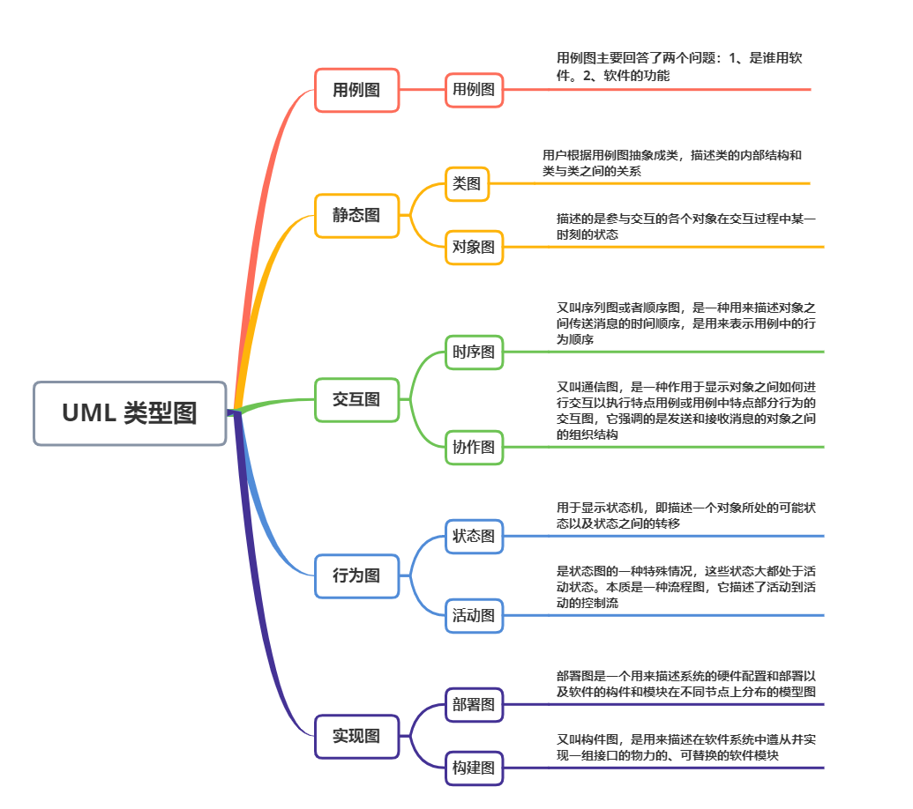

## 软件设计模式概述

### 软件设计模式的产生背景

“设计模式”这个术语最初并不是出现在软件设计中，而是被用于建筑领域的设计中。
1977 年，美国著名建筑大师、加利福尼亚大学伯克利分校环境结构中心主任克里斯托夫·亚历山大（Christopher Alexander）在他的著作《建筑模式语言：城镇、建筑、构造（A Pattern Language: Towns Building Construction）中描述了一些常见的建筑设计问题，并提出了 253 种关于对城镇、邻里、住宅、花园和房间等进行设计的基本模式。

1987 年，肯特·贝克（Kent Beck）和沃德·坎宁安（Ward Cunningham）首先将克里斯托夫·亚历山大的模式思想应用在 Smalltalk 中的图形用户接口的生成中，但没有引起软件界的关注。

1994 年，艾瑞克·伽马（ErichGamma）、理査德·海尔姆（Richard Helm）、拉尔夫·约翰森（Ralph Johnson）、约翰·威利斯迪斯（John Vlissides）等 4 位作者合作出版了《设计模式：可复用面向对象软件的基础》（Design Patterns: Elements of Reusable Object-Oriented Software）一书，在本教程中收录了 23 个设计模式，这是设计模式领域里程碑的事件，导致了软件设计模式的突破。这 4 位作者在软件开发领域里也以他们的“四人组”（Gang of Four，**GoF**）匿名著称。

### 软件设计模式的概念与意义

#### 1. 软件设计模式的概念

软件设计模式（Software Design Pattern），又称设计模式，是一套被反复使用、多数人知晓的、经过分类编目的、代码设计经验的总结。它描述了在软件设计过程中的一些不断重复发生的问题，以及该问题的解决方案。也就是说，它是解决特定问题的一系列套路，是前辈们的代码设计经验的总结，具有一定的普遍性，可以反复使用。其目的是为了提高代码的可重用性、代码的可读性和代码的可靠性。

#### 2. 学习设计模式的意义

设计模式的本质是面向对象设计原则的实际运用，是对类的封装性、继承性和多态性以及类的关联关系和组合关系的充分理解。正确使用设计模式具有以下优点。

- 可以提高程序员的思维能力、编程能力和设计能力。
- 使程序设计更加标准化、代码编制更加工程化，使软件开发效率大大提高，从而缩短软件的开发周期。
- 使设计的代码可重用性高、可读性强、可靠性高、灵活性好、可维护性强。

## 软件设计模式的基本要素

软件设计模式使人们可以更加简单方便地复用成功的设计和体系结构，它通常包含以下几个基本要素：模式名称、别名、动机、问题、解决方案、效果、结构、模式角色、合作关系、实现方法、适用性、已知应用、例程、模式扩展和相关模式等，其中最关键的元素包括以下 4 个主要部分。

#### 1. 模式名称

每一个模式都有自己的名字，通常用一两个词来描述，可以根据模式的问题、特点、解决方案、功能和效果来命名。模式名称（PatternName）有助于我们理解和记忆该模式，也方便我们来讨论自己的设计。

#### 2. 问题

问题（Problem）描述了该模式的应用环境，即何时使用该模式。它解释了设计问题和问题存在的前因后果，以及必须满足的一系列先决条件。

#### 3. 解决方案

模式问题的解决方案（Solution）包括设计的组成成分、它们之间的相互关系及各自的职责和协作方式。因为模式就像一个模板，可应用于多种不同场合，所以解决方案并不描述一个特定而具体的设计或实现，而是提供设计问题的抽象描述和怎样用一个具有一般意义的元素组合（类或对象的 组合）来解决这个问题。

#### 4. 效果

描述了模式的应用效果以及使用该模式应该权衡的问题，即模式的优缺点。主要是对时间和空间的衡量，以及该模式对系统的灵活性、扩充性、可移植性的影响，也考虑其实现问题。显式地列出这些效果（Consequence）对理解和评价这些模式有很大的帮助。


## GoF 的 23 种设计模式的分类和功能

#### 1. 根据目的来分

根据模式是用来完成什么工作来划分，这种方式可分为创建型模式结构型模行为型模式

1. 创建型模式：用于描述“怎样创建对象”，它的主要特点是“将对象的创建与使用分离”。GoF 中提供了单例、原型、工厂方法、抽象工厂、建造者等 5 种创建型模式。
2. 结构型模式：用于描述如何将类或对象按某种布局组成更大的结构，GoF 中提供了代理、适配器、桥接、装饰、外观、享元、组合等 7 种结构型模式。
3. 行为型模式：用于描述类或对象之间怎样相互协作共同完成单个对象都无法单独完成的任务，以及怎样分配职责。GoF 中提供了模板方法、策略、命令、职责链、状态、观察者、中介者、迭代器、访问者、备忘录、解释器等 11 种行为型模式。


#### 2. 根据作用范围来分

根据模式是主要用于类上还是主要用于对象上来分，这种方式可分为类模式对象模式

1. 类模式：用于处理类与子类之间的关系，这些关系通过继承来建立，是静态的，在编译时刻便确定下来了。GoF中的工厂方法、（类）适配器、模板方法、解释器属于该模式。
2. 对象模式：用于处理对象之间的关系，这些关系可以通过组合或聚合来实现，在运行时刻是可以变化的，更具动态性。GoF 中除了以上 4 种，其他的都是对象模式。


#### GoF的23种设计模式的功能

前面说明了 GoF 的 23 种设计模式的分类，现在对各个模式的功能进行介绍。

1. 单例（Singleton）模式：某个类只能生成一个实例，该类提供了一个全局访问点供外部获取该实例，其拓展是有限多例模式。
2. 原型（Prototype）模式：将一个对象作为原型，通过对其进行复制而克隆出多个和原型类似的新实例。
3. 工厂方法（Factory Method）模式：定义一个用于创建产品的接口，由子类决定生产什么产品。
4. 抽象工厂（AbstractFactory）模式：提供一个创建产品族的接口，其每个子类可以生产一系列相关的产品。
5. 建造者（Builder）模式：将一个复杂对象分解成多个相对简单的部分，然后根据不同需要分别创建它们，最后构建成该复杂对象。
6. 代理（Proxy）模式：为某对象提供一种代理以控制对该对象的访问。即客户端通过代理间接地访问该对象，从而限制、增强或修改该对象的一些特性。
7. 适配器（Adapter）模式：将一个类的接口转换成客户希望的另外一个接口，使得原本由于接口不兼容而不能一起工作的那些类能一起工作。
8. 桥接（Bridge）模式：将抽象与实现分离，使它们可以独立变化。它是用组合关系代替继承关系来实现，从而降低了抽象和实现这两个可变维度的耦合度。
9. 装饰（Decorator）模式：动态的给对象增加一些职责，即增加其额外的功能。
10. 外观（Facade）模式：为多个复杂的子系统提供一个一致的接口，使这些子系统更加容易被访问。
11. 享元（Flyweight）模式：运用共享技术来有效地支持大量细粒度对象的复用。
12. 组合（Composite）模式：将对象组合成树状层次结构，使用户对单个对象和组合对象具有一致的访问性。
13. 模板方法（TemplateMethod）模式：定义一个操作中的算法骨架，而将算法的一些步骤延迟到子类中，使得子类可以不改变该算法结构的情况下重定义该算法的某些特定步骤。
14. 策略（Strategy）模式：定义了一系列算法，并将每个算法封装起来，使它们可以相互替换，且算法的改变不会影响使用算法的客户。
15. 命令（Command）模式：将一个请求封装为一个对象，使发出请求的责任和执行请求的责任分割开。
16. 职责链（Chain of Responsibility）模式：把请求从链中的一个对象传到下一个对象，直到请求被响应为止。通过这种方式去除对象之间的耦合。
17. 状态（State）模式：允许一个对象在其内部状态发生改变时改变其行为能力。
18. 观察者（Observer）模式：多个对象间存在一对多关系，当一个对象发生改变时，把这种改变通知给其他多个对象，从而影响其他对象的行为。
19. 中介者（Mediator）模式：定义一个中介对象来简化原有对象之间的交互关系，降低系统中对象间的耦合度，使原有对象之间不必相互了解。
20. 迭代器（Iterator）模式：提供一种方法来顺序访问聚合对象中的一系列数据，而不暴露聚合对象的内部表示。
21. 访问者（Visitor）模式：在不改变集合元素的前提下，为一个集合中的每个元素提供多种访问方式，即每个元素有多个访问者对象访问。
22. 备忘录（Memento）模式：在不破坏封装性的前提下，获取并保存一个对象的内部状态，以便以后恢复它。
23. 解释器（Interpreter）模式：提供如何定义语言的文法，以及对语言句子的解释方法，即解释器。


## 设计模式七大原则

## 2.1      设计模式的目的

编写软件过程中，程序员面临着来自 耦合性，内聚性以及可维护性，可扩展性，重用性，灵活性 等多方面的挑战，设计模式是为了让程序(软件)，具有更好

1)    代码重用性 (即：相同功能的代码，不用多次编写)

2)    可读性 (即：编程规范性, 便于其他程序员的阅读和理解)

3)    可扩展性 (即：当需要增加新的功能时，非常的方便，称为可维护)

4)    可靠性 (即：当我们增加新的功能后，对原来的功能没有影响)

5)    使程序呈现高内聚，低耦合的特性分享金句：

6)    设计模式包含了面向对象的精髓，“懂了设计模式，你就懂了面向对象分析和设计（OOA/D）的精要”

7)    Scott Mayers 在其巨著《Effective C++》就曾经说过：C++老手和 C++新手的区别就是前者手背上有很多伤疤


## 2.2      设计模式七大原则

设计模式原则，其实就是程序员在编程时，应当遵守的原则，也是各种设计模式的基础(即：设计模式为什么这样设计的依据)

### 单一职责原则

单一职责原则表示一个模块的组成元素之间的功能相关性。从软件变化的角度来看，就一个类而言，应该仅有一个让它变化的原因；通俗地说，即一个类只负责一项职责。

假设某个类 P 负责两个不同的职责，职责 P1 和 职责 P2，那么当职责 P1 需求发生改变而需要修改类 P，有可能会导致原来运行正常的职责 P2 功能发生故障。

**单一职责原则注意事项和细节** 

1)    降低类的复杂度，一个类只负责一项职责。

2)    提高类的可读性，可维护性

3)    降低变更引起的风险

4)    通常情况下，我们应当遵守单一职责原则，只有逻辑足够简单，才可以在代码级违反单一职责原则；只有类中方法数量足够少，可以在方法级别保持单一职责原则

### 接口隔离原则

客户端不应该依赖它不需要的接口，即**一个类对另一个类的依赖应该建立在最小的接口上**

接口隔离原则，其 "隔离" 并不是准确的翻译，真正的意图是 “分离” 接口(的功能) 

### 开闭原则

**开放-关闭原则表示软件实体 (类、模块、函数等等) 应该是可以被扩展的，但是不可被修改。(Open for extension, close for modification)** 

如果一个软件能够满足 OCP 原则，那么它将有两项优点：

1. 能够扩展已存在的系统，能够提供新的功能满足新的需求，因此该软件有着很强的适应性和灵活性。
2. 已存在的模块，特别是那些重要的抽象模块，不需要被修改，那么该软件就有很强的稳定性和持久性。

### 依赖倒转(倒置)原则

依赖倒转原则(Dependence Inversion Principle)是指：

1)    高层模块不应该依赖低层模块，二者都应该依赖其抽象

2)    抽象不应该依赖细节，细节应该依赖抽象

3)    依赖倒转(倒置)的中心思想是面向接口编程

4)    依赖倒转原则是基于这样的设计理念：相对于细节的多变性，抽象的东西要稳定的多。以抽象为基础搭建的架构比以细节为基础的架构要稳定的多。在 java 中，抽象指的是接口或抽象类，细节就是具体的实现类 

5)    使用接口或抽象类的目的是制定好规范，而不涉及任何具体的操作，把展现细节的任务交给他们的实现类去完成

### 里氏替换原则

在编程中常常会遇到这样的问题：有一功能 P1, 由类 A 完成，现需要将功能 P1 进行扩展，扩展后的功能为 P，其中P由原有功能P1与新功能P2组成。新功能P由类A的子类B来完成，则子类B在完成新功能P2的同时，有可能会导致原有功能P1发生故障。

里氏替换原则告诉我们，当使用继承时候，类 B 继承类 A 时，除添加新的方法完成新增功能 P2，尽量不要修改父类方法预期的行为。

**里氏替换原则的重点在不影响原功能，而不是不覆盖原方法。**

继承包含这样一层含义：父类中凡是已经实现好的方法（相对于抽象方法而言），实际上是在设定一系列的规范和契约，虽然它不强制要求所有的子类必须遵从这些契约，但是如果子类对这些非抽象方法任意修改，就会对整个继承体系造成破坏。而里氏替换原则就是表达了这一层含义。

### 迪米特法则

1)    一个对象应该对其他对象保持最少的了解

2)    类与类关系越密切，耦合度越大

3)    迪米特法则(Demeter Principle)又叫最少知道原则，即一个类对自己依赖的类知道的越少越好。也就是说，对于被依赖的类不管多么复杂，都尽量将逻辑封装在类的内部。对外除了提供的 public 方法，不对外泄露任何信息

4)    迪米特法则还有个更简单的定义：只与直接的朋友通信

5)    直接的朋友：每个对象都会与其他对象有耦合关系，只要两个对象之间有耦合关系，我们就说这两个对象之间是朋友关系。耦合的方式很多，依赖，关联，组合，聚合等。其中，我们称出现成员变量，方法参数，方法返回值中的类为直接的朋友，而出现在局部变量中的类不是直接的朋友。也就是说，陌生的类最好不要以局部变量的形式出现在类的内部。

### 合成复用原则

组合/聚合复用原则就是在一个新的对象里面使用一些已有的对象，使之成为新对象的一部分; 新的对象通过向这些对象的委派达到复用已有功能的目的。

在面向对象的设计中，如果直接继承基类，会破坏封装，因为继承将基类的实现细节暴露给子类；如果基类的实现发生了改变，则子类的实现也不得不改变；从基类继承而来的实现是静态的，不可能在运行时发生改变，没有足够的灵活性。于是就提出了组合/聚合复用原则，也就是在实际开发设计中，**尽量使用组合/聚合，不要使用类继承**


## UML

 **UML（Unified Modeling Language）是一种统一建模语言，为面向对象开发系统的产品进行说明、可视化、和编制文档的一种标准语言** 


### 基于UML1.5 的UML种类

 


本教程主要介绍软件中经常用到的类图，以及类之间的关系。另外，在实验部分将简单介绍 UML 建模工具的使用方法，当前业界使用最广泛的是 Rational Rose。使用 Umlet 的人也很多，它是一个轻量级的开源 UML 建模工具，简单实用，常用于小型软件系统的开发与设计。

#### 1. 类

类（Class）是指具有相同属性、方法和关系的对象的抽象，它封装了数据和行为，是面向对象程序设计（OOP）的基础，具有封装性、继承性和多态性等三大特性。在 UML 中，类使用包含类名、属性和操作且带有分隔线的矩形来表示。
(1) 类名（Name）是一个字符串，例如，Student。

```
[可见性]属性名:类型[=默认值]
```

例如：-name:String
注意：“可见性”表示该属性对类外的元素是否可见，包括公有（Public）、私有（Private）、受保护（Protected）和朋友（Friendly）4 种，在类图中分别用符号+、-、#、~表示。

```
[可见性]名称(参数列表)[:返回类型]
```

例如：+display():void。
下图所示是学生类的 UML 表示。

  

#### 2. 接口

接口（Interface）是一种特殊的类，它具有类的结构但不可被实例化，只可以被子类实现。它包含抽象操作，但不包含属性。它描述了类或组件对外可见的动作。在 UML 中，接口使用一个带有名称的小圆圈来进行表示。
下图 所示是图形类接口的 UMDL 表示。

 

#### 3. 类图

类图（ClassDiagram）是用来显示系统中的类、接口、协作以及它们之间的静态结构和关系的一种静态模型。它主要用于描述软件系统的结构化设计，帮助人们简化对软件系统的理解，它是系统分析与设计阶段的重要产物，也是系统编码与测试的重要模型依据。
类图中的类可以通过某种编程 语言直接实现。类图在软件系统开发的整个生命周期都是有效的，它是面向对象系统的建模中最常见的图。图 3 所示是“计算长方形和圆形的周长与面积”的类图，图形接口有计算面积和周长的抽象方法，长方形和圆形实现这两个方法供访问类调用。

  

## 类之间的关系

在软件系统中，类不是孤立存在的，类与类之间存在各种关系。根据类与类之间的耦合度从弱到强排列，UML 中的类图有以下几种关系：依赖关系、关联关系、聚合关系、组合关系、泛化关系和实现关系。其中泛化和实现的耦合度相等，它们是最强的。

#### 1. 依赖关系

依赖（Dependency）关系是一种使用关系，它是对象之间耦合度最弱的一种关联方式，是临时性的关联。在代码中，某个类的方法通过局部变量、方法的参数或者对静态方法的调用来访问另一个类（被依赖类）中的某些方法来完成一些职责。
在 UML 类图中，依赖关系使用带箭头的虚线来表示，箭头从使用类指向被依赖的类。图 4 所示是人与手机的关系图，人通过手机的语音传送方法打电话。

 

#### 2. 关联关系

关联（Association）关系是对象之间的一种引用关系，用于表示一类对象与另一类对象之间的联系，如老师和学生、师傅和徒弟、丈夫和妻子等。关联关系是类与类之间最常用的一种关系，分为一般关联关系、聚合关系和组合关系。我们先介绍一般关联。
关联可以是双向的，也可以是单向的。在 UML 类图中，双向的关联可以用带两个箭头或者没有箭头的实线来表示，单向的关联用带一个箭头的实线来表示，箭头从使用类指向被关联的类。也可以在关联线的两端标注角色名，代表两种不同的角色。


图5 关联关系的实例

#### 3. 聚合关系

聚合（Aggregation）关系是关联关系的一种，是强关联关系，是整体和部分之间的关系，是 has-a 的关系。
聚合关系也是通过成员对象来实现的，其中成员对象是整体对象的一部分，但是成员对象可以脱离整体对象而独立存在。例如，学校与老师的关系，学校包含老师，但如果学校停办了，老师依然存在。


图6 聚合关系的实例

#### 4.组合关系

组合（Composition）关系也是关联关系的一种，也表示类之间的整体与部分的关系，但它是一种更强烈的聚合关系，是 cxmtains-a 关系。
在组合关系中，整体对象可以控制部分对象的生命周期，一旦整体对象不存在，部分对象也将不存在，部分对象不能脱离整体对象而存在。例如，头和嘴的关系，没有了头，嘴也就不存在了。


图7 组合关系的实例

#### 5.泛化关系

泛化（Generalization）关系是对象之间耦合度最大的一种关系，表示一般与特殊的关系，是父类与子类之间的关系，是一种继承关系，是 is-a 的关系。
在 UML 类图中，泛化关系用带空心三角箭头的实线来表示，箭头从子类指向父类。在代码实现时，使用面向对象的继承机制来实现泛化关系。例如，Student 类和 Teacher 类都是 Person 类的子类，其类图如图 8 所示。

  

#### 6.实现关系

实现（Realization）关系是接口与实现类之间的关系。在这种关系中，类实现了接口，类中的操作实现了接口中所声明的所有的抽象操作。
在 UML 类图中，实现关系使用带空心三角箭头的虚线来表示，箭头从实现类指向接口。例如，汽车和船实现了交通工具，其类图如图 9 所示。

  

 


https://zhuanlan.zhihu.com/p/44518805 

https://www.edrawsoft.cn/uml-diagram-introduction/ 

http://c.biancheng.net/view/1319.html 