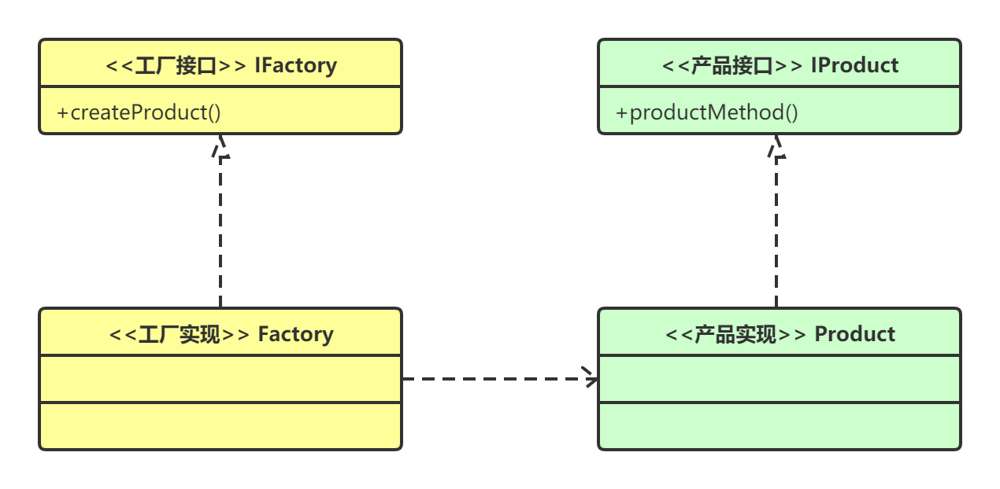

> 1、工厂模式分为几类？
>
> 2、GOF 23种设计模式中，工厂方法模式和抽象工厂模式有什么区别？
>
> 3、不在GOF 23种设计模式中的简单工厂模式是什么？
>
> 4、简单工厂模式、工厂方法模式和抽象工厂模式各自解决什么问题？有什么不同？


## 工厂模式

工厂模式（Factory Pattern）是 Java 中最常用的设计模式之一。这种类型的设计模式属于创建型模式，它提供了一种创建对象的最佳方式。

在工厂模式中，我们在创建对象时不会对客户端暴露创建逻辑，并且是通过使用一个共同的接口来指向新创建的对象。


### 工厂模式可以分为三类：

- 简单工厂模式（Simple Factory）
- 工厂方法模式（Factory Method）
- 抽象工厂模式（Abstract Factory）

简单工厂其实不是一个标准的的设计模式。GOF 23种设计模式中只有「工厂方法模式」与「抽象工厂模式」。简单工厂模式可以看为工厂方法模式的一种特例，为了统一整理学习，就都归为工厂模式。

这三种工厂模式在设计模式的分类中都属于**创建型模式**，三种模式从上到下逐步抽象。

### 创建型模式

创建型模式(Creational Pattern)对类的实例化过程进行了抽象，能够将软件模块中对象的创建和对象的使用分离。为了使软件的结构更加清晰，外界对于这些对象只需要知道它们共同的接口，而不清楚其具体的实现细节，使整个系统的设计更加符合单一职责原则。

创建型模式在创建什么(What)，由谁创建(Who)，何时创建(When)等方面都为软件设计者提供了尽可能大的灵活性。

创建型模式隐藏了类的实例的创建细节，通过隐藏对象如何被创建和组合在一起达到使整个系统独立的目的。

工厂模式是创建型模式中比较重要的。工厂模式的主要功能就是帮助我们实例化对象。之所以名字中包含工厂模式四个字，是因为对象的实例化过程是通过工厂实现的，是用工厂代替new操作的。

### 工厂模式优点：

- **可以使代码结构清晰，有效地封装变化**。在编程中，产品类的实例化有时候是比较复杂和多变的，通过工厂模式，将产品的实例化封装起来，使得调用者根本无需关心产品的实例化过程，只需依赖工厂即可得到自己想要的产品。
- **对调用者屏蔽具体的产品类**。如果使用工厂模式，调用者只关心产品的接口就可以了，至于具体的实现，调用者根本无需关心。即使变更了具体的实现，对调用者来说没有任何影响。
- **降低耦合度**。产品类的实例化通常来说是很复杂的，它需要依赖很多的类，而这些类对于调用者来说根本无需知道，如果使用了工厂方法，我们需要做的仅仅是实例化好产品类，然后交给调用者使用。对调用者来说，产品所依赖的类都是透明的。

### 适用场景

不管是简单工厂模式，工厂方法模式还是抽象工厂模式，他们具有类似的特性，所以他们的适用场景也是类似的。 

首先，作为一种创建类模式，在任何需要生成**复杂对象**的地方，都可以使用工厂方法模式。有一点需要注意的地方就是复杂对象适合使用工厂模式，而简单对象，特别是只需要通过new就可以完成创建的对象，无需使用工厂模式。如果使用工厂模式，就需要引入一个工厂类，会增加系统的复杂度。 

其次，工厂模式是一种典型的**解耦模式**，迪米特法则在工厂模式中表现的尤为明显。假如调用者自己组装产品需要增加依赖关系时，可以考虑使用工厂模式。将会大大降低对象之间的耦合度。

再次，由于工厂模式是依靠抽象架构的，它把实例化产品的任务交由实现类完成，**扩展性比较好**。也就是说，当需要系统有比较好的扩展性时，可以考虑工厂模式，不同的产品用不同的实现工厂来组装。

------


## 简单工厂模式

在介绍简单工厂模式之前，我们尝试解决以下问题：


那么这种重复的创建类的工作其实可以放到一个统一的工厂类中。简单工厂模式有以下优点：

- 一个调用者想创建一个对象，只要知道其名称就可以了。
- 屏蔽产品的具体实现，调用者只关心产品的接口。


定义一个工厂类，它可以根据参数的不同返回不同类的实例，被创建的实例通常都具有共同的父类。因为在简单工厂模式中用于创建实例的方法是静态(static)方法，因此简单工厂模式又被称为静态工厂方法(Static Factory Method)模式。

### 简单工厂模式实现方式

没骗你，简单工厂模式，真是因为简单才被叫做简单工厂模式的。

简单工厂模式包含 3 个角色（要素）：

- Factory：即工厂类， 它是简单工厂模式的核心，负责实现创建所有产品实例的内部逻辑；工厂类可以被外界直接调用，创建所需的产品对象；在工厂类中提供了静态的工厂方法factoryMethod()，它的返回类型为抽象产品类型Product

- Product：抽象产品， 它是工厂类所创建的所有对象的父类，封装了各种产品对象的公有方法，它的引入将提高系统的灵活性，使得在工厂类中只需定义一个通用的工厂方法，因为所有创建的具体产品对象都是其子类对象 。

- ConcreteProduct：具体产品， 它是简单工厂模式的创建目标，所有被创建的对象都充当这个角色的某个具体类的实例。每一个具体产品角色都继承了抽象产品角色，需要实现在抽象产品中声明的抽象方法 。在java中由一个具体类实现。 

关系图如下：


在原有类的基础上，定义工厂类：

```
//工厂类
public class OperationFactory {

    public static Operation createOperation(String operation) {
        Operation oper = null;
        switch (operation) {
            case "+":
                oper = new OperationAdd();
                break;
            case "-":
                oper = new OperationSub();
                break;
            case "*":
                oper = new OperationMul();
                break;

            case "/":
                oper = new OperationDiv();
                break;
            default:
                throw new UnsupportedOperationException("不支持该操作");
        }
        return oper;
    }
}
```

有了工厂类之后，可以使用工厂创建对象：

```
Operation operationAdd = OperationFactory.createOperation("+");
operationAdd.setValue1(10);
operationAdd.setValue2(5);
System.out.println(operationAdd.getResule());
```

通过简单工厂模式，该计算器的使用者不需要关系实现加法逻辑的那个类的具体名字，他只要知道该类对应的参数"+"就可以了。

### 简单工厂模式存在的问题

当我们需要增加一种计算时，例如开平方。这个时候我们需要先定义一个类继承Operation类，其中实现平方的代码。除此之外我们还要修改OperationFactory类的代码，增加一个case。这显然是违背开闭原则的。可想而知对于新产品的加入，工厂类是很被动的。

我们举的例子是最简单的情况。而在实际应用中，很可能产品是一个多层次的树状结构。 简单工厂可能就不太适用了。

### 简单工厂模式总结

工厂类是整个简单工厂模式的关键。包含了必要的逻辑判断，根据外界给定的信息，决定究竟应该创建哪个具体类的对象。通过使用工厂类，外界可以从直接创建具体产品对象的尴尬局面摆脱出来，仅仅需要负责“消费”对象就可以了。而不必管这些对象究竟如何创建及如何组织的。明确了各自的职责和权利，有利于整个软件体系结构的优化。

但是由于工厂类集中了所有实例的创建逻辑，违反了高内聚责任分配原则，将全部创建逻辑集中到了一个工厂类中；**它所能创建的类只能是事先考虑到的，如果需要添加新的类，则就需要改变工厂类了**。

当系统中的具体产品类不断增多时候，可能会出现要求工厂类根据不同条件创建不同实例的需求．这种对条件的判断和对具体产品类型的判断交错在一起，很难避免模块功能的蔓延，对系统的维护和扩展非常不利；

为了解决这些缺点，就有了工厂方法模式。

------


## 工厂方法模式

我们常说的工厂模式，就是指工厂方法模式(Factory Method Pattern)，也叫虚拟构造器(Virtual Constructor)模式或多态工厂(Polymorphic Factory)模式。

工厂方法模式是一种实现了“工厂”概念的面向对象设计模式。就像其他创建型模式一样，它也是处理在不指定对象具体类型的情况下创建对象的问题。

工厂方法模式的实质是“**定义一个创建对象的接口，但让实现这个接口的类来决定实例化哪个类。工厂方法让类的实例化推迟到子类中进行**。”


### 介绍


**使用场景：** 1、日志记录器：记录可能记录到本地硬盘、系统事件、远程服务器等，用户可以选择记录日志到什么地方。 2、数据库访问，当用户不知道最后系统采用哪一类数据库，以及数据库可能有变化时。 3、设计一个连接服务器的框架，需要三个协议，"POP3"、"IMAP"、"HTTP"，可以把这三个作为产品类，共同实现一个接口。


### 工厂方法模式实现

工厂方法模式包含 4 个角色（要素）：**工厂接口**、**工厂实现**、**产品接口**（抽象产品）、**产品实现**（具体产品）

#### UML图



####  工厂方法模式代码

```java
interface IProduct {
    public void productMethod();
}

class Product implements IProduct {
    public void productMethod() {
        System.out.println("产品");
    }
}

interface IFactory {
    public IProduct createProduct();
}

class Factory implements IFactory {
    public IProduct createProduct() {
        return new Product();
    }
}

public class Client {
    public static void main(String[] args) {
        IFactory factory = new Factory();
        IProduct prodect = factory.createProduct();
        prodect.productMethod();
    }
}
```

#### 实例

1. 您需要一辆汽车，可以直接从工厂里面提货，而不用去管这辆汽车是怎么做出来的，以及这个汽车里面的具体实现。

2. Hibernate 换数据库只需换方言和驱动就可以。

### 使用场景

- 日志记录器：记录可能记录到本地硬盘、系统事件、远程服务器等，用户可以选择记录日志到什么地方。

- 数据库访问，当用户不知道最后系统采用哪一类数据库，以及数据库可能有变化时。
- 设计一个连接服务器的框架，需要三个协议，"POP3"、"IMAP"、"HTTP"，可以把这三个作为产品类，共同实现一个接口。

### 工厂方法模式用途

工厂方法模式和简单工厂模式虽然都是通过工厂来创建对象，他们之间最大的不同是——工厂方法模式在设计上完全完全符合“**开闭原则**”。

在以下情况下可以使用工厂方法模式：

- **一个类不知道它所需要的对象的类**：在工厂方法模式中，客户端不需要知道具体产品类的类名，只需要知道所对应的工厂即可，具体的产品对象由具体工厂类创建；客户端需要知道创建具体产品的工厂类。
- **一个类通过其子类来指定创建哪个对象**：在工厂方法模式中，对于抽象工厂类只需要提供一个创建产品的接口，而由其子类来确定具体要创建的对象，利用面向对象的多态性和里氏代换原则，在程序运行时，子类对象将覆盖父类对象，从而使得系统更容易扩展。
- 将创建对象的任务委托给多个工厂子类中的某一个，客户端在使用时可以无须关心是哪一个工厂子类创建产品子类，需要时再动态指定，可将具体工厂类的类名存储在配置文件或数据库中。

### 工厂方法模式总结

工厂方法模式是简单工厂模式的进一步抽象和推广。

由于使用了面向对象的多态性，工厂方法模式保持了简单工厂模式的优点，而且克服了它的缺点。

在工厂方法模式中，核心的工厂类不再负责所有产品的创建，而是将具体创建工作交给子类去做。这个核心类仅仅负责给出具体工厂必须实现的接口，而不负责产品类被实例化这种细节，这使得工厂方法模式可以允许系统在不修改工厂角色的情况下引进新产品。

**优点：** 

- 一个调用者想创建一个对象，只要知道其名称就可以了。 
- 扩展性高，如果想增加一个产品，只要扩展一个工厂类就可以。 
- 屏蔽产品的具体实现，调用者只关心产品的接口。

**缺点：**

每次增加一个产品时，都需要增加一个具体类和对象实现工厂，使得系统中类的个数成倍增加，在一定程度上增加了系统的复杂度，同时也增加了系统具体类的依赖。这并不是什么好事。

------


## 抽象工厂模式

工厂方法模式通过引入工厂等级结构，解决了简单工厂模式中工厂类职责太重的问题，但由于工厂方法模式中的每个工厂只生产一类产品，可能会导致系统中存在大量的工厂类，势必会增加系统的开销。此时，我们可以考虑将一些相关的产品组成一个“**产品族**”，由同一个工厂来统一生产，这就是抽象工厂模式的基本思想。 

  


抽象工厂模式(Abstract Factory Pattern)：提供一个创建一系列相关或相互依赖对象的接口，而无须指定它们具体的类。抽象工厂(Abstract Factory)模式，又称工具箱(Kit 或Toolkit)模式。

抽象工厂模式提供了一种方式，可以将同一产品族的单独的工厂封装起来。在正常使用中，客户端程序需要创建抽象工厂的具体实现，然后使用抽象工厂作为接口来创建这一主题的具体对象。客户端程序不需要知道（或关心）它从这些内部的工厂方法中获得对象的具体类型，因为客户端程序仅使用这些对象的通用接口。抽象工厂模式将一组对象的实现细节与他们的一般使用分离开来。

#### 创建过程如下 

一个具体工厂创建一个产品族，一个产品族是不同系列产品的组合，产品的创建的逻辑分在在每个具体工厂类中。所有的具体工厂继承自同一个抽象工厂。 

客户端创建不同产品族的工厂，产品族的工厂创建具体的产品对客户端是不可见的。 

增加新的产品族时，需要增加具体工厂类,符合OCP原则。 

增加新产品时，需要修改具体工厂类和增加产品类，不符合OCP原则 

如果没有应对“多系列对象创建”的需求变化，则没有必要使用抽象工厂模式，这时候使用简单的静态工厂完全可以。

**产品族**

来认识下什么是产品族: 位于不同产品等级结构中,功能相关的产品组成的家族。如下面的例子，就有两个产品族：跑车族和商务车族。

关系图如下：


**抽象工厂模式用途**

抽象工厂模式和工厂方法模式一样，都符合开放-封闭原则。但是不同的是，工厂方法模式在增加一个具体产品的时候，都要增加对应的工厂。但是抽象工厂模式只有在新增一个类型的具体产品时才需要新增工厂。也就是说，工厂方法模式的一个工厂只能创建一个具体产品。而抽象工厂模式的一个工厂可以创建属于一类类型的多种具体产品。工厂创建产品的个数介于简单工厂模式和工厂方法模式之间。

在以下情况下可以使用抽象工厂模式：

- 一个系统不应当依赖于产品类实例如何被创建、组合和表达的细节，这对于所有类型的工厂模式都是重要的。
- 系统中有多于一个的产品族，而每次只使用其中某一产品族。
- 属于同一个产品族的产品将在一起使用，这一约束必须在系统的设计中体现出来。
- 系统提供一个产品类的库，所有的产品以同样的接口出现，从而使客户端不依赖于具体实现。

**抽象工厂模式实现方式**

抽象工厂模式包含如下角色：

AbstractFactory(抽象工厂)：用于声明生成抽象产品的方法

ConcreteFactory(具体工厂)：实现了抽象工厂声明的生成抽象产品的方法，生成一组具体产品，这些产品构成了一个产品族，每一个产品都位于某个产品等级结构中；

AbstractProduct(抽象产品)：为每种产品声明接口，在抽象产品中定义了产品的抽象业务方法；

Product(具体产品)：定义具体工厂生产的具体产品对象，实现抽象产品接口中定义的业务方法。

本文的例子采用一个汽车代工厂造汽车的例子。假设我们是一家汽车代工厂商，我们负责给奔驰和特斯拉两家公司制造车子。

我们简单的把奔驰车理解为需要加油的车，特斯拉为需要充电的车。其中奔驰车中包含跑车和商务车两种，特斯拉同样也包含奔驰车和商务车。


以上场景，我们就可以把跑车和商务车分别对待，对于跑车有单独的工厂创建，商务车也有单独的工厂。

这样，以后无论是再帮任何其他厂商造车，只要是跑车或者商务车我们都不需要再引入工厂。同样，如果我们要增加一种其他类型的车，比如越野车，我们也不需要对跑车或者商务车的任何东西做修改。

下面是抽象产品，奔驰车和特斯拉车：

```
public interface BenzCar {
    //加汽油
    public void gasUp();

}

public interface TeslaCar {
    //充电
    public void charge();
}
```

下面是具体产品，奔驰跑车、奔驰商务车、特斯拉跑车、特斯拉商务车：

```
public class BenzSportCar implements BenzCar {
    public void gasUp() {
        System.out.println("给我的奔驰跑车加最好的汽油");
    }
}

public class BenzBusinessCar implements BenzCar{
    public void gasUp() {
        System.out.println("给我的奔驰商务车加一般的汽油");
    }
}

public class TeslaSportCar implements TeslaCar {
    public void charge() {
        System.out.println("给我特斯拉跑车冲满电");
    }
}

public class TeslaBusinessCar implements TeslaCar {
    public void charge() {
        System.out.println("不用给我特斯拉商务车冲满电");
    }
}
```

下面是抽象工厂：

```
public interface CarFactory {

    public BenzCar getBenzCar();
    public TeslaCar getTeslaCar();
}
```

下面是具体工厂：

```
public class SportCarFactory implements CarFactory {
    public BenzCar getBenzCar() {
        return new BenzSportCar();
    }

    public TeslaCar getTeslaCar() {
        return new TeslaSportCar();
    }
}

public class BusinessCarFactory implements CarFactory {
    public BenzCar getBenzCar() {
        return new BenzBusinessCar();
    }

    public TeslaCar getTeslaCar() {
        return new TeslaBusinessCar();
    }
}
```

**“开闭原则”的倾斜性**

“开闭原则”要求系统对扩展开放，对修改封闭，通过扩展达到增强其功能的目的。对于涉及到多个产品族与多个产品等级结构的系统，其功能增强包括两方面：

- 增加产品族：对于增加新的产品族，工厂方法模式很好的支持了“开闭原则”，对于新增加的产品族，只需要对应增加一个新的具体工厂即可，对已有代码无须做任何修改。
- 增加新的产品等级结构：对于增加新的产品等级结构，需要修改所有的工厂角色，包括抽象工厂类，在所有的工厂类中都需要增加生产新产品的方法，不能很好地支持“开闭原则”。

抽象工厂模式的这种性质称为“开闭原则”的倾斜性，抽象工厂模式以一种倾斜的方式支持增加新的产品，它为新产品族的增加提供方便，但不能为新的产品等级结构的增加提供这样的方便。

**抽象工厂模式总结**

抽象工厂模式提供一个创建一系列相关或相互依赖对象的接口，而无须指定它们具体的类。抽象工厂模式又称为Kit模式，属于对象创建型模式。

抽象工厂模式是所有形式的工厂模式中最为抽象和最具一般性的一种形态。

抽象工厂模式的主要优点是隔离了具体类的生成，使得客户并不需要知道什么被创建，而且每次可以通过具体工厂类创建一个产品族中的多个对象，增加或者替换产品族比较方便，增加新的具体工厂和产品族很方便；主要缺点在于增加新的产品等级结构很复杂，需要修改抽象工厂和所有的具体工厂类，对“开闭原则”的支持呈现倾斜性。


## **三种工厂模式对比**

**简单工厂模式的优缺点**

- 优点：

- - 1、屏蔽产品的具体实现，调用者只关心产品的接口。
  - 2、实现简单

- 缺点：

- - 1、增加产品，需要修改工厂类，不符合开放-封闭原则
  - 2、工厂类集中了所有实例的创建逻辑，违反了高内聚责任分配原则

**工厂方法模式的优缺点**

- 优点：

- - 1、继承了简单工厂模式的优点
  - 2、符合开放-封闭原则

- 缺点：

- - 1、增加产品，需要增加新的工厂类，导致系统类的个数成对增加，在一定程度上增加了系统的复杂性。

**抽象工厂模式的优缺点**

- 优点：

- - 1、隔离了具体类的生成，使得客户并不需要知道什么被创建
  - 2、每次可以通过具体工厂类创建一个产品族中的多个对象，增加或者替换产品族比较方便，增加新的具体工厂和产品族很方便；

- 缺点

- - 增加新的产品等级结构很复杂，需要修改抽象工厂和所有的具体工厂类，对“开闭原则”的支持呈现倾斜性。

    


**三种工厂模式的对比与转换**


简单工厂 ： 用来生产同一等级结构中的任意产品。（对于增加新的产品，主要是新增产品，就要修改工厂类。符合单一职责原则。不符合开放-封闭原则）

工厂方法 ：用来生产同一等级结构中的固定产品。（支持增加任意产品，新增产品时不需要更改已有的工厂，需要增加该产品对应的工厂。符合单一职责原则、符合开放-封闭原则。但是引入了复杂性）

抽象工厂 ：用来生产不同产品族的全部产品。（增加新产品时，需要修改工厂，增加产品族时，需要增加工厂。符合单一职责原则，部分符合开放-封闭原则，降低了复杂性）

最后，三种工厂模式各有优缺点，没有最好的，只有最合适的！


## 参考

 https://blog.csdn.net/lovelion/article/details/9319181 


 https://blog.csdn.net/lovelion/article/details/17517213 

 https://wiki.jikexueyuan.com/project/java-design-pattern/abstract-factory-pattern.html 