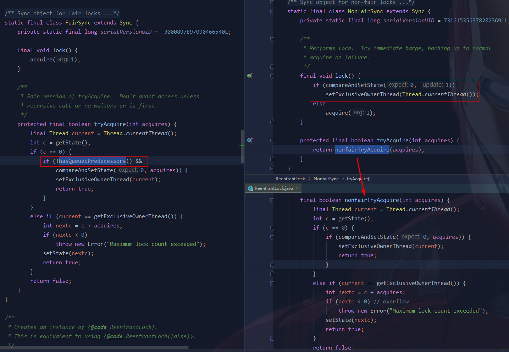

# 唠唠 Java的 “锁”事

Java提供了种类丰富的锁，每种锁因其特性的不同，在适当的场景下能够展现出非常高的效率。

Java中往往是按照是否含有某一特性来定义锁，我们通过特性将锁进行分组归类


- 公平锁、非公平锁
- 可重入锁（又名递归锁）、非可重入锁
- 自旋锁、阻塞锁
- 悲观锁、乐观锁
- 共享锁、排它锁
- 独占锁


## 1. 公平锁 vs 非公平锁

公平锁：是指多个线程按照申请锁的顺序来获取锁，线程直接进入队列中排队，队列中的第一个线程才能获得锁。类似排队打饭，先来后到。

非公平锁：是指多个线程获取锁的顺序并不是按照申请锁的顺序，有可能后申请的线程比先申请的线程优先获取锁。


### 比较

公平锁，就是很公平，在并发环境中，每个线程在获取锁时会先查看此锁维护的等待队列，如果为空，或者当前线程是等待队列的第一个，就占有锁，否则就会加入到等待队列中，以后会按照 FIFO 的规则从队列中取到自己。

非公平锁，比较粗鲁，上来就直接尝试占有锁，如果尝试失败，就再采用类似公平锁的方式。

公平锁的优点是等待锁的线程不会饿死。

非公平锁的优点在于吞吐量比公平锁大。但在高并发的情况下，有可能会造成**优先级反转**或**饥饿现象**。


### 内窥

并发包中 `ReentrantLock` 的创建可以指定构造函数的 `boolean` 类型来得到公平锁或非公平锁，默认为非公平锁。 

查看 `ReentrantLock`，可以看到有一个继承自 `AbstractQueuedSynchronizer` 的内部类 `Sync`，添加锁和释放锁的大部分操作实际上都是在 `Sync` 中实现的。它有公平锁 `FairSync` 和非公平锁 `NonfairSync` 两个子类。

```java
public class ReentrantLock implements Lock, java.io.Serializable {
    private static final long serialVersionUID = 7373984872572414699L;
    private final Sync sync;
    
    public ReentrantLock() {
        sync = new NonfairSync();
    }
    
    public ReentrantLock(boolean fair) {
        sync = fair ? new FairSync() : new NonfairSync();
    }
    
    abstract static class Sync extends AbstractQueuedSynchronizer {
        private static final long serialVersionUID = -5179523762034025860L;

        abstract void lock();
		//......
    }
  
    static final class NonfairSync extends Sync {
		//......
    }

    static final class FairSync extends Sync {
        //......
    }   
}
```



两个构造方法对比，可以看出公平锁和非公平锁的区别

- 非公平锁在调用 lock() 后，首先就会通过 CAS 进行一次抢锁，如果这个时候恰巧锁没有被占用，那么直接就获取到锁返回了，否则按公平锁的方式去排队，进入到阻塞队列等待唤醒

- 公平锁在获取同步状态(获取锁)时 tryAcquire() 多了一个限制条件：`!hasQueuedPredecessors()` ，用来判断当前线程是否位于同步队列中的第一个


Synchronized关键字，也是一种非公平锁。

------


## 2. 乐观锁 VS 悲观锁

乐观锁与悲观锁是一种广义上的概念，体现了看待线程同步的不同角度。在 Java 和数据库中都有此概念对应的实际应用。

- 悲观锁是一种悲观思想，它总认为自己在使用数据的时候一定有别的线程来修改，所以悲观锁在持有数据的时候总会把资源或数据锁住，这样其他线程想要请求这个资源的时候就会阻塞，直到等到悲观锁把资源释放为止。传统的关系型数据库里边就用到了很多这种锁机制，**比如行锁，表锁等，读锁，写锁等，都是在做操作之前先上锁。**悲观锁的实现往往依靠数据库本身的锁功能实现。

  Java 中，synchronized 关键字和 Lock 的实现类都是悲观锁。

- 而乐观锁认为自己在使用数据时不会有别的线程修改数据，所以不会添加锁，只是在更新数据的时候去判断之前有没有别的线程更新了这个数据。如果这个数据没有被更新，当前线程将自己修改的数据成功写入。如果数据已经被其他线程更新，则根据不同的实现方式执行不同的操作（例如报错或者自动重试）

  乐观锁的实现方案一般来说有两种： `版本号机制` 和 `CAS实现` 。

  Java 中 `java.util.concurrent.atomic` 包下面的原子变量类的递增操作就是通过 CAS 实现了乐观锁。


### 比较

悲观锁：比较适合写入操作比较频繁的场景，如果出现大量的读取操作，每次读取的时候都会进行加锁，这样会增加大量的锁的开销，降低了系统的吞吐量。

乐观锁：比较适合读取操作比较频繁的场景，如果出现大量的写入操作，数据发生冲突的可能性就会增大，为了保证数据的一致性，应用层需要不断的重新获取数据，这样会增加大量的查询操作，降低了系统的吞吐量。

**悲观锁比较适合强一致性的场景，但效率比较低，特别是读的并发低。乐观锁则适用于读多写少，并发冲突少的场景。**

乐观锁常见问题：

- ABA 问题
- 循环时间长开销大
- 只能保证一个共享变量的原子操作

------


## 3. 可重入锁（递归锁）

可重入锁又名递归锁，是指在同一个线程在外层方法获取锁的时候，再进入该线程的内层方法会自动获取锁（前提锁对象得是同一个对象或者class），不会因为之前已经获取过还没释放而阻塞。

也就是说，线程可以进入任何一个它已经拥有的锁同步着的代码块。

可重入锁的最大作用是**可一定程度避免死锁**，`ReentrackLock`、`Synchronized` 就是典型的可重入锁。

```java
public class Widget {
    public synchronized void doSomething() {
        System.out.println("方法1执行...");
        doOthers();
    }

    public synchronized void doOthers() {
        System.out.println("方法2执行...");
    }
}
```

在上面的代码中，类中的两个方法都是被内置锁synchronized修饰的，doSomething()方法中调用doOthers()方法。因为内置锁是可重入的，所以同一个线程在调用doOthers()时可以直接获得当前对象的锁，进入doOthers()进行操作。

如果是一个不可重入锁，那么当前线程在调用doOthers()之前需要将执行doSomething()时获取当前对象的锁释放掉，实际上该对象锁已被当前线程所持有，且无法释放。所以此时会出现死锁。


------


## 自旋锁

自旋锁是指尝试获取锁的线程不会立即阻塞，而是采用循环的方式去尝试获取锁，这样的好处是减少线程上下文切换的消耗，缺点是循环会消耗 CPU


```java
/**
 * 面试题分享：手写一个自旋锁
 *
 **/
public class SpinLockDemo {

    AtomicReference<Thread> lock = new AtomicReference<>();

    public void myLock(){
        Thread thread = Thread.currentThread();
        //如果不为空，自旋
        while (!lock.compareAndSet(null,thread)){

        }
    }

    public void myUnlock(){
        Thread thread = Thread.currentThread();
        //解锁后，将锁置为 null
        lock.compareAndSet(thread,null);
    }
}
```

### 优缺点

**缺点：**

1. 如果某个线程持有锁的时间过长，就会导致其它等待获取锁的线程进入循环等待，消耗CPU。使用不当会造成CPU 使用率极高。
2. 上面 Java 实现的自旋锁不是公平的，即无法满足等待时间最长的线程优先获取锁。不公平的锁就会存在“线程饥饿”问题。

**优点：**

1. 自旋锁不会使线程状态发生切换，一直处于用户态，即线程一直都是 active 的；不会使线程进入阻塞状态，减少了不必要的上下文切换，执行速度快
2. 非自旋锁在获取不到锁的时候会进入阻塞状态，从而进入内核态，当获取到锁的时候需要从内核态恢复，需要线程上下文切换。 （线程被阻塞后便进入内核（Linux）调度状态，这个会导致系统在用户态与内核态之间来回切换，严重影响锁的性能）

### 可重入的自旋锁和不可重入的自旋锁

上边写的自旋锁，仔细分析一下可以看出，它是不支持重入的，即当一个线程第一次已经获取到了该锁，在锁释放之前又一次重新获取该锁，第二次就不能成功获取到。由于不满足 CAS，所以第二次获取会进入 while 循环等待，而如果是可重入锁，第二次也是应该能够成功获取到的。

而且，即使第二次能够成功获取，那么当第一次释放锁的时候，第二次获取到的锁也会被释放，而这是不合理的。

为了实现可重入锁，我们需要引入一个计数器，用来记录获取锁的线程数。

```java
public class ReentrantSpinLock {
    private AtomicReference<Thread> cas = new AtomicReference<Thread>();
    private int count;
    public void lock() {
        Thread current = Thread.currentThread();
        if (current == cas.get()) { // 如果当前线程已经获取到了锁，线程数增加一，然后返回
            count++;
            return;
        }
        // 如果没获取到锁，则通过CAS自旋
        while (!cas.compareAndSet(null, current)) {
            // DO nothing
        }
    }
    public void unlock() {
        Thread cur = Thread.currentThread();
        if (cur == cas.get()) {
            if (count > 0) {// 如果大于0，表示当前线程多次获取了该锁，释放锁通过count减一来模拟
                count--;
            } else { // 如果count==0，可以将锁释放，这样就能保证获取锁的次数与释放锁的次数是一致的了。
                cas.compareAndSet(cur, null);
            }
        }
    }
}
```

### 自旋锁的其他变种

#### 1. TicketLock

**TicketLock主要解决的是公平性的问题。**

思路：每当有线程获取锁的时候，就给该线程分配一个递增的id，我们称之为排队号，同时，锁对应一个服务号，每当有线程释放锁，服务号就会递增，此时如果服务号与某个线程排队号一致，那么该线程就获得锁，由于排队号是递增的，所以就保证了最先请求获取锁的线程可以最先获取到锁，就实现了公平性。

可以想象成银行办理业务排队，排队的每一个顾客都代表一个需要请求锁的线程，而银行服务窗口表示锁，每当有窗口服务完成就把自己的服务号加一，此时在排队的所有顾客中，只有自己的排队号与服务号一致的才可以得到服务。

实现代码：

```java
public class TicketLock {
    /**
     * 服务号
     */
    private AtomicInteger serviceNum = new AtomicInteger();
    /**
     * 排队号
     */
    private AtomicInteger ticketNum = new AtomicInteger();
    /**
     * lock:获取锁，如果获取成功，返回当前线程的排队号，获取排队号用于释放锁. <br/>
     *
     * @return
     */
    public int lock() {
        int currentTicketNum = ticketNum.incrementAndGet();
        while (currentTicketNum != serviceNum.get()) {
            // Do nothing
        }
        return currentTicketNum;
    }
    /**
     * unlock:释放锁，传入当前持有锁的线程的排队号 <br/>
     *
     * @param ticketnum
     */
    public void unlock(int ticketnum) {
        serviceNum.compareAndSet(ticketnum, ticketnum + 1);
    }
}
```

上面的实现方式是，线程获取锁之后，将它的排队号返回，等该线程释放锁的时候，需要将该排队号传入。但这样是有风险的，因为这个排队号是可以被修改的，一旦排队号被不小心修改了，那么锁将不能被正确释放。一种更好的实现方式如下：

```java
public class TicketLockV2 {
    /**
     * 服务号
     */
    private AtomicInteger serviceNum = new AtomicInteger();
    /**
     * 排队号
     */
    private AtomicInteger ticketNum = new AtomicInteger();
    /**
     * 新增一个ThreadLocal，用于存储每个线程的排队号
     */
    private ThreadLocal<Integer> ticketNumHolder = new ThreadLocal<Integer>();
    public void lock() {
        int currentTicketNum = ticketNum.incrementAndGet();
        // 获取锁的时候，将当前线程的排队号保存起来
        ticketNumHolder.set(currentTicketNum);
        while (currentTicketNum != serviceNum.get()) {
            // Do nothing
        }
    }
    public void unlock() {
        // 释放锁，从ThreadLocal中获取当前线程的排队号
        Integer currentTickNum = ticketNumHolder.get();
        serviceNum.compareAndSet(currentTickNum, currentTickNum + 1);
    }
}
```

上面的实现方式是将每个线程的排队号放到了ThreadLocal中。

**TicketLock存在的问题:**

多处理器系统上，每个进程/线程占用的处理器都在读写同一个变量serviceNum ，每次读写操作都必须在多个处理器缓存之间进行缓存同步，这会导致繁重的系统总线和内存的流量，大大降低系统整体的性能。

下面介绍的MCSLock和CLHLock就是解决这个问题的。

#### 2. CLHLock

CLH锁是一种基于链表的可扩展、高性能、公平的自旋锁，申请线程只在本地变量上自旋，它不断轮询前驱的状态，如果发现前驱释放了锁就结束自旋，获得锁。

实现代码如下：

```java
import java.util.concurrent.atomic.AtomicReferenceFieldUpdater;
/**
 * CLH的发明人是：Craig，Landin and Hagersten。
 * 代码来源：http://ifeve.com/java_lock_see2/
 */
public class CLHLock {
    /**
     * 定义一个节点，默认的lock状态为true
     */
    public static class CLHNode {
        private volatile boolean isLocked = true;
    }
    /**
     * 尾部节点,只用一个节点即可
     */
    private volatile CLHNode tail;
    private static final ThreadLocal<CLHNode> LOCAL = new ThreadLocal<CLHNode>();
    private static final AtomicReferenceFieldUpdater<CLHLock, CLHNode> UPDATER = AtomicReferenceFieldUpdater.newUpdater(CLHLock.class, CLHNode.class,
            "tail");
    public void lock() {
        // 新建节点并将节点与当前线程保存起来
        CLHNode node = new CLHNode();
        LOCAL.set(node);
        // 将新建的节点设置为尾部节点，并返回旧的节点（原子操作），这里旧的节点实际上就是当前节点的前驱节点
        CLHNode preNode = UPDATER.getAndSet(this, node);
        if (preNode != null) {
            // 前驱节点不为null表示当锁被其他线程占用，通过不断轮询判断前驱节点的锁标志位等待前驱节点释放锁
            while (preNode.isLocked) {
            }
            preNode = null;
            LOCAL.set(node);
        }
        // 如果不存在前驱节点，表示该锁没有被其他线程占用，则当前线程获得锁
    }
    public void unlock() {
        // 获取当前线程对应的节点
        CLHNode node = LOCAL.get();
        // 如果tail节点等于node，则将tail节点更新为null，同时将node的lock状态职位false，表示当前线程释放了锁
        if (!UPDATER.compareAndSet(this, node, null)) {
            node.isLocked = false;
        }
        node = null;
    }
}
```

#### 3. MCSLock

MCSLock则是对本地变量的节点进行循环。

```java
/**
 * MCS:发明人名字John Mellor-Crummey和Michael Scott
 * 代码来源：http://ifeve.com/java_lock_see2/
 */
public class MCSLock {
    /**
     * 节点，记录当前节点的锁状态以及后驱节点
     */
    public static class MCSNode {
        volatile MCSNode next;
        volatile boolean isLocked = true;
    }
    private static final ThreadLocal<MCSNode> NODE = new ThreadLocal<MCSNode>();
    // 队列
    @SuppressWarnings("unused")
    private volatile MCSNode queue;
    // queue更新器
    private static final AtomicReferenceFieldUpdater<MCSLock, MCSNode> UPDATER = AtomicReferenceFieldUpdater.newUpdater(MCSLock.class, MCSNode.class,
            "queue");
    public void lock() {
        // 创建节点并保存到ThreadLocal中
        MCSNode currentNode = new MCSNode();
        NODE.set(currentNode);
        // 将queue设置为当前节点，并且返回之前的节点
        MCSNode preNode = UPDATER.getAndSet(this, currentNode);
        if (preNode != null) {
            // 如果之前节点不为null，表示锁已经被其他线程持有
            preNode.next = currentNode;
            // 循环判断，直到当前节点的锁标志位为false
            while (currentNode.isLocked) {
            }
        }
    }
    public void unlock() {
        MCSNode currentNode = NODE.get();
        // next为null表示没有正在等待获取锁的线程
        if (currentNode.next == null) {
            // 更新状态并设置queue为null
            if (UPDATER.compareAndSet(this, currentNode, null)) {
                // 如果成功了，表示queue==currentNode,即当前节点后面没有节点了
                return;
            } else {
                // 如果不成功，表示queue!=currentNode,即当前节点后面多了一个节点，表示有线程在等待
                // 如果当前节点的后续节点为null，则需要等待其不为null（参考加锁方法）
                while (currentNode.next == null) {
                }
            }
        } else {
            // 如果不为null，表示有线程在等待获取锁，此时将等待线程对应的节点锁状态更新为false，同时将当前线程的后继节点设为null
            currentNode.next.isLocked = false;
            currentNode.next = null;
        }
    }
}
```

#### 4. CLHLock 和 MCSLock

- 都是基于链表，不同的是CLHLock是基于隐式链表，没有真正的后续节点属性，MCSLock是显示链表，有一个指向后续节点的属性。
- 将获取锁的线程状态借助节点(node)保存,每个线程都有一份独立的节点，这样就解决了TicketLock多处理器缓存同步的问题。

### 自旋锁与互斥锁

- 自旋锁与互斥锁都是为了实现保护资源共享的机制。
- 无论是自旋锁还是互斥锁，在任意时刻，都最多只能有一个保持者。
- 获取互斥锁的线程，如果锁已经被占用，则该线程将进入睡眠状态；获取自旋锁的线程则不会睡眠，而是一直循环等待锁释放。

## 总结：

- 自旋锁：线程获取锁的时候，如果锁被其他线程持有，则当前线程将循环等待，直到获取到锁。
- 自旋锁等待期间，线程的状态不会改变，线程一直是用户态并且是活动的(active)。
- 自旋锁如果持有锁的时间太长，则会导致其它等待获取锁的线程耗尽CPU。
- 自旋锁本身无法保证公平性，同时也无法保证可重入性。
- 基于自旋锁，可以实现具备公平性和可重入性质的锁。
- TicketLock:采用类似银行排号叫好的方式实现自旋锁的公平性，但是由于不停的读取serviceNum，每次读写操作都必须在多个处理器缓存之间进行缓存同步，这会导致繁重的系统总线和内存的流量，大大降低系统整体的性能。
- CLHLock和MCSLock通过链表的方式避免了减少了处理器缓存同步，极大的提高了性能，区别在于CLHLock是通过轮询其前驱节点的状态，而MCS则是查看当前节点的锁状态。
- CLHLock在NUMA架构下使用会存在问题。在没有cache的NUMA系统架构中，由于CLHLock是在当前节点的前一个节点上自旋,NUMA架构中处理器访问本地内存的速度高于通过网络访问其他节点的内存，所以CLHLock在NUMA架构上不是最优的自旋锁。

------


## 独占锁（写锁）、共享锁（读锁）、互斥锁

独占锁：指该锁一次只能被一个线程所持有，对 ReentrantLock和 Synchronized 而言都是独占锁

共享锁：指该锁可被多个线程所持有

对 ReentrantReadWriteLock 其读锁是共享锁，其写锁是独占锁。

读锁的共享锁可保证并发读是非常高效的，读写、写读、写写的过程是互斥的。

```java
/**
 * 多个线程同时读一个资源类没有任何问题，所以为了满足并发量，读取共享资源应该可以同时进行
 * <p>
 * 但是如果一个线程想去写共享资源，就不应该再有其他线程对该资源进行读和写
 **/
public class ReadWriteLockDemo {
    public static void main(String[] args) {
        MyCache cache = new MyCache();
        for (int i = 0; i < 5; i++) {
            final int tempInt = i;
            new Thread(() -> {
                cache.put(tempInt + "", tempInt + "");
            }, String.valueOf(i)).start();
        }

        //5 个线程读
        for (int i = 0; i < 5; i++) {
            final int tempInt = i;
            new Thread(() -> {
                cache.get(tempInt + "");
            }, String.valueOf(i)).start();
        }
    }


}


//以一个缓存做例子，写缓存和读缓存
class MyCache {
    volatile Map<String, Object> map = new HashMap<>();

    private ReentrantReadWriteLock lock = new ReentrantReadWriteLock();

    public void put(String key, Object value) {

        lock.writeLock().lock();
        try {
            System.out.println(Thread.currentThread().getName() + "\t 正在写入" + key);
            //模拟网络拥堵
            TimeUnit.MICROSECONDS.sleep(300);
            map.put(key, value);
            System.out.println(Thread.currentThread().getName() + "\t 写入完成");
        } catch (InterruptedException e) {
            e.printStackTrace();
        } finally {
            lock.writeLock().unlock();
        }
    }

    public void get(String key) {

        lock.writeLock().lock();
        try {
            System.out.println(Thread.currentThread().getName() + "\t 正在读取");
            //模拟网络拥堵
            TimeUnit.MICROSECONDS.sleep(300);
            System.out.println(Thread.currentThread().getName() + "\t 读取完成" + map.get(key));
        } catch (InterruptedException e) {
            e.printStackTrace();
        } finally {
            lock.writeLock().unlock();
        }

    }
}
```


## 对各种锁的理解？请手写一个自旋锁


## 参考

https://tech.meituan.com/2018/11/15/java-lock.html