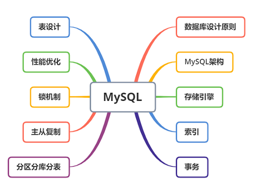

---

---

 

 

MySQL是个啥，就说一句话——**MySQL是一个关系型数据库管理系统**

> [官方文档介绍]( https://dev.mysql.com/doc/refman/5.7/en/ )
>
> [基于MySQL 5.1 的手册](  http://shouce.jb51.net/mysql/  )

**Javer必会MySQL知识架构图**

数据库设计原则

基础

存储引擎

索引

事务

表设计

表建好了，性能不行，mysql性能因素

**优化**

​	查询优化

​	索引优化

大数据量处理理论

分区分库分表

Mysql锁机制

主从复制

 

