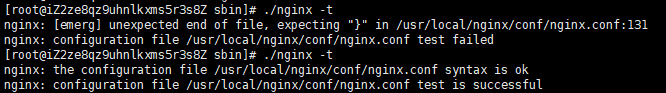
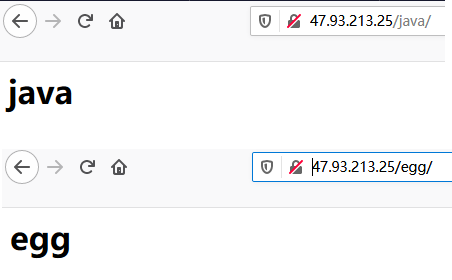
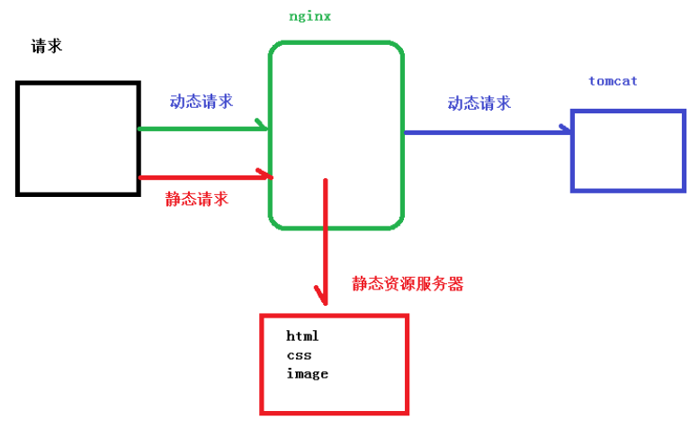
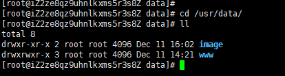
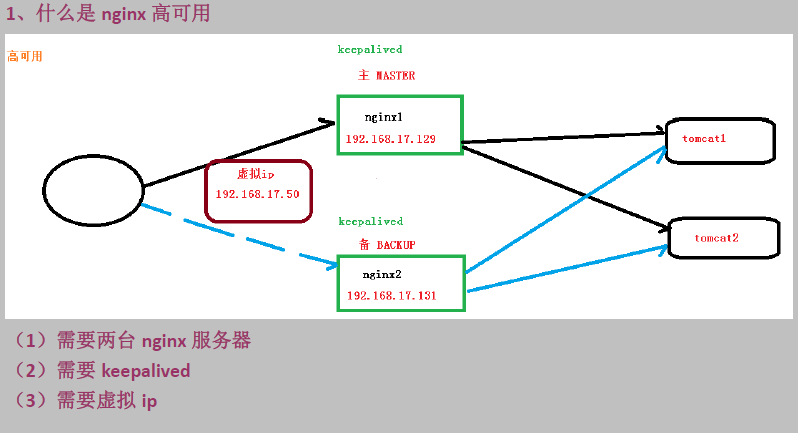

## 1. Nginx简介 

### 1.1 Nginx 概述 

 NGINX是一个免费、开源、高性能、轻量级的HTTP和反向代理服务器，也是一个电子邮件（IMAP/POP3）代理服务器，其特点是占有内存少，并发能力强。 Nginx 因为它的稳定性、丰富的模块库、灵活的配置和低系统资源的消耗而闻名 。中国大陆使用 nginx 网站用户有：百度、京东、新浪、网易、腾讯、淘宝等


Nginx由内核和一系列模块组成，内核提供web服务的基本功能,如启用网络协议,创建运行环境,接收和分配客户端请求,处理模块之间的交互。Nginx的各种功能和操作都由模块来实现。Nginx的模块从结构上分为核心模块、基础模块和第三方模块。

核心模块： HTTP模块、EVENT模块和MAIL模块

基础模块： HTTP Access模块、HTTP FastCGI模块、HTTP Proxy模块和HTTP Rewrite模块

第三方模块： HTTP Upstream Request Hash模块、Notice模块和HTTP Access Key模块及用户自己开发的模块

这样的设计使Nginx方便开发和扩展，也正因此才使得Nginx功能如此强大。Nginx的模块默认编译进nginx中，如果需要增加或删除模块，需要重新编译Nginx,这一点不如Apache的动态加载模块方便。如果有需要动态加载模块，可以使用由淘宝网发起的web服务器Tengine，在nginx的基础上增加了很多高级特性，完全兼容Nginx，已被国内很多网站采用。


### 1.2 Nginx 作为 web 服务器 

Nginx 可以作为静态页面的 web 服务器，同时还支持 CGI 协议的动态语言，比如 perl、php 等。但是不支持 java。Java 程序只能通过与 tomcat 配合完成。Nginx 专为性能优化而开发， 性能是其最重要的考量,实现上非常注重效率 ，能经受高负载的考验,有报告表明能支持高 达 50,000 个并发连接数。 https://lnmp.org/nginx.html 

**nginx和tomcat**

nginx常用做静态内容服务和代理服务器（不是你FQ那个代理），直面外来请求转发给后面的应用服务（tomcat，django什么的），tomcat更多用来做做一个应用容器，让java web app跑在里面的东西，对应同级别的有jboss,jetty等东西。

但是事无绝对，nginx也可以通过模块开发来提供应用功能，tomcat也可以直接提供http服务，通常用在内网和不需要流控等小型服务的场景。

apache用的越来越少了，大体上和nginx功能重合的更多。

严格的来说，Apache/Nginx 应该叫做「HTTP Server」；而 Tomcat 则是一个「Application Server」，或者更准确的来说，是一个「Servlet/JSP」应用的容器（Ruby/Python 等其他语言开发的应用也无法直接运行在 Tomcat 上）。

一个 HTTP Server 关心的是 HTTP 协议层面的传输和访问控制，所以在 Apache/Nginx 上你可以看到代理、负载均衡等功能。客户端通过 HTTP Server 访问服务器上存储的资源（HTML 文件、图片文件等等）。通过 CGI 技术，也可以将处理过的内容通过 HTTP Server 分发，但是一个 HTTP Server 始终只是把服务器上的文件如实的通过 HTTP 协议传输给客户端。

而应用服务器，则是一个应用执行的容器。它首先需要支持开发语言的 Runtime（对于 Tomcat 来说，就是 Java），保证应用能够在应用服务器上正常运行。其次，需要支持应用相关的规范，例如类库、安全方面的特性。对于 Tomcat 来说，就是需要提供 JSP/Sevlet 运行需要的标准类库、Interface 等。为了方便，应用服务器往往也会集成 HTTP Server 的功能，但是不如专业的 HTTP Server 那么强大，所以应用服务器往往是运行在 HTTP Server 的背后，执行应用，将动态的内容转化为静态的内容之后，通过 HTTP Server 分发到客户端。

### 1.3 正向代理 

Nginx 不仅可以做反向代理，实现负载均衡。还能用作正向代理来进行上网等功能。 正向代理：如果把局域网外的 Internet 想象成一个巨大的资源库，则局域网中的客户端要访 问 Internet，则需要通过代理服务器来访问，这种代理服务就称为正向代理。  正向代理“代理”的是客户端，而且客户端是知道目标的，而目标是不知道客户端是通过VPN访问的 


### 1.4 反向代理 

反向代理，其实客户端对代理是无感知的，因为客户端不需要任何配置就可以访问，我们只需要将请求发送到反向代理服务器，由反向代理服务器去选择目标服务器获取数据后，在返回给客户端，此时反向代理服务器和目标服务器对外就是一个服务器，暴露的是代理服务器地址，隐藏了真实服务器 IP 地址。  


## 为什么使用反向代理

- 可以起到保护网站安全的作用，因为任何来自Internet的请求都必须先经过代理服务器。
- 通过缓存静态资源，加速Web请求。
- 实现负载均衡。顺便说下，目前市面上，主流的负载均衡方案，硬件设备有F5，软件方案有四层负载均衡的LVS，七层负载均衡的Nginx、Haproxy等。

### 1.5 负载均衡 

客户端发送多个请求到服务器，服务器处理请求，有一些可能要与数据库进行交互，服务器处理完毕后，再将结果返回给客户端。 这种架构模式对于早期的系统相对单一，并发请求相对较少的情况下是比较适合的，成本也低。但是随着信息数量的不断增长，访问量和数据量的飞速增长，以及系统业务的复杂度增加，这种架构会造成服务器响应客户端的请求日益缓慢，并发量特别大的时候，还容易造成服务器直接崩溃。很明显这是由于服务器性能的瓶颈造成的问题，那么如何解决这种情况呢？ 我们首先想到的可能是升级服务器的配置，比如提高 CPU 执行频率，加大内存等提高机器的物理性能来解决此问题，但是我们知道摩尔定律的日益失效，硬件的性能提升已经不能 满足日益提升的需求了。最明显的一个例子，天猫双十一当天，某个热销商品的瞬时访问量 是极其庞大的，那么类似上面的系统架构，将机器都增加到现有的顶级物理配置，都是不能够满足需求的。那么怎么办呢？ 上面的分析我们去掉了增加服务器物理配置来解决问题的办法，也就是说纵向解决问题的办法行不通了，那么横向增加服务器的数量呢？这时候集群的概念产生了，单个服务器解决不了，我们增加服务器的数量，然后将请求分发到各个服务器上，将原先请求集中到单个服务器上的情况改为将请求分发到多个服务器上，将负载分发到不同的服务器，也就是我们 所说的负载均衡 


### 1.6 动静分离 

为了加快网站的解析速度，可以把动态页面和静态页面由不同的服务器来解析，加快解析速度。降低原来单个服务器的压力。 


## 2. Nginx 安装  

1. [下载Nginx](http://nginx.org/)  

   ```sh
   wget http://nginx.org/download/nginx-1.16.1.tar.gz 
   ```

2. 安装需要编译的插件 

   - 用于编译c、c++代码的GCC；

   - 用c语言编写的正则表达式函数库Pcre；

   - 用于数据压缩的函式库的Zlib；

   - 安全套接字层密码库OpenSSL

   ```sh
   yum install gcc c++                                          
   yum install -y pcre pcre-devel                          
   yum install -y zlib zlib-devel                           
   yum install -y openssl openssl-devel   
   ```

3. 安装、编译nginx 

   ```sh
   tar -zxvf nginx-1.15.tar.gz cd nginx-1.16.1
   cd nginx-1.16.1
   ./configure
   make 
   make install 
   ```

4. 启动

   ```sh
   cd /usr/local/nginx/ 
   cd sbin
   ./nginx
   #关闭命令 
   ./nginx -s stop
   #重启
   ./nginx -s reload
   #修改配置文件后也别嘚瑟，反正我会动不动就写错，检查修改的nginx.conf配置是否正确
   ./nginx -t
   ```

   

5. 验证（浏览器输入ip）

   


## 3. 配置文件

nginx.conf 配置文件分为三部分：

#### 3.1 全局块

从配置文件开始到 events 块之间的内容，主要会设置一些影响 nginx 服务器整体运行的配置指令，主要包括配置运行 Nginx 服务器的用户（组）、允许生成的 worker process 数，进程 PID 存放路径、日志存放路径和类型以 及配置文件的引入等。 比如

```
worker_processes  1;
```

这是 Nginx 服务器并发处理服务的关键配置，worker_processes 值越大，可以支持的并发处理量也越多，但是 会受到硬件、软件等设备的制约 

#### 3.2 events 块 

events 块涉及的指令主要影响 Nginx 服务器与用户的网络连接，常用的设置包括是否开启对多 work process 下的网络连接进行序列化，是否允许同时接收多个网络连接，选取哪种事件驱动模型来处理连接请求，每个 word process 可以同时支持的最大连接数等。

```
events {
    worker_connections  1024;
}
```

上述例子就表示每个 work process 支持的最大连接数为 1024. 这部分的配置对 Nginx 的性能影响较大，在实际中应该灵活配置。 

#### 3.3 http 块  

这算是 Nginx 服务器配置中最频繁的部分，代理、缓存和日志定义等绝大多数功能和第三方模块的配置都在这里。 需要注意的是：http 块也可以包括 http 全局块、server 块。

##### 3.3.1 http 全局块 

http 全局块配置的指令包括文件引入、MIME-TYPE 定义、日志自定义、连接超时时间、单链接请求数上限等。 

    http {
        include       mime.types;
        default_type  application/octet-stream;
    	sendfile        on;
    	keepalive_timeout  65;

##### 3.3.2 server 块 

这块和虚拟主机有密切关系，虚拟主机从用户角度看，和一台独立的硬件主机是完全一样的，该技术的产生是为了 节省互联网服务器硬件成本。

 每个 http 块可以包括多个 server 块，而每个 server 块就相当于一个虚拟主机。 

而每个 server 块也分为全局 server 块，以及可以同时包含多个 locaton 块。

- **全局 server 块** 

  最常见的配置是本虚拟机主机的监听配置和本虚拟主机的名称或 IP 配置。

      server {
        listen       80;
        server_name  localhost;
      #charset koi8-r;
        #access_log  logs/host.access.log  main;

- **location 块** 

  一个 server 块可以配置多个 location 块。

   这块的主要作用是基于 Nginx 服务器接收到的请求字符串（例如 server_name/uri-string），对虚拟主机名称 （也可以是 IP 别名）之外的字符串（例如 前面的 /uri-string）进行匹配，对特定的请求进行处理。地址定向、数据缓 存和应答控制等功能，还有许多第三方模块的配置也在这里进行。

  ```
   location / {
   	root   html;
      index  index.html index.htm;
      }
    
    #error_page  404              /404.html;
    
    # redirect server error pages to the static page /50x.html
    #
    error_page   500 502 503 504  /50x.html;
    location = /50x.html {
    	root   html;
     }
  ```


#### nginx.conf 详细介绍

    #定义Nginx运行的用户和用户组
    #user  nobody; 
    
    #nginx进程数，通常设置成和cpu的数量相等
    worker_processes 4; 
    
    #全局错误日志定义类型，[debug | info | notice | warn | error | crit]
    #error_log  logs/error.log;
    #error_log  logs/error.log  notice;
    #error_log  logs/error.log  info;
    
    #进程pid文件
    #pid        logs/nginx.pid;
    
    #指定进程可以打开的最大描述符：数目
    #工作模式与连接数上限
    ##这个指令是指当一个nginx进程打开的最多文件描述符数目，理论值应该是最多打开文件数（ulimit -n）与nginx进程数相除，但是nginx分配请求并不是那么均匀，所以最好与ulimit -n 的值保持一致。
    #这是因为nginx调度时分配请求到进程并不是那么的均衡，所以假如填写10240，总并发量达到3-4万时就有进程可能超过10240了，这时会返回502错误。
    worker_rlimit_nofile 65535;
    
    events {
        #参考事件模型，use [ kqueue | rtsig | epoll | /dev/poll | select | poll ]; epoll模型
        #是Linux 2.6以上版本内核中的高性能网络I/O模型，linux建议epoll，如果跑在FreeBSD上面，就用kqueue模型。
        #补充说明：
        #与apache相类，nginx针对不同的操作系统，有不同的事件模型
        #A）标准事件模型
        #Select、poll属于标准事件模型，如果当前系统不存在更有效的方法，nginx会选择select或poll
        #B）高效事件模型
        #Kqueue：使用于FreeBSD 4.1+, OpenBSD 2.9+, NetBSD 2.0 和 MacOS X.使用双处理器的MacOS X系统使用kqueue可能会造成内核崩溃。
        #Epoll：使用于Linux内核2.6版本及以后的系统。
        #/dev/poll：使用于Solaris 7 11/99+，HP/UX 11.22+ (eventport)，IRIX 6.5.15+ 和 Tru64 UNIX 5.1A+。
        #Eventport：使用于Solaris 10。 为了防止出现内核崩溃的问题， 有必要安装安全补丁。
        use epoll


​        
        #单个进程最大连接数（最大连接数=连接数+进程数）
        #根据硬件调整，和前面工作进程配合起来用，尽量大，但是别把cup跑到100%就行。
        worker_connections  1024;
        
        #keepalive 超时时间
        keepalive_timeout 60;
        
        #客户端请求头部的缓冲区大小。这个可以根据你的系统分页大小来设置，一般一个请求头的大小不会超过1k，不过由于一般系统分页都要大于1k，所以这里设置为分页大小。
        #分页大小可以用命令getconf PAGESIZE 取得。
        #[root@web001 ~]# getconf PAGESIZE
        #但也有client_header_buffer_size超过4k的情况，但是client_header_buffer_size该值必须设置为“系统分页大小”的整倍数。
        client_header_buffer_size 4k;
        
        #这个将为打开文件指定缓存，默认是没有启用的，max指定缓存数量，建议和打开文件数一致，inactive是指经过多长时间文件没被请求后删除缓存。
        open_file_cache max=65535 inactive=60s;
        
        #这个是指多长时间检查一次缓存的有效信息。
        #语法:open_file_cache_valid time 默认值:open_file_cache_valid 60 使用字段:http, server, location 这个指令指定了何时需要检查open_file_cache中缓存项目的有效信息.
        open_file_cache_valid 80s;
          
        #open_file_cache指令中的inactive参数时间内文件的最少使用次数，如果超过这个数字，文件描述符一直是在缓存中打开的，如上例，如果有一个文件在inactive时间内一次没被使用，它将被移除。
        #语法:open_file_cache_min_uses number 默认值:open_file_cache_min_uses 1 使用字段:http, server, location  这个指令指定了在open_file_cache指令无效的参数中一定的时间范围内可以使用的最小文件数,如果使用更大的值,文件描述符在cache中总是打开状态.
        open_file_cache_min_uses 1;
        
        #语法:open_file_cache_errors on | off 默认值:open_file_cache_errors off 使用字段:http, server, location 这个指令指定是否在搜索一个文件是记录cache错误.
        open_file_cache_errors on;
    }
    
    #设定http服务器，利用它的反向代理功能提供负载均衡支持
    http{
        #文件扩展名与文件类型映射表
        include mime.types;
        
        #默认文件类型
        default_type application/octet-stream;
        
        #默认编码
        charset utf-8;
        
        #服务器名字的hash表大小
        #保存服务器名字的hash表是由指令server_names_hash_max_size 和server_names_hash_bucket_size所控制的。参数hash bucket size总是等于hash表的大小，并且是一路处理器缓存大小的倍数。在减少了在内存中的存取次数后，使在处理器中加速查找hash表键值成为可能。如果hash bucket size等于一路处理器缓存的大小，那么在查找键的时候，最坏的情况下在内存中查找的次数为2。第一次是确定存储单元的地址，第二次是在存储单元中查找键 值。因此，如果Nginx给出需要增大hash max size 或 hash bucket size的提示，那么首要的是增大前一个参数的大小.
        server_names_hash_bucket_size 128;
        
        #客户端请求头部的缓冲区大小。这个可以根据你的系统分页大小来设置，一般一个请求的头部大小不会超过1k，不过由于一般系统分页都要大于1k，所以这里设置为分页大小。分页大小可以用命令getconf PAGESIZE取得。
        client_header_buffer_size 32k;
        
        #客户请求头缓冲大小。nginx默认会用client_header_buffer_size这个buffer来读取header值，如果header过大，它会使用large_client_header_buffers来读取。
        large_client_header_buffers 4 64k;
        
        #设定通过nginx上传文件的大小
        client_max_body_size 8m;
        
        #开启高效文件传输模式，sendfile指令指定nginx是否调用sendfile函数来输出文件，对于普通应用设为 on，如果用来进行下载等应用磁盘IO重负载应用，可设置为off，以平衡磁盘与网络I/O处理速度，降低系统的负载。注意：如果图片显示不正常把这个改成off。
        #sendfile指令指定 nginx 是否调用sendfile 函数（zero copy 方式）来输出文件，对于普通应用，必须设为on。如果用来进行下载等应用磁盘IO重负载应用，可设置为off，以平衡磁盘与网络IO处理速度，降低系统uptime。
        sendfile on;
        
        #开启目录列表访问，合适下载服务器，默认关闭。
        autoindex on;
        
        #此选项允许或禁止使用socke的TCP_CORK的选项，此选项仅在使用sendfile的时候使用
        tcp_nopush on;
         
        tcp_nodelay on;
        
        #长连接超时时间，单位是秒
        keepalive_timeout 120;
        
        #FastCGI相关参数是为了改善网站的性能：减少资源占用，提高访问速度。下面参数看字面意思都能理解。
        fastcgi_connect_timeout 300;
        fastcgi_send_timeout 300;
        fastcgi_read_timeout 300;
        fastcgi_buffer_size 64k;
        fastcgi_buffers 4 64k;
        fastcgi_busy_buffers_size 128k;
        fastcgi_temp_file_write_size 128k;
        
        #gzip模块设置
        gzip on; #开启gzip压缩输出
        gzip_min_length 1k;    #最小压缩文件大小
        gzip_buffers 4 16k;    #压缩缓冲区
        gzip_http_version 1.0; #压缩版本（默认1.1，前端如果是squid2.5请使用1.0）
        gzip_comp_level 2;     #压缩等级
        gzip_types text/plain application/x-javascript text/css application/xml;    #压缩类型，默认就已经包含textml，所以下面就不用再写了，写上去也不会有问题，但是会有一个warn。
        gzip_vary on;
    
        #开启限制IP连接数的时候需要使用
        #limit_zone crawler $binary_remote_addr 10m;


​        
        #负载均衡配置
        upstream piao.jd.com {
         
            #upstream的负载均衡，weight是权重，可以根据机器配置定义权重。weigth参数表示权值，权值越高被分配到的几率越大。
            server 192.168.80.121:80 weight=3;
            server 192.168.80.122:80 weight=2;
            server 192.168.80.123:80 weight=3;
    
            #nginx的upstream目前支持4种方式的分配
            #1、轮询（默认）
            #每个请求按时间顺序逐一分配到不同的后端服务器，如果后端服务器down掉，能自动剔除。
            #2、weight
            #指定轮询几率，weight和访问比率成正比，用于后端服务器性能不均的情况。
            #例如：
            #upstream bakend {
            #    server 192.168.0.14 weight=10;
            #    server 192.168.0.15 weight=10;
            #}
            #2、ip_hash
            #每个请求按访问ip的hash结果分配，这样每个访客固定访问一个后端服务器，可以解决session的问题。
            #例如：
            #upstream bakend {
            #    ip_hash;
            #    server 192.168.0.14:88;
            #    server 192.168.0.15:80;
            #}
            #3、fair（第三方）
            #按后端服务器的响应时间来分配请求，响应时间短的优先分配。
            #upstream backend {
            #    server server1;
            #    server server2;
            #    fair;
            #}
            #4、url_hash（第三方）
            #按访问url的hash结果来分配请求，使每个url定向到同一个后端服务器，后端服务器为缓存时比较有效。
            #例：在upstream中加入hash语句，server语句中不能写入weight等其他的参数，hash_method是使用的hash算法
            #upstream backend {
            #    server squid1:3128;
            #    server squid2:3128;
            #    hash $request_uri;
            #    hash_method crc32;
            #}
    
            #tips:
            #upstream bakend{#定义负载均衡设备的Ip及设备状态}{
            #    ip_hash;
            #    server 127.0.0.1:9090 down;
            #    server 127.0.0.1:8080 weight=2;
            #    server 127.0.0.1:6060;
            #    server 127.0.0.1:7070 backup;
            #}
            #在需要使用负载均衡的server中增加 proxy_pass http://bakend/;
    
            #每个设备的状态设置为:
            #1.down表示单前的server暂时不参与负载
            #2.weight为weight越大，负载的权重就越大。
            #3.max_fails：允许请求失败的次数默认为1.当超过最大次数时，返回proxy_next_upstream模块定义的错误
            #4.fail_timeout:max_fails次失败后，暂停的时间。
            #5.backup： 其它所有的非backup机器down或者忙的时候，请求backup机器。所以这台机器压力会最轻。
    
            #nginx支持同时设置多组的负载均衡，用来给不用的server来使用。
            #client_body_in_file_only设置为On 可以讲client post过来的数据记录到文件中用来做debug
            #client_body_temp_path设置记录文件的目录 可以设置最多3层目录
            #location对URL进行匹配.可以进行重定向或者进行新的代理 负载均衡
        }


​        
        #虚拟主机的配置
        server {
            #监听端口
            listen 80;
    
            #域名可以有多个，用空格隔开
            server_name www.jd.com jd.com;
            #默认入口文件名称
            index index.html index.htm index.php;
            root /data/www/jd;
    
            #对******进行负载均衡
            location ~ .*.(php|php5)?$
            {
                fastcgi_pass 127.0.0.1:9000;
                fastcgi_index index.php;
                include fastcgi.conf;
            }
             
            #图片缓存时间设置
            location ~ .*.(gif|jpg|jpeg|png|bmp|swf)$
            {
                expires 10d;
            }
             
            #JS和CSS缓存时间设置
            location ~ .*.(js|css)?$
            {
                expires 1h;
            }
             
            #日志格式设定
            #$remote_addr与$http_x_forwarded_for用以记录客户端的ip地址；
            #$remote_user：用来记录客户端用户名称；
            #$time_local： 用来记录访问时间与时区；
            #$request： 用来记录请求的url与http协议；
            #$status： 用来记录请求状态；成功是200，
            #$body_bytes_sent ：记录发送给客户端文件主体内容大小；
            #$http_referer：用来记录从那个页面链接访问过来的；
            #$http_user_agent：记录客户浏览器的相关信息；
            #通常web服务器放在反向代理的后面，这样就不能获取到客户的IP地址了，通过$remote_add拿到的IP地址是反向代理服务器的iP地址。反向代理服务器在转发请求的http头信息中，可以增加x_forwarded_for信息，用以记录原有客户端的IP地址和原来客户端的请求的服务器地址。
            log_format access '$remote_addr - $remote_user [$time_local] "$request" '
            '$status $body_bytes_sent "$http_referer" '
            '"$http_user_agent" $http_x_forwarded_for';
             
            #定义本虚拟主机的访问日志
            access_log  /usr/local/nginx/logs/host.access.log  main;
            access_log  /usr/local/nginx/logs/host.access.404.log  log404;
             
            #对 "/connect-controller" 启用反向代理
            location /connect-controller {
                proxy_pass http://127.0.0.1:88; #请注意此处端口号不能与虚拟主机监听的端口号一样（也就是server监听的端口）
                proxy_redirect off;
                proxy_set_header X-Real-IP $remote_addr;
                 
                #后端的Web服务器可以通过X-Forwarded-For获取用户真实IP
                proxy_set_header X-Forwarded-For $proxy_add_x_forwarded_for;
                 
                #以下是一些反向代理的配置，可选。
                proxy_set_header Host $host;
    
                #允许客户端请求的最大单文件字节数
                client_max_body_size 10m;
    
                #缓冲区代理缓冲用户端请求的最大字节数，
                #如果把它设置为比较大的数值，例如256k，那么，无论使用firefox还是IE浏览器，来提交任意小于256k的图片，都很正常。如果注释该指令，使用默认的client_body_buffer_size设置，也就是操作系统页面大小的两倍，8k或者16k，问题就出现了。
                #无论使用firefox4.0还是IE8.0，提交一个比较大，200k左右的图片，都返回500 Internal Server Error错误
                client_body_buffer_size 128k;
    
                #表示使nginx阻止HTTP应答代码为400或者更高的应答。
                proxy_intercept_errors on;
    
                #后端服务器连接的超时时间_发起握手等候响应超时时间
                #nginx跟后端服务器连接超时时间(代理连接超时)
                proxy_connect_timeout 90;
    
                #后端服务器数据回传时间(代理发送超时)
                #后端服务器数据回传时间_就是在规定时间之内后端服务器必须传完所有的数据
                proxy_send_timeout 90;
    
                #连接成功后，后端服务器响应时间(代理接收超时)
                #连接成功后_等候后端服务器响应时间_其实已经进入后端的排队之中等候处理（也可以说是后端服务器处理请求的时间）
                proxy_read_timeout 90;
    
                #设置代理服务器（nginx）保存用户头信息的缓冲区大小
                #设置从被代理服务器读取的第一部分应答的缓冲区大小，通常情况下这部分应答中包含一个小的应答头，默认情况下这个值的大小为指令proxy_buffers中指定的一个缓冲区的大小，不过可以将其设置为更小
                proxy_buffer_size 4k;
    
                #proxy_buffers缓冲区，网页平均在32k以下的设置
                #设置用于读取应答（来自被代理服务器）的缓冲区数目和大小，默认情况也为分页大小，根据操作系统的不同可能是4k或者8k
                proxy_buffers 4 32k;
    
                #高负荷下缓冲大小（proxy_buffers*2）
                proxy_busy_buffers_size 64k;
    
                #设置在写入proxy_temp_path时数据的大小，预防一个工作进程在传递文件时阻塞太长
                #设定缓存文件夹大小，大于这个值，将从upstream服务器传
                proxy_temp_file_write_size 64k;
            }
            
            #本地动静分离反向代理配置
            #所有jsp的页面均交由tomcat或resin处理
            location ~ .(jsp|jspx|do)?$ {
                proxy_set_header Host $host;
                proxy_set_header X-Real-IP $remote_addr;
                proxy_set_header X-Forwarded-For $proxy_add_x_forwarded_for;
                proxy_pass http://127.0.0.1:8080;
            }
        }
    }


## 4. Nginx 配置实例-反向代理 

### 4.1 反向代理demo1

实现效果：使用 nginx 反向代理，访问 test.com 直接跳转到自己的机器 127.0.0.1:8080

1. 启动一个 tomcat，浏览器地址栏输入 127.0.0.1:8080，出现如下界面 


2. 通过修改本地 host 文件（C:\Windows\System32\drivers\etc），添加`127.0.0.1 www.12345.com`将 www.12345.com 映射到自己的机器ip上

3. 配置完成之后，我们便可以通过 www.test.com:8080 访问到第一步出现的 Tomcat 初始界面。那么如何只需要输入 www.12345.com 便可以跳转到 Tomcat 初始界面呢？便用到 nginx 的反向代理。 

4.  修改nginx.conf 配置文件，增加如下配置 `proxy_pass`

   ```
       server {
           listen       80;
           server_name  localhost;
           #charset koi8-r;
           #access_log  logs/host.access.log  main;
           location / {
                  proxy_pass http://127.0.0.1:8080;
           }
   
   ```

5.  如上配置，我们监听 80 端口，访问域名为 www.12345.com，不加端口号时默认为 80 端口，故访问该域名时会跳转到 127.0.0.1:8080 路径上。在浏览器端输入 www.12345.com 结果如下： 


### 4.2 反向代理demo2

实现效果：使用 nginx 反向代理，根据访问的路径跳转到不同端口的服务中 

访问 http://127.0.0.1/java/ 直接跳转到 127.0.0.1:8080

访问 http://127.0.0.1/egg/ 直接跳转到 127.0.0.1:8081

1. 在服务器上起两个tomcat，修改其中一个端口号为8081； 在tomcat/webapps/目录下的各加两个文件夹，并随便写个html页面），我建的是java/index.html和egg/index.html

2. 修改nginx.conf，在http块中添加serve{}

   ```
   server {
           listen       80;
           server_name  localhost;
   
           location ~ /java/ {
               proxy_pass http://127.0.0.1:8080;
           }
   
           location /egg/ {
               proxy_pass http://127.0.0.1:8081;
           }
   }
   ```

3. 重启nginx，验证效果

   

 **location 指令说明** 

该指令用于匹配 URL。

 语法如下：`location [ = | ~ | ~* | ^~] uri{}`

- = ：用于不含正则表达式的 uri 前，要求请求字符串与 uri 严格匹配，如果匹配 成功，就停止继续向下搜索并立即处理该请求。 
- ~：用于表示 uri 包含正则表达式，并且区分大小写。 
- ~*：用于表示 uri 包含正则表达式，并且不区分大小写。
- ^~：用于不含正则表达式的 uri 前，要求 Nginx 服务器找到标识 uri 和请求字 符串匹配度最高的 location 后，立即使用此 location 处理请求，而不再使用 location 块中的正则 uri 和请求字符串做匹配。

 ?> **Tip**  注意：如果 uri 包含正则表达式，则必须要有 ~ 或者 ~* 标识。 


### 4.3 Nginx 配置-负载均衡 

随着互联网信息的爆炸性增长，负载均衡（load balance）已经不再是一个很陌生的话题， 顾名思义，负载均衡即是将负载分摊到不同的服务单元，既保证服务的可用性，又保证响应足够快，给用户很好的体验。快速增长的访问量和数据流量催生了各式各样的负载均衡产品， 很多专业的负载均衡硬件提供了很好的功能，但却价格不菲，这使得负载均衡软件大受欢迎， nginx 就是其中的一个，在 linux 下有 Nginx、LVS、Haproxy 等等服务可以提供负载均衡服务。

 实现效果：配置负载均衡  

1. 同时启动两个Tomcat（为了方便验证效果，修改tomcat端口号的同时，顺便将Tomcat默认欢迎页面apache-tomcat-9.0.29/webapps/ROOR目录下的index.jsp修改下，看下8081欢迎页的“蛋蛋”没）

   

2. 修改nginx.conf

   ```
   http {
       upstream myserver {
           server localhost:8080;
           server localhost:8081;
       }
       server {
           listen 80;
           location / {
               proxy_pass http://myserver;
           }
       }
   }
   ```

3. 重启nginx，验证效果（默认轮询的方式，每次打开新窗口，8080和8081会交替出现，同一个窗口的话需要关闭浏览器缓存)


**Nginx 分配策略：**

1. 轮询（默认） 每个请求按时间顺序逐一分配到不同的后端服务器，如果后端服务器 down 掉，能自动剔除

2. weight weight 代表权,重默认为 1,权重越高被分配的客户端越多 指定轮询几率，weight 和访问比率成正比，用于后端服务器性能不均的情况。 例如：

   ```
    upstream server_pool{ 
   	server 192.168.5.21 weight=10; 
   	server 192.168.5.22 weight=10; } 
   ```

3. ip_hash 每个请求按访问 ip 的 hash 结果分配，这样每个访客固定访问一个后端服务器，可以解决 session 的问题。 例如：

   ```
   upstream server_pool{
   	ip_hash; server 192.168.5.21:80; 
   	server 192.168.5.22:80; 
   } 
   ```

4. fair（第三方） 按后端服务器的响应时间来分配请求，响应时间短的优先分配。 

   ```
   upstream server_pool{ 
   	server 192.168.5.21:80;
       server 192.168.5.22:80; fair;
    } 
   ```


### 4.4 Nginx 配置-动静分离

Nginx 动静分离简单来说就是把动态跟静态请求分开，不能理解成只是单纯的把动态页面和静态页面物理分离。严格意义上说应该是动态请求跟静态请求分开，可以理解成使用 Nginx 处理静态页面，Tomcat 处理动态页面。动静分离从目前实现角度来讲大致分为两种， 一种是纯粹把静态文件独立成单独的域名，放在独立的服务器上，也是目前主流推崇的方案； 另外一种方法就是动态跟静态文件混合在一起发布，通过 nginx 来分开。 通过 location 指定不同的后缀名实现不同的请求转发。通过 expires 参数设置，可以使浏览器缓存过期时间，减少与服务器之前的请求和流量。具体 Expires 定义：是给一个资 源设定一个过期时间，也就是说无需去服务端验证，直接通过浏览器自身确认是否过期即可， 所以不会产生额外的流量。此种方法非常适合不经常变动的资源。（如果经常更新的文件， 不建议使用 Expires 来缓存），我这里设置 3d，表示在这 3 天之内访问这个 URL，发送 一个请求，比对服务器该文件最后更新时间没有变化，则不会从服务器抓取，返回状态码 304，如果有修改，则直接从服务器重新下载，返回状态码 200。



1. 服务器找个目录存放自己的静态文件

   

2. 修改nginx.conf

   ```
       server {
           listen       80;
           server_name  localhost;
           location /static/ {
               root   /usr/data/www;
           }
           location /image/ {
                root /usr/data/;
                autoindex on;
           }
   ```

3. `./nginx -s reload`，验证效果

   


添加监听端口、访问名字 重点是添加 location， 最后检查 Nginx 配置是否正确即可，然后测试动静分离是否成功，之需要删除后端 tomcat 服务器上的某个静态文件，查看是否能访问，如果可以访问说明静态资源 nginx 直接返回 了，不走后端 tomcat 服务器  


## 5. Nginx 高可用




#### 配置高可用

**双机热备方案**

这种方案是国内企业中最为普遍的一种高可用方案，双机热备其实就是指一台服务器在提供服务，另一台为某服务的备用状态，当一台服务器不可用另外一台就会顶替上去。

**keepalived是什么？**

`Keepalived`软件起初是专为`LVS`负载均衡软件设计的，用来管理并监控LVS集群系统中各个服务节点的状态，后来又加入了可以实现高可用的`VRRP (Virtual Router Redundancy Protocol ,虚拟路由器冗余协议）`功能。因此，`Keepalived`除了能够管理LVS软件外，还可以作为其他服务`（例如：Nginx、Haproxy、MySQL等）`的高可用解决方案软件

**故障转移机制**

`Keepalived`高可用服务之间的故障切换转移，是通过`VRRP` 来实现的。
在 `Keepalived`服务正常工作时，主 `Master`节点会不断地向备节点发送（多播的方式）心跳消息，用以告诉备`Backup`节点自己还活着，当主 `Master`节点发生故障时，就无法发送心跳消息，备节点也就因此无法继续检测到来自主 `Master`节点的心跳了，于是调用自身的接管程序，接管主Master节点的 IP资源及服务。而当主 Master节点恢复时，备Backup节点又会释放主节点故障时自身接管的IP资源及服务，恢复到原来的备用角色。

**实现**

1. 准备两台安装Nginx和keepaliver(`yum install keepalived -y`)的服务器 

2. 修改两台服务器上的/etc/keepalived/keepalived.conf

   ```
   #主机
   #检测脚本
   vrrp_script chk_http_port {
       script "/usr/local/src/check_nginx.sh" #心跳执行的脚本，检测nginx是否启动
       interval 2                          #（检测脚本执行的间隔，单位是秒）
       weight 2                            #权重
   }
   #vrrp 实例定义部分
   vrrp_instance VI_1 {
       state MASTER            # 指定keepalived的角色，MASTER为主，BACKUP为备
       interface ens33         # 当前进行vrrp通讯的网络接口卡(当前centos的网卡) 用ifconfig查看你具体的网卡
       virtual_router_id 66    # 虚拟路由编号，主从要一直
       priority 100            # 优先级，数值越大，获取处理请求的优先级越高
       advert_int 1            # 检查间隔，默认为1s(vrrp组播周期秒数)
       #授权访问
       authentication {
           auth_type PASS #设置验证类型和密码，MASTER和BACKUP必须使用相同的密码才能正常通信
           auth_pass 1111
       }
       track_script {
           chk_http_port            #（调用检测脚本）
       }
       virtual_ipaddress {
           192.168.16.150            # 定义虚拟ip(VIP)，可多设，每行一个
       }
   }
   ```

   ```
   # 备机
   #检测脚本
   vrrp_script chk_http_port {
       script "/usr/local/src/check_nginx.sh" #心跳执行的脚本，检测nginx是否启动
       interval 2                          #（检测脚本执行的间隔）
       weight 2                            #权重
   }
   #vrrp 实例定义部分
   vrrp_instance VI_1 {
       state BACKUP                        # 指定keepalived的角色，MASTER为主，BACKUP为备
       interface ens33                      # 当前进行vrrp通讯的网络接口卡(当前centos的网卡) 用ifconfig查看你具体的网卡
       virtual_router_id 66                # 虚拟路由编号，主从要一直
       priority 99                         # 优先级，数值越大，获取处理请求的优先级越高
       advert_int 1                        # 检查间隔，默认为1s(vrrp组播周期秒数)
       #授权访问
       authentication {
           auth_type PASS #设置验证类型和密码，MASTER和BACKUP必须使用相同的密码才能正常通信
           auth_pass 1111
       }
       track_script {
           chk_http_port                   #（调用检测脚本）
       }
       virtual_ipaddress {
           192.168.16.150                   # 定义虚拟ip(VIP)，可多设，每行一个
       }
   }
   ```

3. 新建检测脚本(` chmod 775 check_nginx.sh `)

   ```
   #!/bin/bash
   #检测nginx是否启动了
   A=`ps -C nginx --no-header |wc -l`        
   if [ $A -eq 0 ];then    #如果nginx没有启动就启动nginx                        
         systemctl start nginx                #重启nginx
         if [ `ps -C nginx --no-header |wc -l` -eq 0 ];then    #nginx重启失败，则停掉keepalived服务，进行VIP转移
                 killall keepalived                    
         fi
   fi
   ```

4. 启动Nginx和keepalived(`systemctl start keepalived.service`)

5. 模拟Nginx故障（关闭主服务器Nginx），验证，仍可以通过配置的虚拟ip访问，ok


 第 7 章 nginx 原理与优化参数配置 


master-workers 的机制的好处 

首先，对于每个 worker 进程来说，独立的进程，不需要加锁，所以省掉了锁带来的开销， 同时在编程以及问题查找时，也会方便很多。其次，采用独立的进程，可以让互相之间不会 影响，一个进程退出后，其它进程还在工作，服务不会中断，master 进程则很快启动新的 worker 进程。当然，worker 进程的异常退出，肯定是程序有 bug 了，异常退出，会导致当 前 worker 上的所有请求失败，不过不会影响到所有请求，所以降低了风险。 


 需要设置多少个 worker 

Nginx 同 redis 类似都采用了 io 多路复用机制，每个 worker 都是一个独立的进程，但每个进 程里只有一个主线程，通过异步非阻塞的方式来处理请求， 即使是千上万个请求也不在话 下。每个 worker 的线程可以把一个 cpu 的性能发挥到极致。所以 worker 数和服务器的 cpu 数相等是最为适宜的。设少了会浪费 cpu，设多了会造成 cpu 频繁切换上下文带来的损耗。


 #设置 worker 数量。

 worker_processes 4 

#work 绑定 cpu(4 work 绑定 4cpu)。 

worker_cpu_affinity 0001 0010 0100 1000 

#work 绑定 cpu (4 work 绑定 8cpu 中的 4 个) 。 

worker_cpu_affinity 0000001 00000010 00000100 00001000 


连接数 worker_connection 

这个值是表示每个 worker 进程所能建立连接的最大值，所以，一个 nginx 能建立的最大连接 数，应该是 worker_connections * worker_processes。当然，这里说的是最大连接数，对于 HTTP 请 求 本 地 资 源 来 说 ， 能 够 支 持 的 最 大 并 发 数 量 是 worker_connections * worker_processes，如果是支持 http1.1 的浏览器每次访问要占两个连接，所以普通的静态访 问最大并发数是： worker_connections * worker_processes /2，而如果是 HTTP 作 为反向代 理来说，最大并发数量应该是 worker_connections * worker_processes/4。因为作为反向代理服务器，每个并发会建立与客户端的连接和与后端服 务的连接，会占用两个连接。 


详情见配置文件 nginx.conf  


 第 8 章 nginx 搭建高可用集群

8.1 Keepalived+Nginx 高可用集群（主从模式）

  


```
global_defs {
 notification_email {
 acassen@firewall.loc
 failover@firewall.loc
 sysadmin@firewall.loc
 }
 notification_email_from Alexandre.Cassen@firewall.loc
 smtp_server 192.168.17.129
 smtp_connect_timeout 30
 router_id LVS_DEVEL
}

vrrp_script chk_http_port {

 script "/usr/local/src/nginx_check.sh"

 interval 2 #（检测脚本执行的间隔）

 weight 2 
vrrp_instance VI_1 {
 state BACKUP # 备份服务器上将 MASTER 改为 BACKUP
 interface ens33 //网卡
 virtual_router_id 51 # 主、备机的 virtual_router_id 必须相同
 priority 100 # 主、备机取不同的优先级，主机值较大，备份机值较小
 advert_int 1
 authentication {
 auth_type PASS
 auth_pass 1111
 }
 virtual_ipaddress {
 192.168.17.50 // VRRP H 虚拟地址
 }
}


#!/bin/bash
A=`ps -C nginx –no-header |wc -l`
if [ $A -eq 0 ];then
 /usr/local/nginx/sbin/nginx
 sleep 2
 if [ `ps -C nginx --no-header |wc -l` -eq 0 ];then
 killall keepalived
 fi
fi 
```

 （1）在所有节点上面进行配置 

```
# systemctl stop firewalld //关闭防火墙
# sed -i 's/^SELINUX=.*/SELINUX=disabled/' /etc/sysconfig/selinux //关闭 selinux，重启
生效
# setenforce 0 //关闭 selinux，临时生效
# ntpdate 0.centos.pool.ntp.org //时间同步
# yum install nginx -y //安装 nginx
```


 （2）配置后端 web 服务器（两台一样）  

```
# echo "`hostname` `ifconfig ens33 |sed -n 's#.*inet \(.*\)netmask.*#\1#p'`" >
/usr/share/nginx/html/index.html //准备测试文件，此处是将主机名和 ip 写到 index.html 页
面中
# vim /etc/nginx/nginx.conf //编辑配置文件
user nginx;
worker_processes auto;
error_log /var/log/nginx/error.log;
pid /run/nginx.pid;
include /usr/share/nginx/modules/*.conf;
events {
 worker_connections 1024;
}
http {
 log_format main '$remote_addr - $remote_user [$time_local] "$request" '
 '$status $body_bytes_sent "$http_referer" '
 '"$http_user_agent" "$http_x_forwarded_for"';
 access_log /var/log/nginx/access.log main;
 sendfile on;
 tcp_nopush on;
 tcp_nodelay on;
 keepalive_timeout 65;
 types_hash_max_size 2048;
 include /etc/nginx/mime.types;
 default_type application/octet-stream;
 include /etc/nginx/conf.d/*.conf;
 server {
 listen 80;
 server_name www.mtian.org;
 location / {
 root /usr/share/nginx/html;
 }
 access_log /var/log/nginx/access.log main;
 }
}
# systemctl start nginx //启动 nginx
# systemctl enable nginx //加入开机启动

```

 （3）配置 LB 服务器（两台都一样）  

```
# vim /etc/nginx/nginx.conf
user nginx;
worker_processes auto;
error_log /var/log/nginx/error.log;
pid /run/nginx.pid;
include /usr/share/nginx/modules/*.conf;
events {
worker_connections 1024;
}
http {
 log_format main '$remote_addr - $remote_user [$time_local] "$request" '
 '$status $body_bytes_sent "$http_referer" '
 '"$http_user_agent" "$http_x_forwarded_for"';
 access_log /var/log/nginx/access.log main;
 sendfile on;
 tcp_nopush on;
 tcp_nodelay on;
 keepalive_timeout 65;
 types_hash_max_size 2048;
 include /etc/nginx/mime.types;
 default_type application/octet-stream;
 include /etc/nginx/conf.d/*.conf;
 upstream backend {
 server 192.168.1.33:80 weight=1 max_fails=3 fail_timeout=20s;
 server 192.168.1.34:80 weight=1 max_fails=3 fail_timeout=20s;
 }
 server {
 listen 80;
 server_name www.mtian.org;
 location / {
 proxy_pass http://backend;
 proxy_set_header Host $host:$proxy_port;
 proxy_set_header X-Forwarded-For $remote_addr;
 }
 }
}
# systemctl start nginx //启动 nginx
# systemctl enable nginx //加入开机自启动
```


>  https://juejin.im/post/5cdd4d3ee51d456e8240ddca#heading-0 
>
>  [nginx.conf 配置文件详解](https://juejin.im/post/5c1616186fb9a049a42ef21d)

