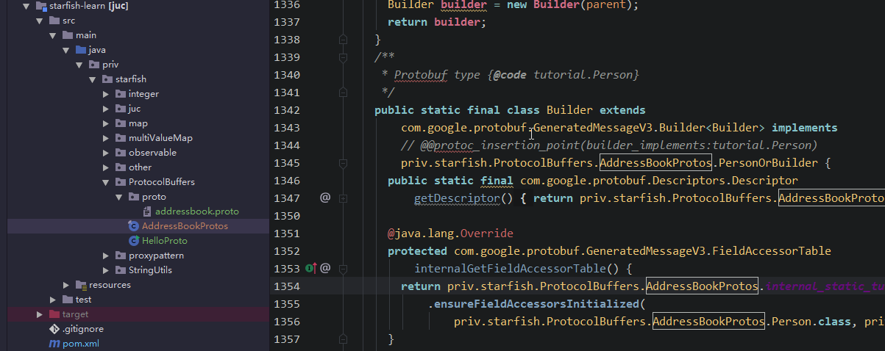

Google Protocol Buffer( 简称 Protobuf) 是 Google 公司内部的混合语言数据标准 ,是一种轻便高效的结构化数据存储格式，可以用于结构化数据串行化，或者说序列化(将 数据结构或对象 转换成 二进制串 的过程 )。它很适合做**数据存储**或 **RPC 数据交换**格式。可用于通讯协议、数据存储等领域的语言无关、平台无关、可扩展的序列化结构数据格式 

*protocol buffers 诞生之初是为了解决服务器端新旧协议(高低版本)兼容性问题，名字也很体贴，“协议缓冲区”。只不过后期慢慢发展成用于传输数据。*

### Protobuf 的优点

- 更小——序列化后，数据大小可缩小约3倍
- 更快——序列化速度更快，比xml和JSON快20-100倍，体积缩小后，传输时，带宽也会优化
- 更简单——proto编译器，自动进行序列化和反序列化
- 维护成本低——跨平台、跨语言，多平台仅需要维护一套对象协议（.proto）
- 可扩展——“向后”兼容性好，不必破坏已部署的、依靠“老”数据格式的程序就可以对数据结构进行升级
- 加密性好——HTTP传输内容抓包只能看到字节

	在传输数据量大、网络环境不稳定的数据存储和RPC数据交换场景比较合适	

### Protobuf 的不足

- 功能简单，无法用来表示复杂的概念
- 通用性较差，XML和JSON已成为多种行业标准的编写工具，pb只是geogle内部使用
- 自解释性差，以二进制数据流方式存储（不可读），需要通过.proto文件才可以


官网 Protocol Buffer Basics: Java <https://developers.google.com/protocol-buffers/docs/javatutorial> 


### Hello World

1. #### 定义 `.proto` 文件的消息格式（你希望存储的数据格式描述文件）

   ```protobuf
   syntax = "proto2";
   
   package tutorial;
   
   option java_package = "com.example.tutorial";
   option java_outer_classname = "AddressBookProtos";
   
   //消息模型
   message Person {
   //消息对象的字段：字段修饰符+字段类型+字段名称+标识号（通过二进制格式唯一标识每个字段，不变可）
     required string name = 1;
     required int32 id = 2;
     optional string email = 3;
   
     enum PhoneType {
       MOBILE = 0;
       HOME = 1;
       WORK = 2;
     }
   
     message PhoneNumber {
       required string number = 1;
       optional PhoneType type = 2 [default = HOME];
     }
   
     repeated PhoneNumber phones = 4;
   }
   
   message AddressBook {
     repeated Person people = 1;
   }
   ```

   ☆☆☆注： 

   - syntax = "proto2"：指明版本
   - package：PB的自己的包名，防止不同 `.proto` 项目间命名 发生冲突 
   - java_package： 生成java类的包名,如不显式指定，默认包名为：按照应用名称倒序方式进行排序
   - java_outer_classname：生成 java类的类名,如不显式指定，则默认为把.proto文件名转换为首字母大写来生成
   - message: 你的消息格式，各数据类型（`bool`, `int32`, `float`, `double`,  `string` ，`enum` ... ）字段的集合，在一个.proto文件中可以定义多个message，一个message里也可以定义另外一个message(相当于java的类，当然也可以有内部类)
   - 当然PB也是支持和java一样的`import`的，`import "xxx.proto";`
   - 像每个字段也必须有修饰符，PB提供的字段修饰符有3种
     - required：必填
     - optional：可选
     - repeated ：可重复字段，可放集合
   - 标识号：通过二进制格式唯一标识每个字段 ，使用后就不能够再改变
     - 标识号使用范围：[1,2的29次方 - 1]
     - 不可使用 [19000－19999] 标识号， 因为 `Protobuf` 协议实现中对这些标识号进行了预留。假若使用，则会报错
     - 每个字段在进行编码时都会占用内存，而 占用内存大小 取决于 标识号： 
       - 范围 [1,15] 标识号的字段 在编码时占用1个字节；
       - 范围 [16,2047] 标识号的字段 在编码时占用2个字节
       - **为频繁出现的 消息字段 保留 [1,15] 的标识号**

   <p align='center'>
     
   </p>

2. #### 使用 protocol buffer 编译器（下载地址：<https://github.com/protocolbuffers/protobuf/releases> )

   ##### winows的话 cmd到编译器安装目录的bin目录中，执行  **protoc.exe -h  （E:\learning\protoc-3.9.0-win64\bin>protoc.exe -h**），可以看到参数说明。

   执行：protoc -I=源地址 --java_out=目标地址  源地址/xxx.proto 

   **E:\learning\protoc-3.9.0-win64\bin>protoc.exe -I=E:\learning\ --java_out=E:\lear**
   **ning\ E:\learning\addressbook.proto**

   

   实际使用中:

   **protoc.exe -I=E:\learn-workspace\starfish\starfish-learn\src\main\java\priv\starfish\ProtocolBuffers\proto\ --java_out=E:\learn-workspace\starfish\starfish-learn\src\main\java  E:\learn-workspace\starfish\starfish-learn\src\main\java\priv\starfish\ProtocolBuffers\proto\addressbook.proto）**



3. #### 通过 Java protocol buffer API 读写消息格式

```
package priv.starfish.ProtocolBuffers;

import com.google.protobuf.InvalidProtocolBufferException;

import priv.starfish.ProtocolBuffers.AddressBookProtos.Person;
import priv.starfish.ProtocolBuffers.AddressBookProtos.AddressBook;
import java.util.Arrays;

/**
 * @author: starfish
 * @date: 2019/7/24 14:39
 * @description:
 */
public class HelloProto {

    public static void main(String[] args) {


        Person person = Person.newBuilder()
                .setId(123)
                .setName("starfish")
                .setEmail("starfish@126.cn")
                .addPhones(AddressBookProtos.Person.PhoneNumber.newBuilder()
                        .setType(AddressBookProtos.Person.PhoneType.HOME)
                        .setNumber("13555555555")
                        .build())
                .build();

        System.out.println(person.toString());

        System.out.println(person.isInitialized());

        try {
            //序列化和反序列化
            System.out.println(Arrays.toString(person.toByteArray()));
            System.out.println(person.toByteString());
            Person newPerson = Person.parseFrom(person.toByteArray());
            System.out.println(newPerson);
            newPerson = Person.parseFrom(person.toByteString());
            System.out.println(newPerson);
        } catch (InvalidProtocolBufferException e) {
            e.printStackTrace();
        }


        // 向地址簿添加两条Person信息
        AddressBook.Builder books = AddressBook.newBuilder();
        books.addPeople(person);
        books.addPeople(Person.newBuilder(person).setEmail("xin@163.com")
                .build());
        System.out.println("AddressBook对象信息：");
        System.out.println(books.build());

    }
}
```


编译后生成的java类是不可变的，类似java的String，不可修改

构造消息，必须先构造一个builder，然后set属性（可以一连串的set），最后调用build() 方法。


PB常用方法

- `isInitialized()`: 检查必填字段（required）是否有set值
- `toString()`: 返回message的可读字符串格式
- `mergeFrom(Message other)`: 合并message
- `clear()`: 清空字段值

- `byte[] toByteArray();`: 序列化message,返回字节数组
- ` MessageType parseFrom(byte[] data);`: 解析给定的字节数组
- `void writeTo(OutputStream output);`: 序列化message并写入输出流`OutputStream`.
- `MessageType parseFrom(InputStream input);`: 从输入流 `InputStream`读取并解析message


Reference:

<https://github.com/halfrost/Halfrost-Field/blob/master/contents/Protocol/Protocol-buffers-encode.md#%E5%85%AD-protocol-buffer-%E7%BC%96%E7%A0%81%E5%8E%9F%E7%90%86> 

 <https://www.jianshu.com/p/e06ba6249edc> 
