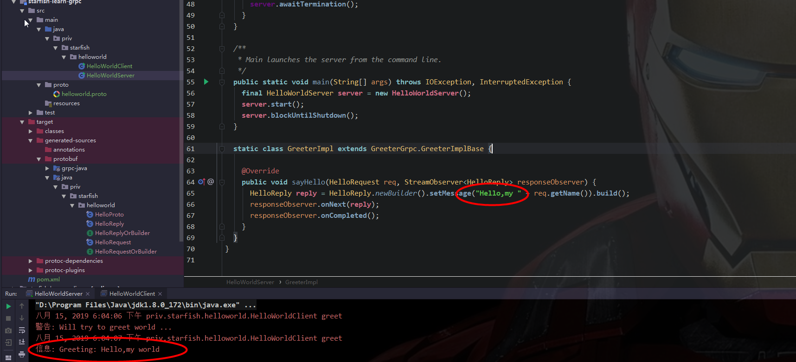

gRPC是一个高性能，跨平台的开源RPC框架，它可以通过可插拔的负载平衡、跟踪、健康检查和身份验证支持，有效地连接数据中心内部和跨数据中心的服务，支持移动端、浏览器端等各种分布式的后端服务。

在 gRPC 里客户端应用可以像调用本地对象一样直接调用另一台不同的机器上服务端应用的方法，使得您能够更容易地创建分布式应用和服务。与许多 RPC 系统类似，gRPC 也是基于以下理念：定义一个服务，指定其能够被远程调用的方法（包含参数和返回类型）。在服务端实现这个接口，并运行一个 gRPC 服务器来处理客户端调用。在客户端拥有一个存根能够像服务端一样的方法。 


## 为什么选择gRPC？

gRPC是可以在任何环境中运行的现代开源高性能RPC框架。它可以通过可插拔的支持来有效地连接数据中心内和跨数据中心的服务，以实现负载平衡，跟踪，运行状况检查和身份验证。它也适用于分布式计算的最后一英里，以将设备，移动应用程序和浏览器连接到后端服务。

- **简单的服务定义**：通过Protocol Buffers, 定义服务的传输数据
- **跨语言和平台工作**：支持多种语言和平台，可通过插件为您的服务自动生成的客户机和服务器存根 
- **快速启动并扩展**：只需一行即可安装运行时和开发环境，并通过该框架每秒可扩展至数百万个RPC
- **双向流和集成身份验证**：基于http2传输的双向流和完全集成的可插拔式身份验证


# Hello gRPC

话不多说，先把项目跑起来~~ 嗖~~~嗖~~~~

一切从简，直接用IDEA的强大功能生成各种文件就可以了，懒得下载protoc 编译器。

#### 1. IDEA安装`Protobuf Support` 插件

#### 2. POM文件

```xml
<dependencies>
        <dependency>
            <groupId>com.google.protobuf</groupId>
            <artifactId>protobuf-java</artifactId>
            <version>3.9.0</version>
        </dependency>

        <dependency>
            <groupId>io.grpc</groupId>
            <artifactId>grpc-netty-shaded</artifactId>
            <version>1.23.0</version>
        </dependency>
        <dependency>
            <groupId>io.grpc</groupId>
            <artifactId>grpc-protobuf</artifactId>
            <version>1.23.0</version>
        </dependency>
        <dependency>
            <groupId>io.grpc</groupId>
            <artifactId>grpc-stub</artifactId>
            <version>1.23.0</version>
        </dependency>
        <dependency>
            <groupId>io.grpc</groupId>
            <artifactId>grpc-core</artifactId>
            <version>1.23.0</version>
        </dependency>
    </dependencies>

	<!-- protobuf-maven-plugin插件，用于生成Stub代码库-->
    <build>
        <extensions>
            <extension>
                <groupId>kr.motd.maven</groupId>
                <artifactId>os-maven-plugin</artifactId>
                <version>1.5.0.Final</version>
            </extension>
        </extensions>
        <plugins>
            <plugin>
                <groupId>org.xolstice.maven.plugins</groupId>
                <artifactId>protobuf-maven-plugin</artifactId>
                <version>0.5.1</version>
                <configuration>
                    <protocArtifact>com.google.protobuf:protoc:3.9.0:exe:${os.detected.classifier}</protocArtifact>
                    <pluginId>grpc-java</pluginId>
                    <pluginArtifact>io.grpc:protoc-gen-grpc-java:1.23.0:exe:${os.detected.classifier}</pluginArtifact>
                </configuration>
                <executions>
                    <execution>
                        <goals>
                            <goal>compile</goal>
                            <goal>compile-custom</goal>
                        </goals>
                    </execution>
                </executions>
            </plugin>
            <plugin>
                <groupId>org.apache.maven.plugins</groupId>
                <artifactId>maven-compiler-plugin</artifactId>
                <configuration>
                    <source>6</source>
                    <target>6</target>
                </configuration>
            </plugin>
        </plugins>
    </build>
```


#### 3. helloworld.proto文件

```protobuf
syntax = "proto3";
option java_multiple_files = true;
option java_package = "priv.starfish.helloworld";
option java_outer_classname = "HelloProto";
option objc_class_prefix = "HLW";

package helloworld;
// The greeting service definition.
service Greeter {
  // Sends a greeting
  rpc SayHello (HelloRequest) returns (HelloReply) {}
}

// The request message containing the user's name.
message HelloRequest {
  string name = 1;
}

// The response message containing the greetings
message HelloReply {
  string message = 1;
}

```


#### 4. complie自己的maven项目


#### 5. Server + Client

Ctrl +C ——> Ctrl +V 官网的demo:  [demo](https://github.com/grpc/grpc-java/tree/master/examples/src/main/java/io/grpc/examples/helloworld)

```java
package priv.starfish.helloworld;

import io.grpc.Server;
import io.grpc.ServerBuilder;
import io.grpc.stub.StreamObserver;

import java.io.IOException;
import java.util.logging.Logger;

public class HelloWorldServer {
  private static final Logger logger = Logger.getLogger(HelloWorldServer.class.getName());

  private Server server;
  private void start() throws IOException {
    int port = 50051;
    server = ServerBuilder.forPort(port)
        .addService(new GreeterImpl())
        .build()
        .start();
    logger.info("Server started, listening on " + port);
    Runtime.getRuntime().addShutdownHook(new Thread() {
      @Override
      public void run() {
        // Use stderr here since the logger may have been reset by its JVM shutdown hook.
        System.err.println("*** shutting down gRPC server since JVM is shutting down");
        HelloWorldServer.this.stop();
        System.err.println("*** server shut down");
      }
    });
  }

  private void stop() {
    if (server != null) {
      server.shutdown();
    }
  }

  /**
   * Await termination on the main thread since the grpc library uses daemon threads.
   */
  private void blockUntilShutdown() throws InterruptedException {
    if (server != null) {
      server.awaitTermination();
    }
  }

  /**
   * Main launches the server from the command line.
   */
  public static void main(String[] args) throws IOException, InterruptedException {
    final HelloWorldServer server = new HelloWorldServer();
    server.start();
    server.blockUntilShutdown();
  }

  static class GreeterImpl extends GreeterGrpc.GreeterImplBase {

    @Override
    public void sayHello(HelloRequest req, StreamObserver<HelloReply> responseObserver) {
      HelloReply reply = HelloReply.newBuilder().setMessage("Hello,my " + req.getName()).build();
      responseObserver.onNext(reply);
      responseObserver.onCompleted();
    }
  }
}

```

```java
package priv.starfish.helloworld;

import io.grpc.ManagedChannel;
import io.grpc.ManagedChannelBuilder;
import io.grpc.StatusRuntimeException;
import java.util.concurrent.TimeUnit;
import java.util.logging.Level;
import java.util.logging.Logger;

/**
 * A simple client that requests a greeting from the {@link HelloWorldServer}.
 */
public class HelloWorldClient {
  private static final Logger logger = Logger.getLogger(HelloWorldClient.class.getName());

  private final ManagedChannel channel;
  private final GreeterGrpc.GreeterBlockingStub blockingStub;

  /** Construct client connecting to HelloWorld server at {@code host:port}. */
  public HelloWorldClient(String host, int port) {
    this(ManagedChannelBuilder.forAddress(host, port)
        // Channels are secure by default (via SSL/TLS). For the example we disable TLS to avoid
        // needing certificates.
        .usePlaintext()
        .build());
  }

  /** Construct client for accessing HelloWorld server using the existing channel. */
  HelloWorldClient(ManagedChannel channel) {
    this.channel = channel;
    blockingStub = GreeterGrpc.newBlockingStub(channel);
  }

  public void shutdown() throws InterruptedException {
    channel.shutdown().awaitTermination(5, TimeUnit.SECONDS);
  }

  /** Say hello to server. */
  public void greet(String name) {
    logger.warning("Will try to greet " + name + " ...");
    HelloRequest request = HelloRequest.newBuilder().setName(name).build();
    HelloReply response;
    try {
      response = blockingStub.sayHello(request);
    } catch (StatusRuntimeException e) {
      logger.log(Level.WARNING, "RPC failed: {0}", e.getStatus());
      return;
    }
    logger.info("Greeting: " + response.getMessage());
  }

  /**
   * Greet server. If provided, the first element of {@code args} is the name to use in the
   * greeting.
   */
  public static void main(String[] args) throws Exception {
    HelloWorldClient client = new HelloWorldClient("localhost", 50051);
    try {
      /* Access a service running on the local machine on port 50051 */
      String user = "world";
      if (args.length > 0) {
        user = args[0]; /* Use the arg as the name to greet if provided */
      }
      client.greet(user);
    } finally {
      client.shutdown();
    }
  }
}
```

#### 6. 分别启动server和client




# gRPC 概念

### 服务定义

正如其他 RPC 系统，gRPC 基于如下思想：定义一个服务， 指定其可以被远程调用的方法及其参数和返回类型。gRPC 默认使用 [protocol buffers](https://developers.google.com/protocol-buffers/) 作为接口定义语言，来描述服务接口和有效载荷消息结构。如果有需要的话，可以使用其他替代方案。


- gRPC 允许你定义四类服务方法：

  - 单项 RPC，即客户端发送一个请求给服务端，从服务端获取一个应答，就像一次普通的函数调用。

  ```
  rpc SayHello(HelloRequest) returns (HelloResponse){
  }
  ```

  - 服务端流式 RPC，即客户端发送一个请求给服务端，可获取一个数据流用来读取一系列消息。客户端从返回的数据流里一直读取直到没有更多消息为止。

  ```
  rpc LotsOfReplies(HelloRequest) returns (stream HelloResponse){
  }
  ```

  - 客户端流式 RPC，即客户端用提供的一个数据流写入并发送一系列消息给服务端。一旦客户端完成消息写入，就等待服务端读取这些消息并返回应答。

  ```
  rpc LotsOfGreetings(stream HelloRequest) returns (HelloResponse) {
  }
  ```

  - 双向流式 RPC，即两边都可以分别通过一个读写数据流来发送一系列消息。这两个数据流操作是相互独立的，所以客户端和服务端能按其希望的任意顺序读写，例如：服务端可以在写应答前等待所有的客户端消息，或者它可以先读一个消息再写一个消息，或者是读写相结合的其他方式。每个数据流里消息的顺序会被保持。

  ```
  rpc BidiHello(stream HelloRequest) returns (stream HelloResponse){
  }
  ```


### 使用 API 接口

gRPC 提供 protocol buffer 编译插件，能够从一个服务定义的 .proto 文件生成客户端和服务端代码。通常 gRPC 用户可以在服务端实现这些API，并从客户端调用它们。

- 在服务侧，服务端实现服务接口，运行一个 gRPC 服务器来处理客户端调用。gRPC 底层架构会解码传入的请求，执行服务方法，编码服务应答。
- 在客户侧，客户端有一个*存根*实现了服务端同样的方法。客户端可以在本地存根调用这些方法，用合适的 protocol buffer 消息类型封装这些参数— gRPC 来负责发送请求给服务端并返回服务端 protocol buffer 响应。


### 同步 vs 异步

同步 RPC 调用一直会阻塞直到从服务端获得一个应答，这与 RPC 希望的抽象最为接近。另一方面网络内部是异步的，并且在许多场景下能够在不阻塞当前线程的情况下启动 RPC 是非常有用的。

在多数语言里，gRPC 编程接口同时支持同步和异步的特点。


## RPC 生命周期

gRPC 客户端调用 gRPC 服务端的方法时到底发生了什么?

### 单项 RPC

首先我们来了解一下最简单的 RPC 形式：客户端发出单个请求，获得单个响应。

- 一旦客户端通过stub/client 调用一个方法，服务端会得到相关通知 ，通知包括客户端的元数据，方法名，允许的响应期限（如果可以的话）
- 服务端既可以在任何响应之前直接发送回初始的元数据，也可以等待客户端的请求信息，到底哪个先发生，取决于具体的应用。
- 一旦服务端获得客户端的请求信息，就会做所需的任何工作来创建或组装对应的响应。如果成功的话，这个响应会和包含状态码以及可选的状态信息等状态明细及可选的追踪信息返回给客户端 。
- 假如状态是 OK 的话，客户端会得到应答，这将结束客户端的调用。

### 服务端流式 RPC

服务端流式 RPC 除了在得到客户端请求信息后发送回一个应答流之外，与我们的简单例子一样。在发送完所有应答后，服务端的状态详情(状态码和可选的状态信息)和可选的跟踪元数据被发送回客户端，以此来完成服务端的工作。客户端在接收到所有服务端的应答后也完成了工作。

### 客户端流式 RPC

客户端流式 RPC 也基本与我们的简单例子一样，区别在于客户端通过发送一个请求流给服务端，取代了原先发送的单个请求。服务端通常（但并不必须）会在接收到客户端所有的请求后发送回一个应答，其中附带有它的状态详情和可选的跟踪数据。

### 双向流式 RPC

双向流式 RPC ，调用由客户端调用方法来初始化，而服务端则接收到客户端的元数据，方法名和截止时间。服务端可以选择发送回它的初始元数据或等待客户端发送请求。 下一步怎样发展取决于应用，因为客户端和服务端能在任意顺序上读写 - 这些流的操作是完全独立的。例如服务端可以一直等直到它接收到所有客户端的消息才写应答，或者服务端和客户端可以像"乒乓球"一样：服务端得到一个请求就回送一个应答，接着客户端根据应答来发送另一个请求，以此类推。

### 截止时间

gRPC 允许客户端在调用一个远程方法前指定一个最后期限值。这个值指定了在客户端可以等待服务端多长时间来应答，超过这个时间值 RPC 将结束并返回`DEADLINE_EXCEEDED`错误。在服务端可以查询这个期限值来看是否一个特定的方法已经过期，或者还剩多长时间来完成这个方法。 各语言来指定一个截止时间的方式是不同的 - 比如在 Python 里一个截止时间值总是必须的，但并不是所有语言都有一个默认的截止时间。

### RPC 终止

在 gRPC 里，客户端和服务端对调用成功的判断是独立的、本地的，他们的结论可能不一致。这意味着，比如你有一个 RPC 在服务端成功结束("我已经返回了所有应答!")，到那时在客户端可能是失败的("应答在最后期限后才来到!")。也可能在客户端把所有请求发送完前，服务端却判断调用已经完成了。

### 取消 RPC

无论客户端还是服务端均可以再任何时间取消一个 RPC 。一个取消会立即终止 RPC 这样可以避免更多操作被执行。它*不是*一个"撤销"， 在取消前已经完成的不会被回滚。当然，通过同步调用的 RPC 不能被取消，因为直到 RPC 结束前，程序控制权还没有交还给应用。

### 元数据集

元数据是一个特殊 RPC 调用对应的信息([授权详情](https://doc.oschina.net/docs/guides/auth.html)]) ，这些信息以键值对的形式存在，一般键的类型是字符串，值的类型一般也是字符串(当然也可以是二进制数据)。元数据对 gRPC 本事来说是不透明的 - 它让客户端提供调用相关的信息给服务端，反之亦然。 对于元数据的访问是语言相关的。

### 频道

在创建客户端存根时，一个 gRPC 频道提供一个特定主机和端口服务端的连接。客户端可以通过指定频道参数来修改 gRPC 的默认行为，比如打开关闭消息压缩。一个频道具有状态，包含`已连接`和`空闲` 。 gRPC 如何处理关闭频道是语言相关的。有些语言可允许询问频道状态。


## 安全认证

### 认证

gRPC 被设计成可以利用插件的形式支持多种授权机制。本文档对多种支持的授权机制提供了一个概览，并且用例子来论述对应API，最后就其扩展性作了讨论。 马上将会推出更多文档和例子。

gRPC被设计用于与各种身份验证机制一起工作，使得安全地使用gRPC与其他系统进行通信变得很容易。 


### 支持的授权机制

gRPC内置以下认证机制: 

- **SSL/TLS**: gRP 集成 SSL/TLS 并对服务端授权所使用的 SSL/TLS 进行了改良，对客户端和服务端交换的所有数据进行了加密。对客户端来讲提供了可选的机制提供凭证来获得共同的授权。 
- **Token-based authentication with Google**: gRPC 提供通用的机制来对请求和应答附加基于元数据的凭证。

**WARNING**: Google credentials should only be used to connect to Google services. Sending a Google issued OAuth2 token to a non-Google service could result in this token being stolen and used to impersonate the client to Google services. 


### Authentication API

为了减少复杂性和将混乱最小化， gRPC 以一个统一的凭证对象来进行工作。 凭证可以是以下两类：

- *频道凭证*, 被附加在 `频道`上， 比如 SSL 凭证。
- *调用凭证*, 被附加在调用上(或者 C++ 里的 `客户端上下文`)。 凭证可以用`组合频道凭证`来进行组合。一个`组合频道凭证`可以将一个`频道凭证`和一个`调用凭证`关联创建一个新的`频道凭证`。结果在这个频道上的每次调用会发送组合的`调用凭证`来作为授权数据。 例如，一各`频道凭证`可以由一个`Ssl 凭证`和一个`访问令牌凭证`生成。结果是在这个频道上的每次调用都会发送对应的访问令牌。 `调用凭证`可以用 `组合凭证`来组装。组装后的 `调用凭证`应用到一个`客户端上下文`里，将触发发送这两个`调用凭证`的授权数据。

#### Using client-side SSL/TLS

这是个最简单的认证场景：一个客户端仅仅想认证服务器并且加密所有数据。

```
// Create a default SSL ChannelCredentials object.
auto channel_creds = grpc::SslCredentials(grpc::SslCredentialsOptions());
// Create a channel using the credentials created in the previous step.
auto channel = grpc::CreateChannel(server_name, creds);
// Create a stub on the channel.
std::unique_ptr<Greeter::Stub> stub(Greeter::NewStub(channel));
// Make actual RPC calls on the stub.
grpc::Status s = stub->sayHello(&context, *request, response);
```

对于高级的用例比如改变根 CA 或使用客户端证书，可以在发送给工厂方法的 SslCredentialsOptions 参数里的相应选项进行设置。

### Using Google token-based authentication

gRPC应用可以使用一个简单的API来创建一个可以工作在不同部署场景下的凭证。

```
auto creds = grpc::GoogleDefaultCredentials();
// Create a channel, stub and make RPC calls (same as in the previous example)
auto channel = grpc::CreateChannel(server_name, creds);
std::unique_ptr<Greeter::Stub> stub(Greeter::NewStub(channel));
grpc::Status s = stub->sayHello(&context, *request, response);
```

这个应用使用的频道凭证对象就像 [Google 计算引擎  (GCE)](https://cloud.google.com/compute/)里运行的应用一样使用服务账号。在前面的案例里，服务账号的密钥从环境变量 `GOOGLE_APPLICATION_CREDENTIALS` 对应的文件里加载。这些密钥被用来生成承载令牌附加在在相应频道的每次 RPC 调用里。 对于 GCE 里运行的应用，可以在虚拟机设置的时候为其配置一个默认的服务账号和相应的 OAuth2 范围。在运行时，这个凭证被用来与认证系统通讯来获取 OAuth2 访问令牌并且把令牌用作在相应的频道上的 RPC 调用。

### Extending gRPC to support other authentication mechanisms

相应的凭证插件 API 允许开发者开发自己的凭证插件。

- `MetadataCredentialsPlugin` 抽象类包含需要被开发者创建的子类实现的纯虚方法 `GetMetadata`。
- `MetadataCredentialsFromPlugin` 方法可以从 `MetadataCredentialsPlugin` 创建一个 `调用者凭证`。 这类有个简单的凭证插件例子，是通过在自定义头了设置一个认证票据。

```
class MyCustomAuthenticator : public grpc::MetadataCredentialsPlugin {
 public:
  MyCustomAuthenticator(const grpc::string& ticket) : ticket_(ticket) {}

  grpc::Status GetMetadata(
      grpc::string_ref service_url, grpc::string_ref method_name,
      const grpc::AuthContext& channel_auth_context,
      std::multimap<grpc::string, grpc::string>* metadata) override {
    metadata->insert(std::make_pair("x-custom-auth-ticket", ticket_));
    return grpc::Status::OK;
  }

 private:
  grpc::string ticket_;
};

auto call_creds = grpc::MetadataCredentialsFromPlugin(
    std::unique_ptr<grpc::MetadataCredentialsPlugin>(
        new MyCustomAuthenticator("super-secret-ticket")));
```

更深层次的集成可以通过在将 gRPC 的凭证实现以插件的形式集成进核心层。gRPC 内部也允许用其他加密机制来替换 SSL/TLS 。

### Examples

##### Base case - no encryption or authentication

```
ManagedChannel channel = ManagedChannelBuilder.forAddress("localhost", 50051)
    .usePlaintext(true)
    .build();
GreeterGrpc.GreeterStub stub = GreeterGrpc.newStub(channel);
```

##### With server authentication SSL/TLS

Java中推荐使用OpenSSL,要在服务器上启用TLS，需要以PEM格式指定证书链和私钥 ,这样的私钥不应该使用密码 

. The order of certificates in the chain matters: more specifically, the certificate at the top has to be the host CA, while the one at the very bottom has to be the root CA. The standard TLS port is 443, but we use 8443 below to avoid needing extra permissions from the OS.

```
Server server = ServerBuilder.forPort(8443)
    // Enable TLS
    .useTransportSecurity(certChainFile, privateKeyFile)
    .addService(TestServiceGrpc.bindService(serviceImplementation))
    .build();
server.start();
```

If the issuing certificate authority is not known to the client then a properly configured `SslContext` or `SSLSocketFactory` should be provided to the`NettyChannelBuilder` or `OkHttpChannelBuilder`, respectively.

On the client side, server authentication with SSL/TLS looks like this:

```
// With server authentication SSL/TLS
ManagedChannel channel = ManagedChannelBuilder.forAddress("myservice.example.com", 443)
    .build();
GreeterGrpc.GreeterStub stub = GreeterGrpc.newStub(channel);

// With server authentication SSL/TLS; custom CA root certificates; not on Android
ManagedChannel channel = NettyChannelBuilder.forAddress("myservice.example.com", 443)
    .sslContext(GrpcSslContexts.forClient().trustManager(new File("roots.pem")).build())
    .build();
GreeterGrpc.GreeterStub stub = GreeterGrpc.newStub(channel);
```

##### Authenticate with Google

The following code snippet shows how you can call the [Google Cloud PubSub API](https://cloud.google.com/pubsub/overview) using gRPC with a service account. The credentials are loaded from a key stored in a well-known location or by detecting that the application is running in an environment that can provide one automatically, e.g. Google Compute Engine. While this example is specific to Google and its services, similar patterns can be followed for other service providers.

```
GoogleCredentials creds = GoogleCredentials.getApplicationDefault();
ManagedChannel channel = ManagedChannelBuilder.forTarget("greeter.googleapis.com")
    .build();
GreeterGrpc.GreeterStub stub = GreeterGrpc.newStub(channel)
    .withCallCredentials(MoreCallCredentials.from(creds));
```


## 实际使用

### Why use gRPC?

Our example is a simple route mapping application that lets clients get information about features on their route, create a summary of their route, and exchange route information such as traffic updates with the server and other clients.

With gRPC we can define our service once in a .proto file and implement clients and servers in any of gRPC’s supported languages, which in turn can be run in environments ranging from servers inside Google to your own tablet - all the complexity of communication between different languages and environments is handled for you by gRPC. We also get all the advantages of working with protocol buffers, including efficient serialization, a simple IDL, and easy interface updating.


### Defining the service

Our first step (as you’ll know from the [Overview](https://grpc.io/docs/)) is to define the gRPC *service* and the method *request* and *response* types using [protocol buffers](https://developers.google.com/protocol-buffers/docs/overview). 

```
syntax = "proto3";

option java_multiple_files = true;
option java_package = "priv.starfish.routeguide";
option java_outer_classname = "RouteGuideProto";
option objc_class_prefix = "RTG";

package routeguide;

// Interface exported by the server.在服务定义中定义rpc方法，指定它们的请求的和响应类型 
// gRPC支持4种方式的服务定义，
service RouteGuide {

  //一个 简单 RPC ， 客户端使用存根发送请求到服务器并等待响应返回，就像平常的函数调用一样。
  rpc GetFeature(Point) returns (Feature) {}
  
  /*
    一个 服务器端流式 RPC ， 客户端发送请求到服务器，拿到一个流去读取返回的消息序列。 客户端读取
    返回的流，直到里面没有任何消息。从例子中可以看出，通过在 响应 类型前插入 stream 关键字，可以
    指定一个服务器端的流方法
  */
  rpc ListFeatures(Rectangle) returns (stream Feature) {}
  
  /**
  	一个 客户端流式 RPC,客户端写入一个消息序列并将其发送到服务器，同样也是使用流。一旦客户端完成
  	写入消息，它等待服务器完成读取返回它的响应。通过在 请求 类型前指定 stream 关键字来指定一个
  	客户端的流方法。
  */
  rpc RecordRoute(stream Point) returns (RouteSummary) {}
  
  /**
  	一个 双向流式 RPC 是双方使用读写流去发送一个消息序列。两个流独立操作，因此客户端和服务器可以
  	以任意喜欢的顺序读写：比如， 服务器可以在写入响应前等待接收所有的客户端消息，或者可以交替的
  	读取和写入消息，或者其他读写的组合。 每个流中的消息顺序被预留。你可以通过在请求和响应前加
  	stream 关键字去制定方法的类型。
  */
  rpc RouteChat(stream RouteNote) returns (stream RouteNote) {}
}

message Point {
  int32 latitude = 1;
  int32 longitude = 2;
}

message Rectangle {

  Point lo = 1;
  Point hi = 2;
}

message Feature {
  string name = 1;
  Point location = 2;
}

message FeatureDatabase {
  repeated Feature feature = 1;
}

message RouteNote {
  Point location = 1;
  string message = 2;
}

message RouteSummary {
  int32 point_count = 1;
  int32 feature_count = 2;
  int32 distance = 3;
  int32 elapsed_time = 4;
}
```


我们的 .proto 文件也包含了所有请求的 protocol buffer 消息类型定义以及在服务方法中使用的响 应类型——比如，下面的`Point`消息类型： 

```
// Points are represented as latitude-longitude pairs in the E7 representation
// (degrees multiplied by 10**7 and rounded to the nearest integer).
// Latitudes should be in the range +/- 90 degrees and longitude should be in
// the range +/- 180 degrees (inclusive).
message Point {
  int32 latitude = 1;
  int32 longitude = 2;
}
```


### Generating client and server code

- 我们通过 protocol buffer 的编译器 `protoc` 以及一个特殊的 gRPC Java 插件来完成 


### Creating the server

First let’s look at how we create a `RouteGuide` server. 

There are two parts to making our `RouteGuide` service do its job:

- 实现我们服务定义的生成的服务接口：做我们的服务的实际的“工作”。
- 运行一个 gRPC 服务器，监听来自客户端的请求并返回服务的响应。


#### Implementing RouteGuide

```
private static class RouteGuideService extends RouteGuideGrpc.RouteGuideImplBase {
...
}
```

#### Simple RPC

`RouteGuideService` implements all our service methods. Let’s look at the simplest type first, `GetFeature`, which just gets a `Point` from the client and returns the corresponding feature information from its database in a `Feature`.

```
@Override
public void getFeature(Point request, StreamObserver<Feature> responseObserver) {
  responseObserver.onNext(checkFeature(request));
  responseObserver.onCompleted();
}

...

private Feature checkFeature(Point location) {
  for (Feature feature : features) {
    if (feature.getLocation().getLatitude() == location.getLatitude()
        && feature.getLocation().getLongitude() == location.getLongitude()) {
      return feature;
    }
  }

  // No feature was found, return an unnamed feature.
  return Feature.newBuilder().setName("").setLocation(location).build();
}
```

`getFeature()` takes two parameters:

- `Point`: the request
- `StreamObserver<Feature>`: a response observer, which is a special interface for the server to call with its response.

To return our response to the client and complete the call:

1. We construct and populate a `Feature` response object to return to the client, as specified in our service definition. In this example, we do this in a separate private `checkFeature()` method.
2. We use the response observer’s `onNext()` method to return the `Feature`.
3. We use the response observer’s `onCompleted()` method to specify that we’ve finished dealing with the RPC.

##### Server-side streaming RPC

Next let’s look at one of our streaming RPCs. `ListFeatures` is a server-side streaming RPC, so we need to send back multiple `Feature`s to our client.

```
private final Collection<Feature> features;

...

@Override
public void listFeatures(Rectangle request, StreamObserver<Feature> responseObserver) {
  int left = min(request.getLo().getLongitude(), request.getHi().getLongitude());
  int right = max(request.getLo().getLongitude(), request.getHi().getLongitude());
  int top = max(request.getLo().getLatitude(), request.getHi().getLatitude());
  int bottom = min(request.getLo().getLatitude(), request.getHi().getLatitude());

  for (Feature feature : features) {
    if (!RouteGuideUtil.exists(feature)) {
      continue;
    }

    int lat = feature.getLocation().getLatitude();
    int lon = feature.getLocation().getLongitude();
    if (lon >= left && lon <= right && lat >= bottom && lat <= top) {
      responseObserver.onNext(feature);
    }
  }
  responseObserver.onCompleted();
}
```

Like the simple RPC, this method gets a request object (the `Rectangle` in which our client wants to find `Feature`s) and a `StreamObserver` response observer.

This time, we get as many `Feature` objects as we need to return to the client (in this case, we select them from the service’s feature collection based on whether they’re inside our request `Rectangle`), and write them each in turn to the response observer using its `onNext()` method. Finally, as in our simple RPC, we use the response observer’s `onCompleted()` method to tell gRPC that we’ve finished writing responses.

##### Client-side streaming RPC

Now let’s look at something a little more complicated: the client-side streaming method `RecordRoute`, where we get a stream of `Point`s from the client and return a single `RouteSummary` with information about their trip.

```
@Override
public StreamObserver<Point> recordRoute(final StreamObserver<RouteSummary> responseObserver) {
  return new StreamObserver<Point>() {
    int pointCount;
    int featureCount;
    int distance;
    Point previous;
    long startTime = System.nanoTime();

    @Override
    public void onNext(Point point) {
      pointCount++;
      if (RouteGuideUtil.exists(checkFeature(point))) {
        featureCount++;
      }
      // For each point after the first, add the incremental distance from the previous point
      // to the total distance value.
      if (previous != null) {
        distance += calcDistance(previous, point);
      }
      previous = point;
    }

    @Override
    public void onError(Throwable t) {
      logger.log(Level.WARNING, "Encountered error in recordRoute", t);
    }

    @Override
    public void onCompleted() {
      long seconds = NANOSECONDS.toSeconds(System.nanoTime() - startTime);
      responseObserver.onNext(RouteSummary.newBuilder().setPointCount(pointCount)
          .setFeatureCount(featureCount).setDistance(distance)
          .setElapsedTime((int) seconds).build());
      responseObserver.onCompleted();
    }
  };
}
```

As you can see, like the previous method types our method gets a `StreamObserver` response observer parameter, but this time it returns a`StreamObserver` for the client to write its `Point`s.

In the method body we instantiate an anonymous `StreamObserver` to return, in which we:

- Override the `onNext()` method to get features and other information each time the client writes a `Point` to the message stream.
- Override the `onCompleted()` method (called when the *client* has finished writing messages) to populate and build our `RouteSummary`. We then call our method’s own response observer’s `onNext()` with our `RouteSummary`, and then call its `onCompleted()` method to finish the call from the server side.

##### Bidirectional streaming RPC

Finally, let’s look at our bidirectional streaming RPC `RouteChat()`.

```
@Override
public StreamObserver<RouteNote> routeChat(final StreamObserver<RouteNote> responseObserver) {
  return new StreamObserver<RouteNote>() {
    @Override
    public void onNext(RouteNote note) {
      List<RouteNote> notes = getOrCreateNotes(note.getLocation());

      // Respond with all previous notes at this location.
      for (RouteNote prevNote : notes.toArray(new RouteNote[0])) {
        responseObserver.onNext(prevNote);
      }

      // Now add the new note to the list
      notes.add(note);
    }

    @Override
    public void onError(Throwable t) {
      logger.log(Level.WARNING, "Encountered error in routeChat", t);
    }

    @Override
    public void onCompleted() {
      responseObserver.onCompleted();
    }
  };
}
```

As with our client-side streaming example, we both get and return a `StreamObserver` response observer, except this time we return values via our method’s response observer while the client is still writing messages to *their* message stream. The syntax for reading and writing here is exactly the same as for our client-streaming and server-streaming methods. Although each side will always get the other’s messages in the order they were written, both the client and server can read and write in any order — the streams operate completely independently.

#### Starting the server

Once we’ve implemented all our methods, we also need to start up a gRPC server so that clients can actually use our service. The following snippet shows how we do this for our `RouteGuide` service:

```
public RouteGuideServer(int port, URL featureFile) throws IOException {
  this(ServerBuilder.forPort(port), port, RouteGuideUtil.parseFeatures(featureFile));
}

/** Create a RouteGuide server using serverBuilder as a base and features as data. */
public RouteGuideServer(ServerBuilder<?> serverBuilder, int port, Collection<Feature> features) {
  this.port = port;
  server = serverBuilder.addService(new RouteGuideService(features))
      .build();
}
...
public void start() throws IOException {
  server.start();
  logger.info("Server started, listening on " + port);
 ...
}
```

As you can see, we build and start our server using a `ServerBuilder`.

To do this, we:

1. Specify the address and port we want to use to listen for client requests using the builder’s `forPort()` method.
2. Create an instance of our service implementation class `RouteGuideService` and pass it to the builder’s `addService()` method.
3. Call `build()` and `start()` on the builder to create and start an RPC server for our service.


## Creating the client

In this section, we’ll look at creating a Java client for our `RouteGuide` service. 

#### Creating a stub

To call service methods, we first need to create a *stub*, or rather, two stubs:

- a *blocking/synchronous* stub: this means that the RPC call waits for the server to respond, and will either return a response or raise an exception.
- a *non-blocking/asynchronous* stub that makes non-blocking calls to the server, where the response is returned asynchronously. You can make certain types of streaming call only using the asynchronous stub.

First we need to create a gRPC *channel* for our stub, specifying the server address and port we want to connect to:

```
public RouteGuideClient(String host, int port) {
  this(ManagedChannelBuilder.forAddress(host, port).usePlaintext());
}

/** Construct client for accessing RouteGuide server using the existing channel. */
public RouteGuideClient(ManagedChannelBuilder<?> channelBuilder) {
  channel = channelBuilder.build();
  blockingStub = RouteGuideGrpc.newBlockingStub(channel);
  asyncStub = RouteGuideGrpc.newStub(channel);
}
```

We use a `ManagedChannelBuilder` to create the channel.

Now we can use the channel to create our stubs using the `newStub` and `newBlockingStub` methods provided in the `RouteGuideGrpc` class we generated from our .proto.

```
blockingStub = RouteGuideGrpc.newBlockingStub(channel);
asyncStub = RouteGuideGrpc.newStub(channel);
```

#### Calling service methods

Now let’s look at how we call our service methods.

##### Simple RPC

Calling the simple RPC `GetFeature` on the blocking stub is as straightforward as calling a local method.

```
Point request = Point.newBuilder().setLatitude(lat).setLongitude(lon).build();
Feature feature;
try {
  feature = blockingStub.getFeature(request);
} catch (StatusRuntimeException e) {
  logger.log(Level.WARNING, "RPC failed: {0}", e.getStatus());
  return;
}
```

We create and populate a request protocol buffer object (in our case `Point`), pass it to the `getFeature()` method on our blocking stub, and get back a`Feature`.

If an error occurs, it is encoded as a `Status`, which we can obtain from the `StatusRuntimeException`.

##### Server-side streaming RPC

Next, let’s look at a server-side streaming call to `ListFeatures`, which returns a stream of geographical `Feature`s:

```
Rectangle request =
    Rectangle.newBuilder()
        .setLo(Point.newBuilder().setLatitude(lowLat).setLongitude(lowLon).build())
        .setHi(Point.newBuilder().setLatitude(hiLat).setLongitude(hiLon).build()).build();
Iterator<Feature> features;
try {
  features = blockingStub.listFeatures(request);
} catch (StatusRuntimeException ex) {
  logger.log(Level.WARNING, "RPC failed: {0}", e.getStatus());
  return;
}
```

As you can see, it’s very similar to the simple RPC we just looked at, except instead of returning a single `Feature`, the method returns an `Iterator` that the client can use to read all the returned `Feature`s.

##### Client-side streaming RPC

Now for something a little more complicated: the client-side streaming method `RecordRoute`, where we send a stream of `Point`s to the server and get back a single `RouteSummary`. For this method we need to use the asynchronous stub. If you’ve already read [Creating the server](https://grpc.io/docs/tutorials/basic/java/#server) some of this may look very familiar - asynchronous streaming RPCs are implemented in a similar way on both sides.

```
public void recordRoute(List<Feature> features, int numPoints) throws InterruptedException {
  info("*** RecordRoute");
  final CountDownLatch finishLatch = new CountDownLatch(1);
  StreamObserver<RouteSummary> responseObserver = new StreamObserver<RouteSummary>() {
    @Override
    public void onNext(RouteSummary summary) {
      info("Finished trip with {0} points. Passed {1} features. "
          + "Travelled {2} meters. It took {3} seconds.", summary.getPointCount(),
          summary.getFeatureCount(), summary.getDistance(), summary.getElapsedTime());
    }

    @Override
    public void onError(Throwable t) {
      Status status = Status.fromThrowable(t);
      logger.log(Level.WARNING, "RecordRoute Failed: {0}", status);
      finishLatch.countDown();
    }

    @Override
    public void onCompleted() {
      info("Finished RecordRoute");
      finishLatch.countDown();
    }
  };

  StreamObserver<Point> requestObserver = asyncStub.recordRoute(responseObserver);
  try {
    // Send numPoints points randomly selected from the features list.
    Random rand = new Random();
    for (int i = 0; i < numPoints; ++i) {
      int index = rand.nextInt(features.size());
      Point point = features.get(index).getLocation();
      info("Visiting point {0}, {1}", RouteGuideUtil.getLatitude(point),
          RouteGuideUtil.getLongitude(point));
      requestObserver.onNext(point);
      // Sleep for a bit before sending the next one.
      Thread.sleep(rand.nextInt(1000) + 500);
      if (finishLatch.getCount() == 0) {
        // RPC completed or errored before we finished sending.
        // Sending further requests won't error, but they will just be thrown away.
        return;
      }
    }
  } catch (RuntimeException e) {
    // Cancel RPC
    requestObserver.onError(e);
    throw e;
  }
  // Mark the end of requests
  requestObserver.onCompleted();

  // Receiving happens asynchronously
  finishLatch.await(1, TimeUnit.MINUTES);
}
```

As you can see, to call this method we need to create a `StreamObserver`, which implements a special interface for the server to call with its `RouteSummary`response. In our `StreamObserver` we:

- Override the `onNext()` method to print out the returned information when the server writes a `RouteSummary` to the message stream.
- Override the `onCompleted()` method (called when the *server* has completed the call on its side) to reduce a `CountDownLatch` that we can check to see if the server has finished writing.

We then pass the `StreamObserver` to the asynchronous stub’s `recordRoute()` method and get back our own `StreamObserver` request observer to write our `Point`s to send to the server. Once we’ve finished writing points, we use the request observer’s `onCompleted()` method to tell gRPC that we’ve finished writing on the client side. Once we’re done, we check our `CountDownLatch` to check that the server has completed on its side.

##### Bidirectional streaming RPC

Finally, let’s look at our bidirectional streaming RPC `RouteChat()`.

```
public void routeChat() throws Exception {
  info("*** RoutChat");
  final CountDownLatch finishLatch = new CountDownLatch(1);
  StreamObserver<RouteNote> requestObserver =
      asyncStub.routeChat(new StreamObserver<RouteNote>() {
        @Override
        public void onNext(RouteNote note) {
          info("Got message \"{0}\" at {1}, {2}", note.getMessage(), note.getLocation()
              .getLatitude(), note.getLocation().getLongitude());
        }

        @Override
        public void onError(Throwable t) {
          Status status = Status.fromThrowable(t);
          logger.log(Level.WARNING, "RouteChat Failed: {0}", status);
          finishLatch.countDown();
        }

        @Override
        public void onCompleted() {
          info("Finished RouteChat");
          finishLatch.countDown();
        }
      });

  try {
    RouteNote[] requests =
        {newNote("First message", 0, 0), newNote("Second message", 0, 1),
            newNote("Third message", 1, 0), newNote("Fourth message", 1, 1)};

    for (RouteNote request : requests) {
      info("Sending message \"{0}\" at {1}, {2}", request.getMessage(), request.getLocation()
          .getLatitude(), request.getLocation().getLongitude());
      requestObserver.onNext(request);
    }
  } catch (RuntimeException e) {
    // Cancel RPC
    requestObserver.onError(e);
    throw e;
  }
  // Mark the end of requests
  requestObserver.onCompleted();

  // Receiving happens asynchronously
  finishLatch.await(1, TimeUnit.MINUTES);
}
```

As with our client-side streaming example, we both get and return a `StreamObserver` response observer, except this time we send values via our method’s response observer while the server is still writing messages to *their* message stream. The syntax for reading and writing here is exactly the same as for our client-streaming method. Although each side will always get the other’s messages in the order they were written, both the client and server can read and write in any order — the streams operate completely independently.


内容来自官方文档，方便自己查看